# EXStreamTV Architecture Diagrams

All diagrams use Mermaid. Referenced from Platform Guide, EPG Alignment, Observability, Invariants, Lessons Learned.

**Last Revised:** 2026-04-01

---

## 1. System Architecture Overview

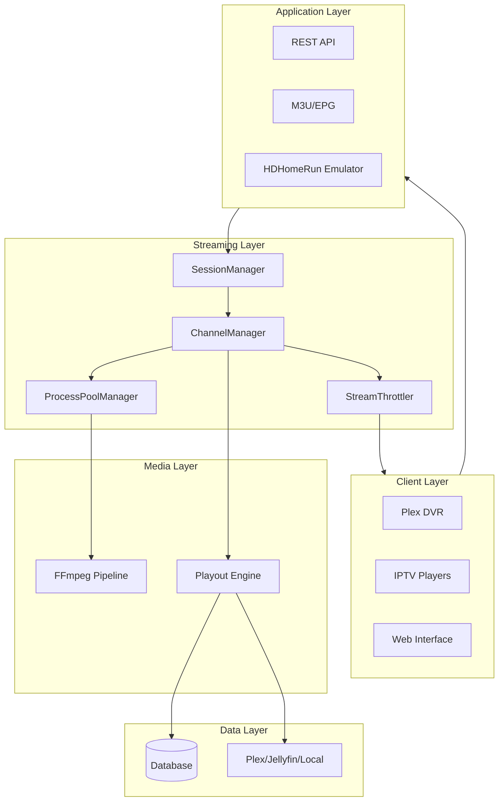

---

## 2. Zero-Drift Clock Authority Flow

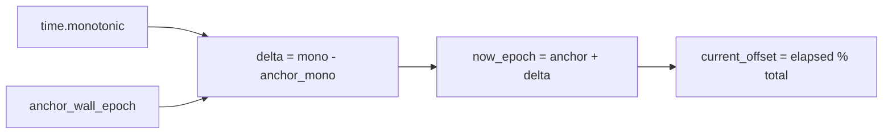

---

## 3. XMLTV Generation Pipeline

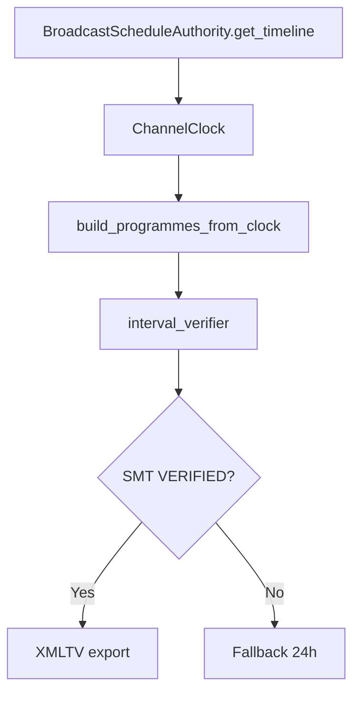

---

## 4. Validation Pipeline Order

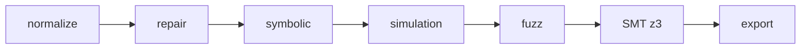

---

## 5. BroadcastScheduleAuthority Internal Flow

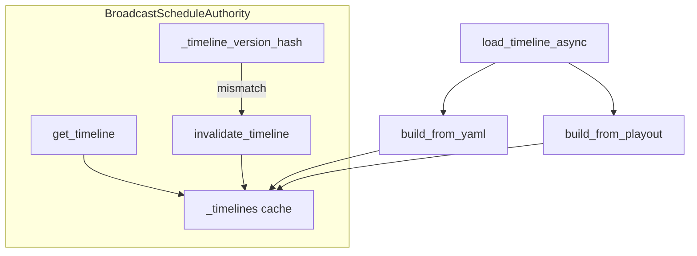

---

## 6. Watchdog Monitoring Loop

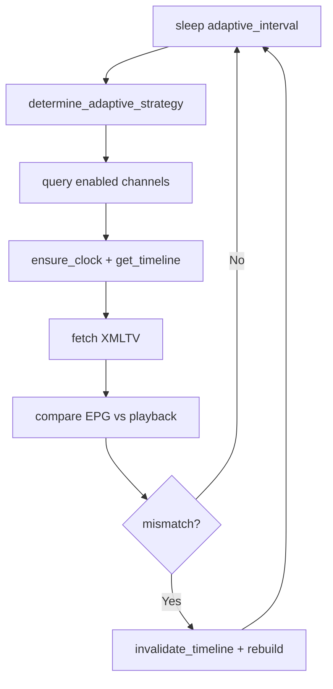

---

## 7. Adaptive Self-Tuning Feedback Loop

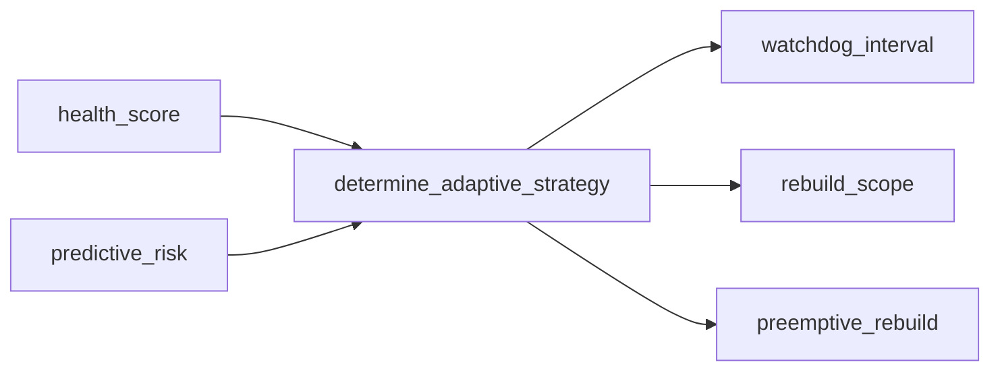

---

## 8. Metrics Exporter to Prometheus Flow

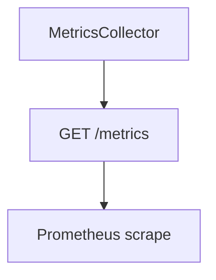

---

## 9. Dashboard Health Score Predictive Analyzer

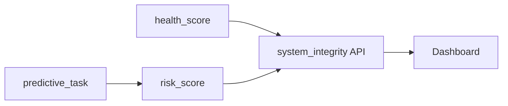

---

## 10. ChannelManager Lifecycle

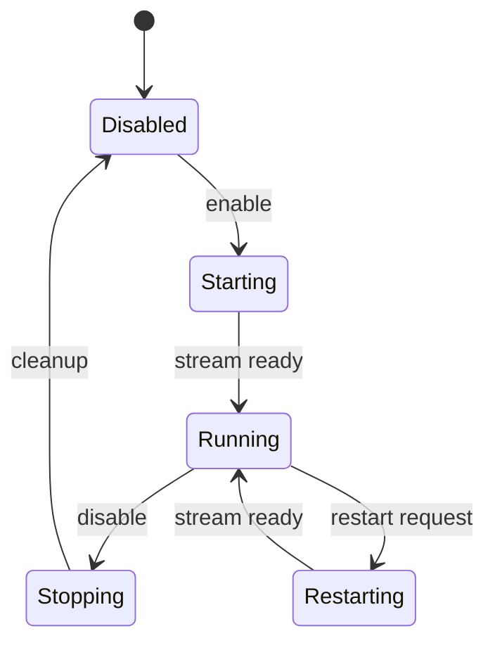

---

## 11. Stream Pre-flight Validation Path

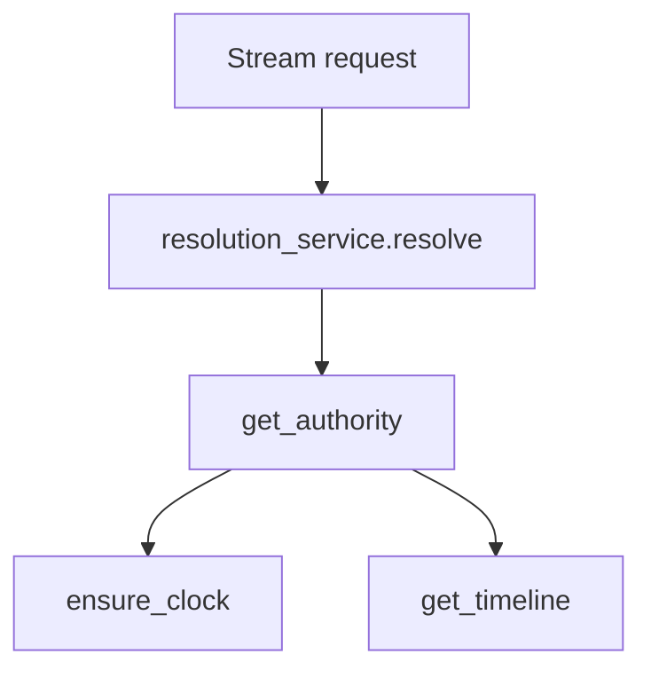

---

## 12. Fallback Safety Gate Logic

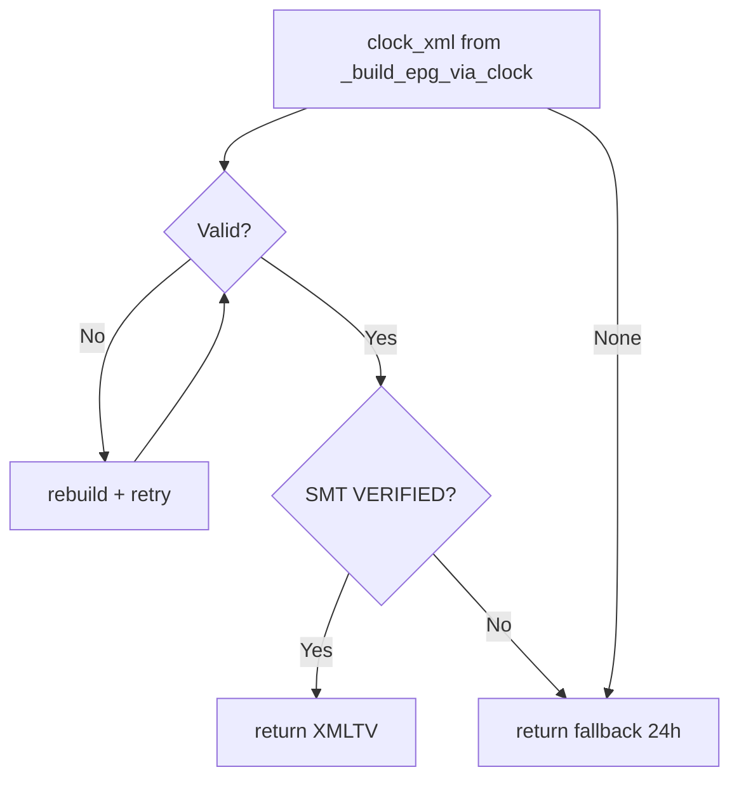

---

## 13. Temporal Simulation and Fuzz Layer

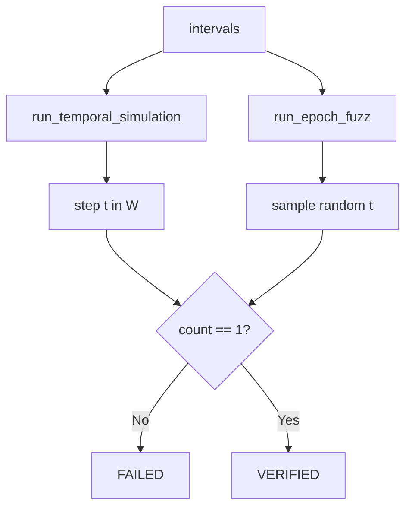

---

## 14. SMT Verifier Integration Path

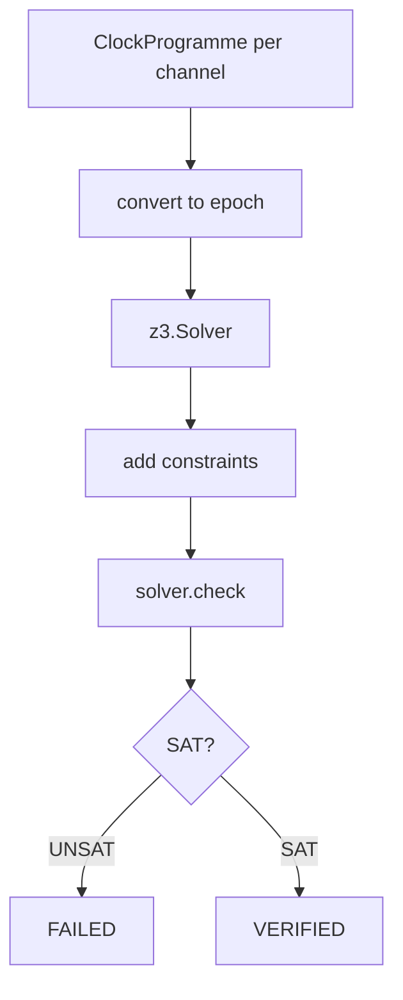

---

## 15. Stream resolution safety contract

Validates resolved sources before FFmpeg (`resolution_service`, `StreamingContractEnforcer`, `StreamSource`).

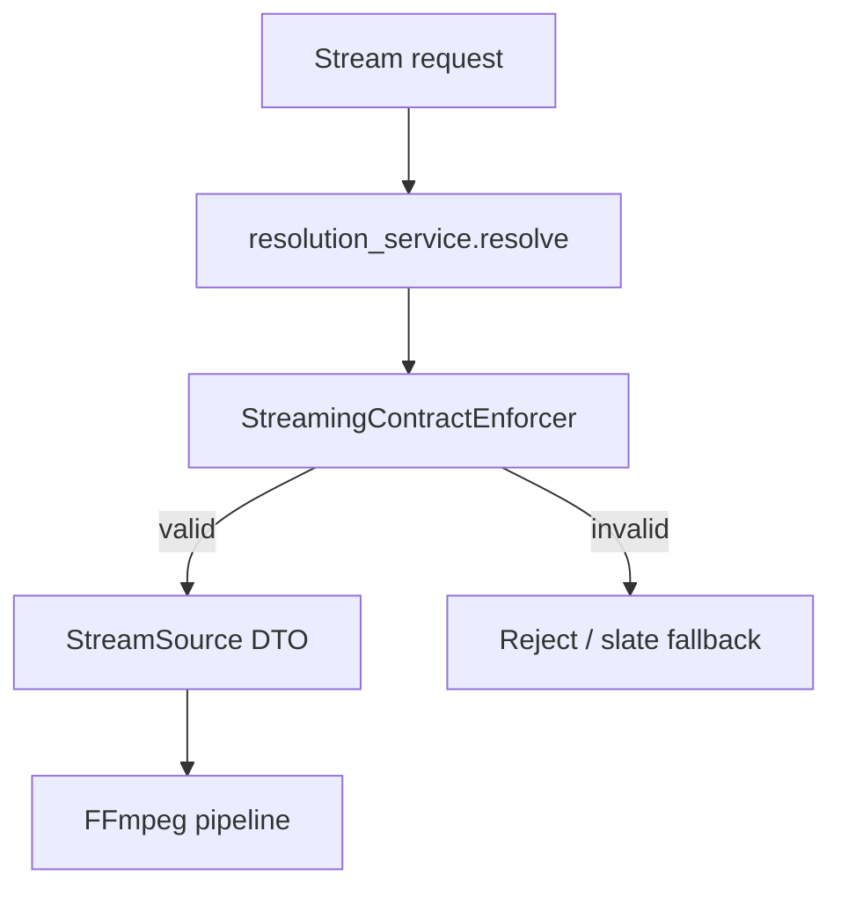

---

## 16. FFmpeg Command Builder Safety Layer (2026-03 remediation — LL-002 to LL-016)

All FFmpeg command builders import flags from a single constants module. No flag string is
hardcoded in individual builder files. This eliminates the class of bugs where two builders
used different loudnorm targets, different fflags, or omitted required bitstream filters.

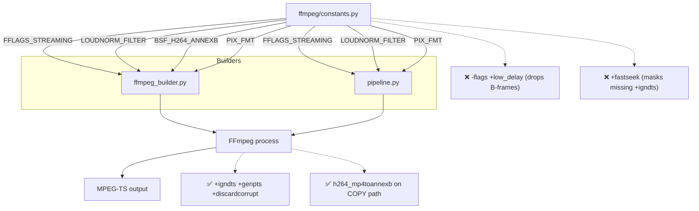

---

## 17. Async Lock Collect-Then-Act Pattern (2026-03 remediation — LL-013)

The process watchdog previously held its lock during 5-second kill operations, deadlocking
all callers. The fix: collect work items inside the lock (fast), execute outside it (slow).
This pattern applies to any async lock guarding I/O-heavy operations.

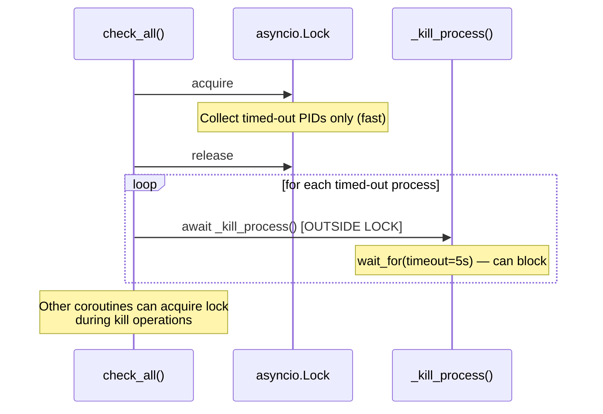

---

## 18. Six-layer AI / coding safety enforcement (2026-03 — post-merge `main`)

Redundant guardrails keep Cursor and human contributors aligned with audited patterns
(`docs/LESSONS_LEARNED.md`). Layers overlap so context drift or model switches still leave
multiple active reminders.

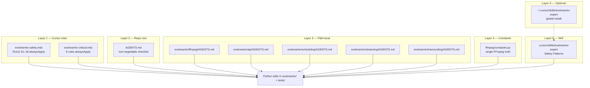

**Merge note (2026-03-21):** Branch `2026-02-21-ufnw` was merged into `default` `main` so GitHub,
local clones, and wiki sources all reflect the same remediation + hardening + tooling tree.

---

## 19. Schedule history (memento) API

Capture and revert channel schedule snapshots stored in **`schedule_history`** (Alembic **006**).

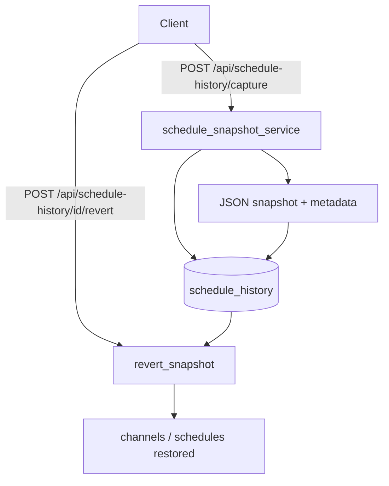

See [System Design — Schedule history](SYSTEM_DESIGN.md#schedule-history-exstreamtvdatabasemodelsschedule_historypy-migration-006).
