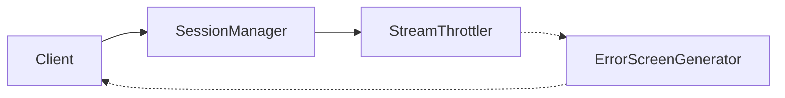
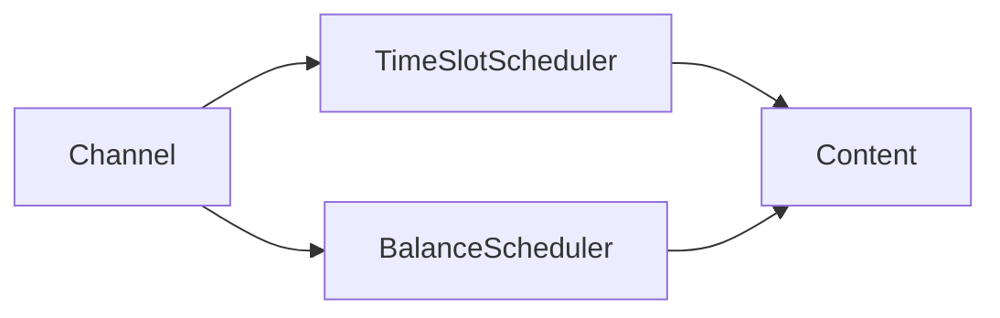
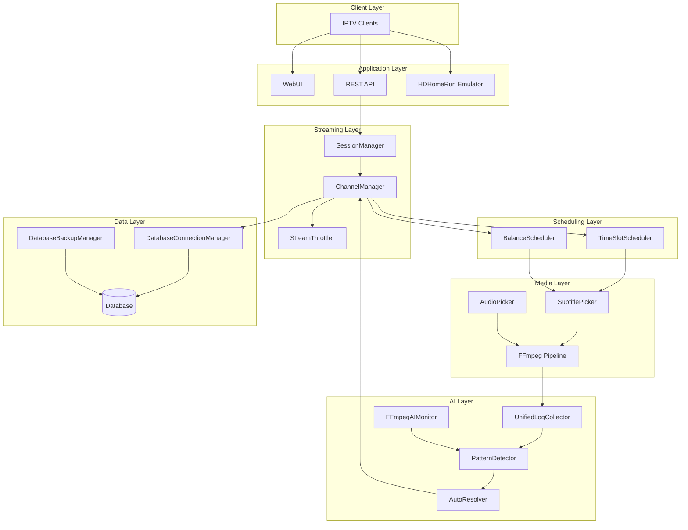

# EXStreamTV Documentation

Architecture diagrams: [docs/architecture/DIAGRAMS.md](Architecture-Diagrams) — Mermaid-only, **19** standardized diagrams (includes schedule history memento flow, §19).

**Version:** 2.6.0  
**Last Updated:** 2026-04-01

Welcome to the EXStreamTV documentation. This guide will help you set up, configure, and use EXStreamTV for your IPTV streaming needs.

---

## Quick Links

| Document | Description |
|----------|-------------|
| [Platform Guide](Platform-Guide) | Full architecture, streaming, HDHomeRun, AI, observability |
| [Quick Start](Quick-Start) | Get started in 10 minutes |
| [Installation](Installation) | Complete installation guide |
| [API Reference](API-Reference) | REST API documentation |
| [System Design](System-Design) | Architecture overview |
| [Pattern refactor sources](Pattern-Refactor-Sources) | Refactor inventory + Alembic stamp note |
| [ADR: ChannelManager DB sessions](ADR-Channel-Manager-Database) | Sync vs async SQLAlchemy boundaries |

---

## Documentation Structure

```
docs/
├── README.md                    # This file
├── PLATFORM_GUIDE.md            # Master platform document (architecture, streaming, AI, observability)
├── OBSERVABILITY.md             # Prometheus metrics reference
├── OPERATIONAL_GUIDE.md         # Diagnosis and verification
├── INVARIANTS.md                # Formal invariants
├── FEATURE_FLAGS.md             # Config toggles
├── VERSION                      # Documentation version
├── CHANGELOG.md                 # Documentation changes
│
├── guides/                      # User Guides
│   ├── QUICK_START.md          # Getting started
│   ├── INSTALLATION.md         # Installation
│   ├── AI_SETUP.md             # AI configuration
│   ├── CHANNEL_CREATION_GUIDE.md # Channel creation
│   ├── LOCAL_MEDIA.md          # Local media setup
│   ├── HW_TRANSCODING.md       # Hardware transcoding
│   ├── MACOS_APP_GUIDE.md      # macOS app
│   ├── NAVIGATION_GUIDE.md     # UI navigation
│   ├── ONBOARDING.md           # Onboarding
│   ├── STREAMING_STABILITY.md  # Streaming features (NEW)
│   └── ADVANCED_SCHEDULING.md  # Scheduling features (NEW)
│
├── api/                         # API Documentation
│   └── README.md               # Complete API reference
│
├── architecture/                # Architecture Documentation
│   ├── SYSTEM_DESIGN.md        # System architecture
│   ├── DIAGRAMS.md             # 19 Mermaid diagrams (canonical)
│   ├── PATTERN_REFACTOR_SOURCES.md
│   ├── ADR-channel-manager-database-sessions.md
│   └── TUNARR_DIZQUETV_INTEGRATION.md # v2.6.0 integration
│
├── development/                 # Development Documentation
│   └── DISTRIBUTION.md         # Distribution guide
│
├── confluence/                  # Confluence-Ready Documentation (NEW)
│   ├── README.md               # Upload instructions
│   ├── 00-HOME.confluence.md   # Documentation home
│   ├── 01-SYSTEM-DESIGN.confluence.md
│   ├── 02-TUNARR-INTEGRATION.confluence.md
│   ├── 03-API-REFERENCE.confluence.md
│   ├── 04-STREAMING-STABILITY.confluence.md
│   ├── 05-ADVANCED-SCHEDULING.confluence.md
│   ├── 06-AI-SETUP.confluence.md
│   ├── 07-QUICK-START.confluence.md
│   └── 08-BUILD-PROGRESS.confluence.md
│
└── BUILD_PROGRESS.md           # Build tracking
```

---

## Getting Started

### New Users

1. **[Installation Guide](Installation)** - Install EXStreamTV on your system
2. **[Quick Start](Quick-Start)** - Create your first channel in 10 minutes
3. **[AI Setup](AI-Setup)** - Configure AI for smart channel creation

### Intermediate Users

1. **[Channel Creation Guide](Channel-Creation-Guide)** - Advanced channel options
2. **[Local Media Setup](Local-Media)** - Add your own media libraries
3. **[Hardware Transcoding](Hardware-Transcoding)** - GPU acceleration setup

### Advanced Users

1. **[Advanced Scheduling](Advanced-Scheduling)** - Time slots and balance scheduling
2. **[Streaming Stability](Streaming-Stability)** - Session management and throttling
3. **[API Reference](API-Reference)** - Build integrations

---

## New in v2.6.0

EXStreamTV v2.6.0 introduces major enhancements from the Tunarr/dizqueTV integration:

### Streaming Stability



- **Session Management** - Track and manage client connections
- **Stream Throttling** - Prevent buffer overruns
- **Error Screens** - Graceful fallback during failures

📖 [Streaming Stability Guide](Streaming-Stability)

### Advanced Scheduling



- **Time Slot Scheduling** - Time-of-day programming blocks
- **Balance Scheduling** - Weight-based content distribution

📖 [Advanced Scheduling Guide](Advanced-Scheduling)

### AI Self-Healing


- **Unified Log Collector** - Multi-source log aggregation
- **FFmpeg AI Monitor** - Intelligent process monitoring
- **Pattern Detector** - ML-based issue detection
- **Auto Resolver** - Autonomous issue resolution

📖 [AI Setup Guide](AI-Setup#ai-self-healing-system-new-in-v260)

### Database Backup

- **Scheduled Backups** - Automatic daily backups
- **Backup Rotation** - Keep N most recent
- **Compression** - Gzip for space savings
- **Easy Restore** - One-click restoration

📖 [AI Setup Guide](AI-Setup#database-backup-new-in-v260)

---

## Architecture Overview



📖 [System Design](System-Design) | [Tunarr/dizqueTV Integration](Tunarr-DizqueTV-Integration)

---

## API Overview

The EXStreamTV API provides complete control over your streaming server:

| Category | Endpoints | Description |
|----------|-----------|-------------|
| Channels | `/api/channels` | Channel CRUD, filler, deco |
| Playlists | `/api/playlists` | Playlist management |
| Schedules | `/api/schedules` | Schedule configuration |
| Playouts | `/api/playouts` | Playout control |
| Blocks | `/api/blocks` | Time-based blocks |
| Templates | `/api/templates` | Reusable schedules |
| AI | `/api/ai` | AI self-healing, health |
| System | `/api/health` | System monitoring |

📖 [Complete API Reference](API-Reference)

---

## Component Versions

| Component | Version | Last Modified |
|-----------|---------|---------------|
| backend_core | 2.6.0 | 2026-01-31 |
| streaming | 2.6.0 | 2026-01-31 |
| database | 2.6.0 | 2026-01-31 |
| ai_agent | 2.6.0 | 2026-01-31 |
| scheduling | 2.6.0 | 2026-01-31 |
| ffmpeg | 2.6.0 | 2026-01-31 |
| docs | 2.6.0 | 2026-01-31 |

---

## Confluence Export

All documentation is available in Confluence-ready format in the `confluence/` folder.

### Confluence Files

| File | Description |
|------|-------------|
| `00-HOME.confluence.md` | Documentation home page |
| `01-SYSTEM-DESIGN.confluence.md` | System architecture |
| `02-TUNARR-INTEGRATION.confluence.md` | v2.6.0 integration details |
| `03-API-REFERENCE.confluence.md` | REST API documentation |
| `04-STREAMING-STABILITY.confluence.md` | Streaming features |
| `05-ADVANCED-SCHEDULING.confluence.md` | Scheduling features |
| `06-AI-SETUP.confluence.md` | AI configuration |
| `07-QUICK-START.confluence.md` | Getting started |
| `08-BUILD-PROGRESS.confluence.md` | Development status |

### Upload Instructions

1. Install the "Mermaid Diagrams for Confluence" app
2. Create a new page in Confluence
3. Use "Insert" → "Markup" → "Markdown"
4. Copy/paste content from `.confluence.md` files

See `confluence/README.md` for detailed instructions.

---

## Support

- **GitHub Issues**: Report bugs and request features
- **Documentation**: This documentation site
- **Logs**: Check `Settings > Logs` for troubleshooting

---

## Related Resources

- [CHANGELOG](Documentation-Changelog) - Version history
- [CONTRIBUTING](../CONTRIBUTING.md) - Contribution guidelines
- [LICENSE](../LICENSE) - MIT license

**Last Revised:** 2026-03-21

Repo root [AGENTS.md](../AGENTS.md) and per-module `exstreamtv/*/AGENTS.md` complement `.cursor/rules/` for human and AI contributors. Wiki pages are synced from `docs/` with `scripts/sync_docs_to_wiki.py`.
