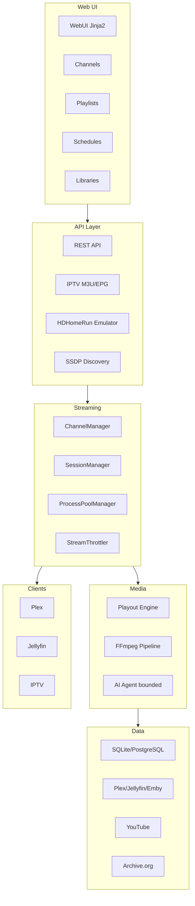

# EXStreamTV System Design

**Version:** 2.6.0  
**Last Updated:** 2026-03-20

For a full architecture overview, streaming lifecycle, restart safety, and AI model, see the [Platform Guide](Platform-Guide). This document focuses on component layout and data models.

---

## Overview

EXStreamTV combines StreamTV (Python/FastAPI, AI agent) and ErsatzTV (scheduling, transcoding, local media) into one platform. Clients connect via REST, M3U/EPG, or HDHomeRun emulation; the channel manager and ProcessPoolManager control streaming; the playout engine drives scheduling.

---

## Component Layout



---

## Core Components

### FastAPI Application (`exstreamtv/main.py`)

- Lifespan: async startup/shutdown for database, channel manager, ProcessPoolManager
- Routers: REST, IPTV, HDHomeRun, WebUI, SSDP
- Static files and Jinja2 templates

### Channel Manager (`exstreamtv/streaming/channel_manager.py`)

- Background streams per channel
- Shared streams for multiple clients
- Integration with ProcessPoolManager for FFmpeg spawn/release
- Buffer: 2MB with 64KB read chunks

### ProcessPoolManager (`exstreamtv/streaming/process_pool_manager.py`)

Sole gatekeeper for FFmpeg processes. See [Platform Guide §2](Platform-Guide#2-how-streaming-works).

- `acquire_process` / `release_process`
- Rate limiting, memory/FD guards, zombie detection

### Circuit Breaker (`exstreamtv/streaming/circuit_breaker.py`)

Per-channel restart protection. States: CLOSED → OPEN → HALF_OPEN. See [Platform Guide §2](Platform-Guide#circuitbreaker-behavior).

### Session Manager (`exstreamtv/streaming/session_manager.py`)

Tracks client connections per channel. Idle timeout, cleanup, error counting.

### Stream Throttler (`exstreamtv/streaming/throttler.py`)

Rate-limits MPEG-TS delivery. Modes: realtime, burst, adaptive, disabled.

### Playout Engine (`exstreamtv/scheduling/`)

Schedule modes (Flood, Duration, Multiple, One), block scheduling, filler. See [Advanced Scheduling](Advanced-Scheduling).

### FFmpeg Pipeline (`exstreamtv/ffmpeg/`)

Hardware detection (VideoToolbox, NVENC, QSV, VAAPI, AMF), encoder selection, filter chains, profiles.

### AI Agent (`exstreamtv/ai_agent/`)

Bounded loop, tool registry, grounded envelope, containment. See [Platform Guide §5](Platform-Guide#5-ai-agent--safety-model).

### Media Scanner (`exstreamtv/media/scanner/`)

Library sources (Plex, Jellyfin, Emby, local), metadata providers, collection building.

---

## Data Models

### Channel
```python
# Simplified
id: int
number: int
name: str
streaming_mode: str  # "iptv" | "hdhomerun" | "both"
playouts: List[Playout]
```

### Playout
```python
id: int
channel_id: int
program_schedule_id: int
anchor: PlayoutAnchor
items: List[PlayoutItem]
```

### PlayoutItem
```python
id: int
playout_id: int
media_item_id: int
start_time: datetime
finish_time: datetime
in_point: timedelta
out_point: timedelta
filler_kind: str
```

### ProgramSchedule
```python
id: int
name: str
items: List[ProgramScheduleItem]
# Modes: keep_multi_part_episodes, shuffle_schedule_items, random_start_point
```

---

## Streaming and Playout Flow

Stream request flow (Client → SessionManager → ChannelManager → ProcessPoolManager → FFmpeg → Throttler) and restart decision logic are in [Platform Guide §2](Platform-Guide#2-how-streaming-works).

Playout: Schedule Timer → TimeSlot/Balance Scheduler → Media Selection → Subtitle/Audio Pickers → FFmpeg → Channel Stream.

---

## Configuration

`config.yaml` with `EXSTREAMTV_` environment overrides:

```yaml
server:
  host: "0.0.0.0"
  port: 8411

ffmpeg:
  max_processes: 150
  spawns_per_second: 5
  memory_guard_threshold: 0.85
  fd_guard_reserve: 100

hdhomerun:
  device_id: "E5E17001"  # Must be 8 hex chars
  tuner_count: 4
```

---

## Related Documentation

- [Platform Guide](Platform-Guide) — Full architecture, streaming, HDHomeRun, AI, observability
- [TUNARR_DIZQUETV_INTEGRATION.md](./TUNARR_DIZQUETV_INTEGRATION.md) — v2.6 integration
- [API Reference](API-Reference) — REST and IPTV endpoints

**Last Revised:** 2026-03-20
