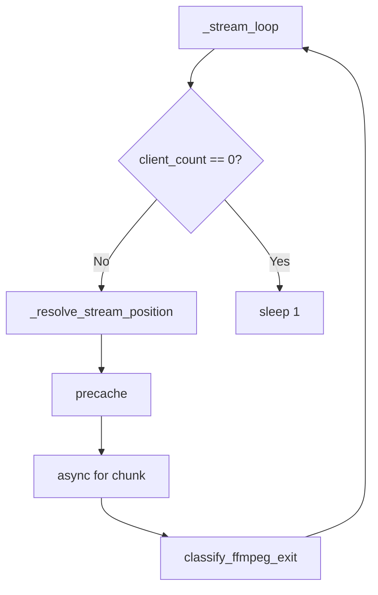

# Infinite Restart Root Cause Analysis

## Executive Summary

Channels show "Restarting" indefinitely because:

1. **Retry-exhausted sleep is too short** — When precache or stream fails and retries are exhausted, we sleep `min(60, duration)` then re-resolve. For long items (e.g. 30 min), the clock is still on the same item. We loop forever on the same failing item.
2. **Health timeout (180s) fires during sleep** — We produce no output during the sleep. `last_output_time` goes stale. Health task restarts the channel. After restart, we resolve to the *same* item again, fail again, sleep 60s, repeat. Infinite restart loop.
3. **FFmpeg processes accumulate** — Restart does `stop_channel` + `start_channel`. The previous stream task is cancelled. FFmpeg cleanup runs in the generator's `finally`. If cancellation doesn't propagate correctly in all code paths, or if multiple channels restart rapidly, orphan processes can accumulate.

## State Machine Trace

The `ChannelStream` does **not** use the `StreamState` enum explicitly. The effective flow:

**Stuck path**: precache fails → retries exhausted → `sleep(60)` → continue → resolve same item → precache fails → ...

## Root Cause

| Factor | Location | Issue |
|--------|----------|-------|
| Sleep cap 60s | channel_manager.py L603, L716 | `min(remain, 60)` prevents clock from advancing past long items |
| No last_output_time during sleep | — | Health sees stale timestamp, restarts at 180s |
| Same position on every resolve | StreamPositionResolver | Clock-based; wall time barely moves in 60s |

## FFmpeg Process Lifecycle

- **FFmpeg is started** in `MPEGTSStreamer.stream()` or `stream_via_pool()`.
- **FFmpeg is terminated** in the generator's `finally` when the async for loop exits (normal, exception, or cancel).
- **Health task** does not kill FFmpeg; it calls `stop_channel` which cancels the stream task. Task cancel propagates to the stream generator, which runs `finally` and terminates the process.
- **Multiple long-running FFmpeg** suggests either: (a) some code paths don't run the generator's `finally`, or (b) prewarm/spawn creates processes that aren't properly torn down on restart.

## Fix (Implemented)

**1. Periodic health pings during retry-exhausted sleep** — Added `_sleep_with_health_pings(seconds)` that sleeps in 90s chunks and updates `last_output_time` after each chunk. This prevents the health task from restarting the channel while waiting for the clock to advance.

**2. Longer wait duration** — Replaced `min(60, ...)` cap with `min(600, ...)` so the clock can advance past long items (e.g. 30 min). Previously we only slept 60s, re-resolved the same item, and looped forever.

**Locations changed in `channel_manager.py`:**
- Precache retry exhausted (2 sites): `_sleep_with_health_pings(min(600, duration or 60))`
- Stream retry exhausted (EARLY_EOF etc.): `_sleep_with_health_pings(min(600, remain))`

This keeps the channel "alive" in the health task's eyes while the clock advances, so the next resolve can move to the next item.

**Last Revised:** 2026-03-20
