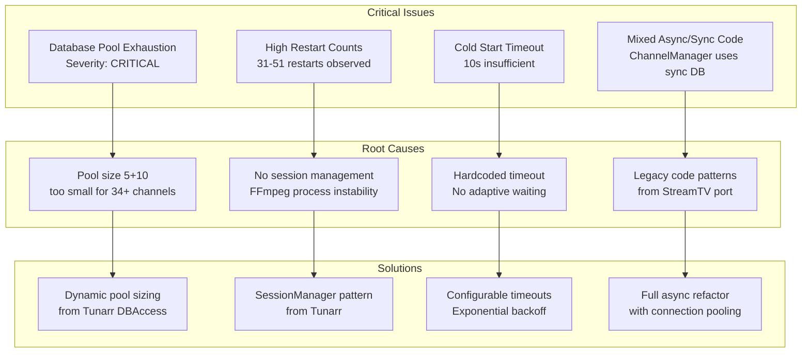
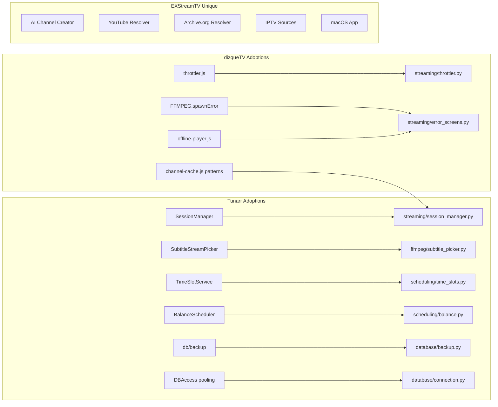

# EXStreamTV Integration Plan: Adopting dizqueTV & Tunarr Modules

**Version:** 1.0  
**Date:** January 31, 2026  
**Authors:** Principal Senior Integration Engineer, Principal Senior Application Developer

---

## Table of Contents

1. [Executive Summary](#1-executive-summary)
2. [Current Issues Analysis](#2-current-issues-analysis)
3. [Phase 1: Critical Stability Fixes](#3-phase-1-critical-stability-fixes)
4. [Phase 2: Error Handling System](#4-phase-2-error-handling-system)
5. [Phase 3: Advanced Scheduling](#5-phase-3-advanced-scheduling)
6. [Phase 4: Media Pipeline Improvements](#6-phase-4-media-pipeline-improvements)
7. [Phase 5: Database & Infrastructure](#7-phase-5-database--infrastructure)
8. [Module Adoption Matrix](#8-module-adoption-matrix)
9. [Risk Assessment](#9-risk-assessment)
10. [Testing Strategy](#10-testing-strategy)

---

## 1. Executive Summary

This integration plan outlines the adoption of specific modules and patterns from **dizqueTV** and **Tunarr** to resolve current EXStreamTV issues while preserving our unique competitive advantages (AI features, diverse media sources, Python ecosystem).

### Goals

1. **Resolve Critical Issues:** Database pool exhaustion, high restart counts, cold start timeouts
2. **Improve Stability:** Adopt proven patterns from mature projects
3. **Enhance Features:** Add missing capabilities (backups, advanced scheduling, subtitles)
4. **Maintain Uniqueness:** Keep AI, YouTube, Archive.org, IPTV support

### Non-Goals

1. Complete rewrite to TypeScript (Tunarr stack)
2. Removal of FastAPI/Python architecture
3. Abandoning AI-powered features

---

## 2. Current Issues Analysis

### 2.1 Critical Issues



### 2.2 Issue Mapping to Solutions

| Issue | Source Platform | Module/Pattern | Effort | Impact |
|-------|-----------------|----------------|--------|--------|
| DB Pool Exhaustion | Tunarr | DBAccess pattern | Low | Critical |
| High Restarts | Tunarr | SessionManager | Medium | Critical |
| Cold Start | dizqueTV | Immediate spawn | Low | High |
| Stream Buffering | dizqueTV | Throttler | Low | High |
| No Error Screens | dizqueTV | FFMPEG.spawnError | Medium | Medium |
| No Backups | Tunarr | db/backup module | Low | Medium |
| Limited Subtitles | Tunarr | SubtitleStreamPicker | Medium | Medium |
| No Audio Selection | Tunarr | Audio preference | Low | Low |

---

## 3. Phase 1: Critical Stability Fixes

### 3.1 Database Connection Pool Optimization

**Source:** Tunarr `DBAccess.ts` pattern  
**Target:** `exstreamtv/database/connection.py`

#### Current Code (Problematic)

```python
# exstreamtv/database/connection.py - CURRENT
engine = create_async_engine(
    database_url,
    pool_size=5,      # Too small!
    max_overflow=10,  # 15 total is insufficient
)
```

#### Proposed Fix

```python
# exstreamtv/database/connection.py - PROPOSED

from sqlalchemy import event
from sqlalchemy.pool import QueuePool
import logging

logger = logging.getLogger(__name__)

class DatabaseConnectionManager:
    """
    Enhanced connection management inspired by Tunarr DBAccess.
    Dynamically sizes pool based on channel count.
    """
    
    def __init__(self, database_url: str):
        self.database_url = database_url
        self._engine = None
        self._channel_count = 0
        
    def get_engine(self, channel_count: int = 50):
        """
        Get or create engine sized for expected load.
        
        Each channel requires approximately:
        - 1 connection for streaming
        - 1 connection for position updates
        - 0.5 connections for playout queries
        
        Plus overhead for API requests, background tasks.
        """
        if self._engine is None or channel_count != self._channel_count:
            self._channel_count = channel_count
            self._engine = self._create_engine(channel_count)
        return self._engine
        
    def _create_engine(self, channel_count: int):
        # Base pool: 2.5 connections per channel + 10 overhead
        pool_size = max(20, int(channel_count * 2.5) + 10)
        max_overflow = pool_size  # Allow 2x for bursts
        
        logger.info(
            f"Creating database engine: pool_size={pool_size}, "
            f"max_overflow={max_overflow} for {channel_count} channels"
        )
        
        engine = create_async_engine(
            self.database_url,
            poolclass=QueuePool,
            pool_size=pool_size,
            max_overflow=max_overflow,
            pool_timeout=60,  # Increased from default 30
            pool_recycle=3600,  # Recycle hourly
            pool_pre_ping=True,  # Validate before use
            echo=False,
        )
        
        # Connection pool event listeners for monitoring
        @event.listens_for(engine.sync_engine, "checkout")
        def on_checkout(dbapi_conn, connection_record, connection_proxy):
            logger.debug("Connection checked out from pool")
            
        @event.listens_for(engine.sync_engine, "checkin")
        def on_checkin(dbapi_conn, connection_record):
            logger.debug("Connection returned to pool")
            
        return engine
```

### 3.2 Session Manager Implementation

**Source:** Tunarr `stream/SessionManager.ts`  
**Target:** `exstreamtv/streaming/session_manager.py` (NEW)

```python
# exstreamtv/streaming/session_manager.py

"""
Session Manager for streaming sessions.
Port of Tunarr SessionManager pattern.
"""

import asyncio
import logging
import uuid
from dataclasses import dataclass, field
from datetime import datetime
from typing import Dict, Optional, Set
from weakref import WeakSet

logger = logging.getLogger(__name__)


@dataclass
class StreamSession:
    """
    Represents an active streaming session.
    Tracks connections and manages lifecycle.
    """
    session_id: str
    channel_id: int
    created_at: datetime = field(default_factory=datetime.utcnow)
    last_activity: datetime = field(default_factory=datetime.utcnow)
    
    # Connection tracking
    active_connections: int = 0
    total_connections: int = 0
    bytes_streamed: int = 0
    
    # FFmpeg process reference
    ffmpeg_pid: Optional[int] = None
    
    # Session state
    is_healthy: bool = True
    error_count: int = 0
    restart_count: int = 0
    
    _lock: asyncio.Lock = field(default_factory=asyncio.Lock, repr=False)
    
    async def add_connection(self) -> int:
        """Add a connection to this session."""
        async with self._lock:
            self.active_connections += 1
            self.total_connections += 1
            self.last_activity = datetime.utcnow()
            return self.active_connections
            
    async def remove_connection(self) -> int:
        """Remove a connection, return remaining count."""
        async with self._lock:
            self.active_connections = max(0, self.active_connections - 1)
            self.last_activity = datetime.utcnow()
            return self.active_connections
            
    async def record_bytes(self, count: int):
        """Record bytes streamed."""
        self.bytes_streamed += count
        self.last_activity = datetime.utcnow()
        
    async def record_error(self):
        """Record an error occurrence."""
        async with self._lock:
            self.error_count += 1
            if self.error_count > 5:
                self.is_healthy = False
                
    async def record_restart(self):
        """Record a stream restart."""
        async with self._lock:
            self.restart_count += 1
            self.error_count = 0  # Reset error count on restart


class SessionManager:
    """
    Manages all streaming sessions.
    
    Features (ported from Tunarr):
    - Connection tracking per session
    - Automatic cleanup of idle sessions
    - Health monitoring
    - Restart management
    """
    
    def __init__(
        self,
        idle_timeout_seconds: int = 300,
        max_restarts_per_session: int = 10,
        cleanup_interval_seconds: int = 60,
    ):
        self.idle_timeout = idle_timeout_seconds
        self.max_restarts = max_restarts_per_session
        self.cleanup_interval = cleanup_interval_seconds
        
        self._sessions: Dict[int, StreamSession] = {}
        self._lock = asyncio.Lock()
        self._cleanup_task: Optional[asyncio.Task] = None
        self._running = False
        
    async def start(self):
        """Start the session manager."""
        if self._running:
            return
        self._running = True
        self._cleanup_task = asyncio.create_task(self._cleanup_loop())
        logger.info("SessionManager started")
        
    async def stop(self):
        """Stop the session manager and cleanup."""
        self._running = False
        if self._cleanup_task:
            self._cleanup_task.cancel()
            try:
                await self._cleanup_task
            except asyncio.CancelledError:
                pass
        
        # Stop all sessions
        async with self._lock:
            for session in self._sessions.values():
                await self._terminate_session(session)
            self._sessions.clear()
        logger.info("SessionManager stopped")
        
    async def get_or_create_session(self, channel_id: int) -> StreamSession:
        """Get existing session or create new one."""
        async with self._lock:
            if channel_id in self._sessions:
                session = self._sessions[channel_id]
                if session.is_healthy:
                    return session
                else:
                    # Session unhealthy, terminate and recreate
                    await self._terminate_session(session)
                    
            # Create new session
            session = StreamSession(
                session_id=str(uuid.uuid4()),
                channel_id=channel_id,
            )
            self._sessions[channel_id] = session
            logger.info(
                f"Created new session {session.session_id} "
                f"for channel {channel_id}"
            )
            return session
            
    async def get_session(self, channel_id: int) -> Optional[StreamSession]:
        """Get existing session if any."""
        return self._sessions.get(channel_id)
        
    async def remove_session(self, channel_id: int):
        """Remove and terminate a session."""
        async with self._lock:
            if channel_id in self._sessions:
                session = self._sessions.pop(channel_id)
                await self._terminate_session(session)
                
    async def _terminate_session(self, session: StreamSession):
        """Terminate a session and cleanup resources."""
        logger.info(
            f"Terminating session {session.session_id} "
            f"(connections: {session.active_connections}, "
            f"bytes: {session.bytes_streamed}, "
            f"restarts: {session.restart_count})"
        )
        # FFmpeg process cleanup would happen here
        # The actual FFmpeg handling remains in ChannelManager
        
    async def _cleanup_loop(self):
        """Background task to cleanup idle sessions."""
        while self._running:
            try:
                await asyncio.sleep(self.cleanup_interval)
                await self._cleanup_idle_sessions()
            except asyncio.CancelledError:
                break
            except Exception as e:
                logger.error(f"Error in cleanup loop: {e}")
                
    async def _cleanup_idle_sessions(self):
        """Remove sessions with no active connections past timeout."""
        now = datetime.utcnow()
        to_remove = []
        
        async with self._lock:
            for channel_id, session in self._sessions.items():
                if session.active_connections == 0:
                    idle_seconds = (now - session.last_activity).total_seconds()
                    if idle_seconds > self.idle_timeout:
                        to_remove.append(channel_id)
                        
        for channel_id in to_remove:
            await self.remove_session(channel_id)
            logger.info(f"Cleaned up idle session for channel {channel_id}")
            
    def get_stats(self) -> Dict:
        """Get session manager statistics."""
        return {
            "total_sessions": len(self._sessions),
            "active_sessions": sum(
                1 for s in self._sessions.values() 
                if s.active_connections > 0
            ),
            "total_connections": sum(
                s.active_connections for s in self._sessions.values()
            ),
            "total_bytes": sum(
                s.bytes_streamed for s in self._sessions.values()
            ),
            "unhealthy_sessions": sum(
                1 for s in self._sessions.values() 
                if not s.is_healthy
            ),
        }
```

### 3.3 Stream Throttler

**Source:** dizqueTV `throttler.js`  
**Target:** `exstreamtv/streaming/throttler.py` (NEW)

```python
# exstreamtv/streaming/throttler.py

"""
Stream throttler for smooth MPEG-TS delivery.
Port of dizqueTV throttler.js
"""

import asyncio
import logging
import time
from typing import AsyncIterator

logger = logging.getLogger(__name__)


class StreamThrottler:
    """
    Throttles MPEG-TS stream to prevent buffer overruns.
    
    Ensures stream is delivered at approximately real-time rate,
    preventing clients from being overwhelmed with data.
    
    Based on dizqueTV throttler.js concept.
    """
    
    # MPEG-TS packet size
    TS_PACKET_SIZE = 188
    
    def __init__(
        self,
        bitrate_kbps: int = 4000,
        buffer_duration_ms: int = 500,
    ):
        """
        Initialize throttler.
        
        Args:
            bitrate_kbps: Target bitrate in kbps
            buffer_duration_ms: How far ahead to allow buffering
        """
        self.bitrate_bps = bitrate_kbps * 1000
        self.bytes_per_second = self.bitrate_bps / 8
        self.buffer_bytes = int(
            self.bytes_per_second * buffer_duration_ms / 1000
        )
        
    async def throttle(
        self,
        stream: AsyncIterator[bytes],
        start_time: float = None,
    ) -> AsyncIterator[bytes]:
        """
        Throttle stream to target bitrate.
        
        Args:
            stream: Input stream of bytes
            start_time: Optional start time for timing calculations
            
        Yields:
            Throttled stream chunks
        """
        if start_time is None:
            start_time = time.monotonic()
            
        total_bytes = 0
        
        async for chunk in stream:
            chunk_size = len(chunk)
            total_bytes += chunk_size
            
            # Calculate expected time for this many bytes
            expected_duration = total_bytes / self.bytes_per_second
            actual_duration = time.monotonic() - start_time
            
            # If we're ahead of schedule, wait
            ahead_by = expected_duration - actual_duration
            if ahead_by > 0:
                # Allow some buffer before throttling
                buffer_time = self.buffer_bytes / self.bytes_per_second
                if ahead_by > buffer_time:
                    await asyncio.sleep(ahead_by - buffer_time)
                    
            yield chunk
            
    async def throttle_with_keepalive(
        self,
        stream: AsyncIterator[bytes],
        keepalive_interval_ms: int = 5000,
        keepalive_packet: bytes = None,
    ) -> AsyncIterator[bytes]:
        """
        Throttle stream with keepalive packets during stalls.
        
        If no data is received for keepalive_interval, sends null TS packets
        to keep connection alive.
        """
        if keepalive_packet is None:
            # Null TS packet (PID 0x1FFF)
            keepalive_packet = bytes([0x47, 0x1F, 0xFF, 0x10] + [0xFF] * 184)
            
        keepalive_interval = keepalive_interval_ms / 1000
        start_time = time.monotonic()
        total_bytes = 0
        
        async def read_with_timeout():
            try:
                return await asyncio.wait_for(
                    stream.__anext__(),
                    timeout=keepalive_interval
                )
            except asyncio.TimeoutError:
                return None
            except StopAsyncIteration:
                raise
                
        while True:
            try:
                chunk = await read_with_timeout()
                
                if chunk is None:
                    # Timeout - send keepalive
                    logger.debug("Sending keepalive packet")
                    yield keepalive_packet
                    continue
                    
                chunk_size = len(chunk)
                total_bytes += chunk_size
                
                # Throttle calculation
                expected = total_bytes / self.bytes_per_second
                actual = time.monotonic() - start_time
                ahead_by = expected - actual - (self.buffer_bytes / self.bytes_per_second)
                
                if ahead_by > 0:
                    await asyncio.sleep(ahead_by)
                    
                yield chunk
                
            except StopAsyncIteration:
                break
```

---

## 4. Phase 2: Error Handling System

### 4.1 Error Screen Generator

**Source:** dizqueTV `ffmpeg.js` (spawnError, spawnOffline)  
**Target:** `exstreamtv/streaming/error_screens.py` (NEW)

```python
# exstreamtv/streaming/error_screens.py

"""
Error and offline screen generation.
Port of dizqueTV FFMPEG.spawnError and FFMPEG.spawnOffline
"""

import asyncio
import logging
from dataclasses import dataclass
from enum import Enum
from pathlib import Path
from typing import AsyncIterator, Optional

from exstreamtv.config import get_config

logger = logging.getLogger(__name__)


class ErrorAudioType(Enum):
    """Audio type for error screens."""
    SILENT = "silent"
    SINE = "sine"           # 440Hz tone
    WHITENOISE = "whitenoise"


class ErrorScreenType(Enum):
    """Visual type for error screens."""
    TEXT = "text"           # Black background with text
    STATIC = "static"       # TV static noise
    TESTSRC = "testsrc"     # FFmpeg test pattern
    PIC = "pic"             # Custom image
    BLANK = "blank"         # Black screen


@dataclass
class ErrorScreenConfig:
    """Configuration for error screen generation."""
    width: int = 1920
    height: int = 1080
    screen_type: ErrorScreenType = ErrorScreenType.TEXT
    audio_type: ErrorAudioType = ErrorAudioType.SILENT
    font_path: Optional[str] = None
    error_image_path: Optional[str] = None
    volume_percent: int = 70


class ErrorScreenGenerator:
    """
    Generates error and offline screens as MPEG-TS streams.
    
    Features ported from dizqueTV:
    - Multiple visual modes (text, static, test pattern, image)
    - Multiple audio modes (silent, sine, whitenoise)
    - Offline screen with custom image and soundtrack
    - Volume control
    """
    
    def __init__(self, config: Optional[ErrorScreenConfig] = None):
        self.config = config or ErrorScreenConfig()
        self.ffmpeg_path = get_config().ffmpeg.path
        
    async def generate_error_stream(
        self,
        title: str,
        subtitle: str = "",
        duration_seconds: int = 60,
        screen_type: Optional[ErrorScreenType] = None,
        audio_type: Optional[ErrorAudioType] = None,
    ) -> AsyncIterator[bytes]:
        """
        Generate error screen as MPEG-TS stream.
        
        Args:
            title: Main error message
            subtitle: Secondary message
            duration_seconds: Duration to generate
            screen_type: Override visual type
            audio_type: Override audio type
            
        Yields:
            MPEG-TS chunks
        """
        screen = screen_type or self.config.screen_type
        audio = audio_type or self.config.audio_type
        
        cmd = [self.ffmpeg_path, "-hide_banner", "-loglevel", "warning"]
        
        # Add video input based on screen type
        if screen == ErrorScreenType.TEXT:
            cmd.extend(self._build_text_input(
                title, subtitle, duration_seconds
            ))
        elif screen == ErrorScreenType.STATIC:
            cmd.extend(self._build_static_input(duration_seconds))
        elif screen == ErrorScreenType.TESTSRC:
            cmd.extend(self._build_testsrc_input(duration_seconds))
        elif screen == ErrorScreenType.PIC:
            cmd.extend(self._build_pic_input(duration_seconds))
        else:  # BLANK
            cmd.extend(self._build_blank_input(duration_seconds))
            
        # Add audio input
        cmd.extend(self._build_audio_input(audio, duration_seconds))
        
        # Output settings
        cmd.extend([
            "-c:v", "libx264",
            "-preset", "ultrafast",
            "-tune", "stillimage",
            "-c:a", "aac",
            "-b:a", "128k",
            "-ar", "48000",
            "-ac", "2",
            "-f", "mpegts",
            "-mpegts_flags", "resend_headers",
            "pipe:1"
        ])
        
        logger.debug(f"Error screen command: {' '.join(cmd)}")
        
        async for chunk in self._run_ffmpeg(cmd):
            yield chunk
            
    async def generate_offline_stream(
        self,
        offline_image_path: Optional[str] = None,
        soundtrack_path: Optional[str] = None,
        duration_seconds: int = 3600,
    ) -> AsyncIterator[bytes]:
        """
        Generate offline screen with optional soundtrack.
        
        Args:
            offline_image_path: Path to offline image
            soundtrack_path: Path to audio file (loops)
            duration_seconds: Duration to generate
            
        Yields:
            MPEG-TS chunks
        """
        cmd = [self.ffmpeg_path, "-hide_banner", "-loglevel", "warning"]
        
        # Video: loop the offline image
        if offline_image_path and Path(offline_image_path).exists():
            cmd.extend([
                "-loop", "1",
                "-r", "24",
                "-i", offline_image_path,
            ])
        else:
            # Fallback to black screen
            cmd.extend([
                "-f", "lavfi",
                "-i", f"color=c=black:s={self.config.width}x{self.config.height}:r=24:d={duration_seconds}",
            ])
            
        # Audio: loop soundtrack or generate silence
        if soundtrack_path and Path(soundtrack_path).exists():
            cmd.extend([
                "-stream_loop", "-1",  # Loop indefinitely
                "-i", soundtrack_path,
            ])
        else:
            cmd.extend([
                "-f", "lavfi",
                "-i", f"anullsrc=r=48000:cl=stereo:d={duration_seconds}",
            ])
            
        # Map streams and set duration
        cmd.extend([
            "-map", "0:v",
            "-map", "1:a",
            "-t", str(duration_seconds),
            "-c:v", "libx264",
            "-preset", "ultrafast",
            "-tune", "stillimage",
            "-c:a", "aac",
            "-b:a", "128k",
            "-shortest",
            "-f", "mpegts",
            "pipe:1"
        ])
        
        async for chunk in self._run_ffmpeg(cmd):
            yield chunk
            
    def _build_text_input(
        self, 
        title: str, 
        subtitle: str, 
        duration: int
    ) -> list:
        """Build FFmpeg input for text-based error screen."""
        w, h = self.config.width, self.config.height
        
        # Calculate font sizes based on resolution
        title_size = max(24, h // 20)
        subtitle_size = max(16, h // 30)
        
        # Escape text for FFmpeg
        title_escaped = title.replace("'", "\\'").replace(":", "\\:")
        subtitle_escaped = subtitle.replace("'", "\\'").replace(":", "\\:")
        
        # Build drawtext filter
        filter_str = (
            f"drawtext=text='{title_escaped}':"
            f"fontsize={title_size}:fontcolor=white:"
            f"x=(w-text_w)/2:y=(h-text_h)/2-{subtitle_size}"
        )
        
        if subtitle:
            filter_str += (
                f",drawtext=text='{subtitle_escaped}':"
                f"fontsize={subtitle_size}:fontcolor=gray:"
                f"x=(w-text_w)/2:y=(h+text_h)/2+{subtitle_size//2}"
            )
            
        return [
            "-f", "lavfi",
            "-i", f"color=c=black:s={w}x{h}:d={duration}",
            "-vf", filter_str,
        ]
        
    def _build_static_input(self, duration: int) -> list:
        """Build FFmpeg input for TV static."""
        w, h = self.config.width, self.config.height
        return [
            "-f", "lavfi",
            "-i", f"nullsrc=s={w}x{h}:d={duration}",
            "-vf", f"geq=random(1)*255:128:128,realtime",
        ]
        
    def _build_testsrc_input(self, duration: int) -> list:
        """Build FFmpeg input for test pattern."""
        w, h = self.config.width, self.config.height
        return [
            "-f", "lavfi",
            "-i", f"testsrc=size={w}x{h}:d={duration}",
        ]
        
    def _build_pic_input(self, duration: int) -> list:
        """Build FFmpeg input for custom error image."""
        w, h = self.config.width, self.config.height
        
        if self.config.error_image_path and Path(self.config.error_image_path).exists():
            return [
                "-loop", "1",
                "-r", "24",
                "-t", str(duration),
                "-i", self.config.error_image_path,
                "-vf", f"scale={w}:{h}:force_original_aspect_ratio=1,pad={w}:{h}:(ow-iw)/2:(oh-ih)/2",
            ]
        else:
            return self._build_blank_input(duration)
            
    def _build_blank_input(self, duration: int) -> list:
        """Build FFmpeg input for blank screen."""
        w, h = self.config.width, self.config.height
        return [
            "-f", "lavfi",
            "-i", f"color=c=black:s={w}x{h}:d={duration}",
        ]
        
    def _build_audio_input(
        self, 
        audio_type: ErrorAudioType, 
        duration: int
    ) -> list:
        """Build FFmpeg audio input."""
        vol = self.config.volume_percent / 100.0
        
        if audio_type == ErrorAudioType.SILENT:
            return [
                "-f", "lavfi",
                "-i", f"anullsrc=r=48000:cl=stereo:d={duration}",
            ]
        elif audio_type == ErrorAudioType.SINE:
            return [
                "-f", "lavfi",
                "-i", f"sine=f=440:r=48000:d={duration}",
                "-af", f"volume={vol}",
            ]
        else:  # WHITENOISE
            return [
                "-f", "lavfi",
                "-i", f"anoisesrc=r=48000:a=0.1:d={duration}",
                "-af", f"volume={vol}",
            ]
            
    async def _run_ffmpeg(self, cmd: list) -> AsyncIterator[bytes]:
        """Run FFmpeg and yield output chunks."""
        process = await asyncio.create_subprocess_exec(
            *cmd,
            stdout=asyncio.subprocess.PIPE,
            stderr=asyncio.subprocess.PIPE,
        )
        
        try:
            while True:
                chunk = await process.stdout.read(65536)
                if not chunk:
                    break
                yield chunk
        finally:
            if process.returncode is None:
                process.terminate()
                await process.wait()
```

---

## 5. Phase 3: Advanced Scheduling

### 5.1 Time Slot Scheduler

**Source:** Tunarr `services/scheduling/TimeSlotService.ts`  
**Target:** `exstreamtv/scheduling/time_slots.py` (NEW)

```python
# exstreamtv/scheduling/time_slots.py

"""
Time slot scheduling system.
Port of Tunarr TimeSlotService.
"""

from dataclasses import dataclass, field
from datetime import datetime, time, timedelta
from enum import Enum
from typing import Dict, List, Optional, Any
import logging

logger = logging.getLogger(__name__)


class SlotOrder(Enum):
    """Order for playing content within a slot."""
    ORDERED = "ordered"       # Play in sequence
    SHUFFLE = "shuffle"       # Random order, track position
    RANDOM = "random"         # Pure random each time


class SlotPadding(Enum):
    """How to handle time when content is shorter than slot."""
    NONE = "none"             # Start next content immediately
    FILLER = "filler"         # Fill with filler content
    LOOP = "loop"             # Loop current content
    NEXT = "next"             # Play next scheduled content


@dataclass
class TimeSlot:
    """
    Represents a time-based programming slot.
    """
    slot_id: str
    start_time: time           # Time of day
    duration: timedelta        # How long this slot lasts
    collection_ids: List[int]  # Collections to pull content from
    
    # Content selection
    order: SlotOrder = SlotOrder.SHUFFLE
    
    # Padding behavior
    padding: SlotPadding = SlotPadding.FILLER
    
    # Flex mode: allow slot to extend/shrink
    flex: bool = False
    flex_max_extension: timedelta = field(default_factory=lambda: timedelta(minutes=15))
    
    # State tracking
    _current_index: int = 0
    _shuffle_order: List[int] = field(default_factory=list)
    
    def get_next_item(self, items: List[Any]) -> Optional[Any]:
        """Get next item based on order setting."""
        if not items:
            return None
            
        if self.order == SlotOrder.RANDOM:
            import random
            return random.choice(items)
            
        if self.order == SlotOrder.SHUFFLE:
            if not self._shuffle_order or self._current_index >= len(self._shuffle_order):
                import random
                self._shuffle_order = list(range(len(items)))
                random.shuffle(self._shuffle_order)
                self._current_index = 0
                
            idx = self._shuffle_order[self._current_index]
            self._current_index += 1
            return items[idx]
            
        # ORDERED
        if self._current_index >= len(items):
            self._current_index = 0
        item = items[self._current_index]
        self._current_index += 1
        return item


@dataclass
class TimeSlotSchedule:
    """
    Complete time slot schedule for a channel.
    """
    schedule_id: str
    channel_id: int
    slots: List[TimeSlot]
    
    # Week configuration
    active_days: List[int] = field(default_factory=lambda: [0,1,2,3,4,5,6])  # 0=Monday
    
    def get_slot_for_time(self, dt: datetime) -> Optional[TimeSlot]:
        """Find which slot should be active at given time."""
        if dt.weekday() not in self.active_days:
            return None
            
        current_time = dt.time()
        
        for slot in sorted(self.slots, key=lambda s: s.start_time):
            slot_end = self._add_time(slot.start_time, slot.duration)
            
            if self._time_in_range(current_time, slot.start_time, slot_end):
                return slot
                
        return None
        
    def _add_time(self, t: time, delta: timedelta) -> time:
        """Add timedelta to time, wrapping at midnight."""
        dt = datetime.combine(datetime.today(), t) + delta
        return dt.time()
        
    def _time_in_range(self, t: time, start: time, end: time) -> bool:
        """Check if time is in range, handling midnight wrap."""
        if start <= end:
            return start <= t < end
        else:
            # Wraps midnight
            return t >= start or t < end


class TimeSlotScheduler:
    """
    Manages time slot-based scheduling.
    """
    
    def __init__(self, schedule: TimeSlotSchedule):
        self.schedule = schedule
        
    def calculate_current_program(
        self,
        now: datetime,
        collections: Dict[int, List[Any]],
    ) -> Optional[Dict[str, Any]]:
        """
        Calculate what should be playing right now.
        
        Returns program info with start_time, duration, and media details.
        """
        slot = self.schedule.get_slot_for_time(now)
        if not slot:
            return None
            
        # Gather items from all collections in this slot
        items = []
        for coll_id in slot.collection_ids:
            items.extend(collections.get(coll_id, []))
            
        if not items:
            logger.warning(f"No items found for slot {slot.slot_id}")
            return None
            
        item = slot.get_next_item(items)
        
        return {
            "slot_id": slot.slot_id,
            "item": item,
            "slot_start": slot.start_time,
            "slot_duration": slot.duration,
            "order": slot.order.value,
        }
```

### 5.2 Balance Scheduler

**Source:** Tunarr Balance scheduling  
**Target:** `exstreamtv/scheduling/balance.py` (NEW)

```python
# exstreamtv/scheduling/balance.py

"""
Weight-based content balancing.
Port of Tunarr Balance feature.
"""

import random
from dataclasses import dataclass, field
from typing import Dict, List, Any, Optional
import logging

logger = logging.getLogger(__name__)


@dataclass
class WeightedCollection:
    """A collection with a weight for selection probability."""
    collection_id: int
    weight: float = 1.0
    cooldown_minutes: int = 0
    
    # Tracking
    last_played: Optional[float] = None
    play_count: int = 0


@dataclass
class BalanceSchedulerState:
    """State tracking for balance scheduler."""
    collections: List[WeightedCollection]
    _cumulative_weights: List[float] = field(default_factory=list)
    
    def __post_init__(self):
        self._update_weights()
        
    def _update_weights(self):
        """Recalculate cumulative weights."""
        total = 0
        self._cumulative_weights = []
        for coll in self.collections:
            total += coll.weight
            self._cumulative_weights.append(total)
            
    @property
    def total_weight(self) -> float:
        return self._cumulative_weights[-1] if self._cumulative_weights else 0


class BalanceScheduler:
    """
    Selects content based on weighted distribution.
    
    Features:
    - Weight-based probability
    - Cooldown periods to avoid repetition
    - Fair distribution tracking
    """
    
    def __init__(self, state: BalanceSchedulerState):
        self.state = state
        
    def select_next(
        self,
        current_time: float,
        collections: Dict[int, List[Any]],
    ) -> Optional[Dict[str, Any]]:
        """
        Select next item based on weights and cooldowns.
        """
        available = self._get_available_collections(current_time)
        
        if not available:
            logger.warning("No collections available (all on cooldown)")
            return None
            
        # Select collection by weight
        selected = self._weighted_select(available)
        
        if selected is None:
            return None
            
        # Get items from collection
        items = collections.get(selected.collection_id, [])
        if not items:
            logger.warning(f"No items in collection {selected.collection_id}")
            return None
            
        # Select random item from collection
        item = random.choice(items)
        
        # Update state
        selected.last_played = current_time
        selected.play_count += 1
        
        return {
            "collection_id": selected.collection_id,
            "item": item,
            "weight": selected.weight,
            "play_count": selected.play_count,
        }
        
    def _get_available_collections(
        self,
        current_time: float
    ) -> List[WeightedCollection]:
        """Get collections not on cooldown."""
        available = []
        
        for coll in self.state.collections:
            if coll.last_played is None:
                available.append(coll)
            elif coll.cooldown_minutes == 0:
                available.append(coll)
            else:
                elapsed = (current_time - coll.last_played) / 60
                if elapsed >= coll.cooldown_minutes:
                    available.append(coll)
                    
        return available
        
    def _weighted_select(
        self,
        available: List[WeightedCollection]
    ) -> Optional[WeightedCollection]:
        """Select from available collections by weight."""
        if not available:
            return None
            
        total = sum(c.weight for c in available)
        r = random.uniform(0, total)
        
        cumulative = 0
        for coll in available:
            cumulative += coll.weight
            if r <= cumulative:
                return coll
                
        return available[-1]
        
    def get_distribution(self) -> Dict[int, float]:
        """Get actual vs expected distribution."""
        total_plays = sum(c.play_count for c in self.state.collections)
        if total_plays == 0:
            return {}
            
        result = {}
        for coll in self.state.collections:
            expected = coll.weight / self.state.total_weight
            actual = coll.play_count / total_plays
            result[coll.collection_id] = {
                "expected": expected,
                "actual": actual,
                "difference": actual - expected,
                "play_count": coll.play_count,
            }
            
        return result
```

---

## 6. Phase 4: Media Pipeline Improvements

### 6.1 Subtitle Stream Picker

**Source:** Tunarr `ffmpeg/SubtitleStreamPicker.ts`  
**Target:** `exstreamtv/ffmpeg/subtitle_picker.py` (NEW)

```python
# exstreamtv/ffmpeg/subtitle_picker.py

"""
Subtitle stream selection and handling.
Port of Tunarr SubtitleStreamPicker.
"""

from dataclasses import dataclass, field
from enum import Enum
from typing import Dict, List, Optional, Any
import logging

logger = logging.getLogger(__name__)


class SubtitleType(Enum):
    """Type of subtitle stream."""
    TEXT = "text"       # SRT, ASS, SSA, WebVTT
    IMAGE = "image"     # PGS, VOBSUB, DVB


@dataclass
class SubtitlePreference:
    """Per-channel subtitle preferences."""
    enabled: bool = True
    languages: List[str] = field(default_factory=lambda: ["eng", "en"])
    
    # Type preferences
    prefer_text: bool = True
    fallback_to_image: bool = True
    
    # Burn-in for image subtitles
    burn_in_image: bool = True
    
    # SDH/CC preference
    prefer_sdh: bool = False


@dataclass 
class SubtitleStream:
    """Parsed subtitle stream info."""
    index: int
    codec: str
    language: str
    title: str = ""
    is_default: bool = False
    is_forced: bool = False
    is_sdh: bool = False
    subtitle_type: SubtitleType = SubtitleType.TEXT


class SubtitleStreamPicker:
    """
    Selects the best subtitle stream based on preferences.
    
    Ported from Tunarr SubtitleStreamPicker with enhancements.
    """
    
    # Known text-based subtitle codecs
    TEXT_CODECS = {"subrip", "srt", "ass", "ssa", "webvtt", "mov_text"}
    
    # Known image-based subtitle codecs
    IMAGE_CODECS = {"hdmv_pgs_subtitle", "dvd_subtitle", "dvb_subtitle"}
    
    def __init__(self, preferences: SubtitlePreference):
        self.preferences = preferences
        
    def pick_stream(
        self,
        streams: List[Dict[str, Any]]
    ) -> Optional[SubtitleStream]:
        """
        Pick the best subtitle stream from ffprobe output.
        
        Args:
            streams: List of stream dicts from ffprobe
            
        Returns:
            Selected SubtitleStream or None
        """
        if not self.preferences.enabled:
            return None
            
        # Parse subtitle streams
        subtitle_streams = []
        for stream in streams:
            if stream.get("codec_type") == "subtitle":
                parsed = self._parse_stream(stream)
                subtitle_streams.append(parsed)
                
        if not subtitle_streams:
            return None
            
        # Score and rank streams
        scored = [
            (self._score_stream(s), s) 
            for s in subtitle_streams
        ]
        scored.sort(key=lambda x: x[0], reverse=True)
        
        # Get best match that passes minimum threshold
        for score, stream in scored:
            if score > 0:
                logger.debug(
                    f"Selected subtitle stream {stream.index}: "
                    f"{stream.language} ({stream.codec}) - score {score}"
                )
                return stream
                
        return None
        
    def _parse_stream(self, stream: Dict[str, Any]) -> SubtitleStream:
        """Parse ffprobe stream dict into SubtitleStream."""
        codec = stream.get("codec_name", "").lower()
        tags = stream.get("tags", {})
        
        # Determine type
        if codec in self.TEXT_CODECS:
            sub_type = SubtitleType.TEXT
        elif codec in self.IMAGE_CODECS:
            sub_type = SubtitleType.IMAGE
        else:
            # Default based on codec characteristics
            sub_type = SubtitleType.TEXT
            
        # Extract language
        language = tags.get("language", "und")
        title = tags.get("title", "")
        
        # Detect SDH/CC from title
        is_sdh = any(
            x in title.lower() 
            for x in ["sdh", "cc", "closed caption", "hearing impaired"]
        )
        
        return SubtitleStream(
            index=stream.get("index", 0),
            codec=codec,
            language=language,
            title=title,
            is_default=stream.get("disposition", {}).get("default", 0) == 1,
            is_forced=stream.get("disposition", {}).get("forced", 0) == 1,
            is_sdh=is_sdh,
            subtitle_type=sub_type,
        )
        
    def _score_stream(self, stream: SubtitleStream) -> int:
        """
        Score a subtitle stream based on preferences.
        
        Higher score = better match.
        Score of 0 or negative = don't use.
        """
        score = 0
        
        # Language matching (highest priority)
        if stream.language in self.preferences.languages:
            # Earlier in list = higher priority
            lang_index = self.preferences.languages.index(stream.language)
            score += 1000 - (lang_index * 100)
        else:
            # Language doesn't match - might still use if forced
            if not stream.is_forced:
                return 0
                
        # Type preference
        if stream.subtitle_type == SubtitleType.TEXT:
            if self.preferences.prefer_text:
                score += 50
        else:  # IMAGE
            if not self.preferences.prefer_text:
                score += 50
            elif not self.preferences.fallback_to_image:
                return 0  # Don't use image if not allowed
                
        # SDH preference
        if stream.is_sdh:
            if self.preferences.prefer_sdh:
                score += 25
            else:
                score -= 10  # Slightly penalize SDH if not preferred
                
        # Forced subtitles are always important
        if stream.is_forced:
            score += 200
            
        # Default stream bonus
        if stream.is_default:
            score += 10
            
        return score
        
    def get_ffmpeg_args(
        self,
        stream: SubtitleStream,
        burn_in: bool = None
    ) -> List[str]:
        """
        Get FFmpeg arguments for the selected subtitle stream.
        
        Args:
            stream: Selected subtitle stream
            burn_in: Override burn-in setting
            
        Returns:
            List of FFmpeg arguments
        """
        should_burn = burn_in if burn_in is not None else (
            stream.subtitle_type == SubtitleType.IMAGE and 
            self.preferences.burn_in_image
        )
        
        args = []
        
        if should_burn:
            # Burn subtitles into video
            if stream.subtitle_type == SubtitleType.TEXT:
                args.extend([
                    "-filter_complex",
                    f"[0:v][0:{stream.index}]overlay[v]",
                    "-map", "[v]",
                ])
            else:
                # Image subtitles
                args.extend([
                    "-filter_complex",
                    f"[0:v][0:{stream.index}]overlay[v]",
                    "-map", "[v]",
                ])
        else:
            # Pass through as subtitle stream
            args.extend([
                "-map", f"0:{stream.index}",
                "-c:s", "mov_text",  # For MPEG-TS compatibility
            ])
            
        return args
```

### 6.2 Audio Stream Picker

**Source:** Tunarr audio preference system  
**Target:** `exstreamtv/ffmpeg/audio_picker.py` (NEW)

```python
# exstreamtv/ffmpeg/audio_picker.py

"""
Audio stream selection based on preferences.
"""

from dataclasses import dataclass, field
from typing import Dict, List, Optional, Any
import logging

logger = logging.getLogger(__name__)


@dataclass
class AudioPreference:
    """Per-channel audio preferences."""
    languages: List[str] = field(default_factory=lambda: ["eng", "en"])
    prefer_surround: bool = False
    prefer_commentary: bool = False
    prefer_original: bool = True


@dataclass
class AudioStream:
    """Parsed audio stream info."""
    index: int
    codec: str
    language: str
    channels: int
    title: str = ""
    is_default: bool = False
    is_commentary: bool = False
    is_original: bool = False


class AudioStreamPicker:
    """
    Selects the best audio stream based on preferences.
    """
    
    def __init__(self, preferences: AudioPreference):
        self.preferences = preferences
        
    def pick_stream(
        self,
        streams: List[Dict[str, Any]]
    ) -> AudioStream:
        """
        Pick the best audio stream from ffprobe output.
        
        Always returns a stream (first audio if no match).
        """
        audio_streams = []
        for stream in streams:
            if stream.get("codec_type") == "audio":
                audio_streams.append(self._parse_stream(stream))
                
        if not audio_streams:
            raise ValueError("No audio streams found")
            
        # Score and rank
        scored = [
            (self._score_stream(s), s)
            for s in audio_streams
        ]
        scored.sort(key=lambda x: x[0], reverse=True)
        
        selected = scored[0][1]
        logger.debug(
            f"Selected audio stream {selected.index}: "
            f"{selected.language} {selected.channels}ch"
        )
        return selected
        
    def _parse_stream(self, stream: Dict[str, Any]) -> AudioStream:
        """Parse ffprobe stream dict."""
        tags = stream.get("tags", {})
        title = tags.get("title", "").lower()
        
        return AudioStream(
            index=stream.get("index", 0),
            codec=stream.get("codec_name", ""),
            language=tags.get("language", "und"),
            channels=stream.get("channels", 2),
            title=title,
            is_default=stream.get("disposition", {}).get("default", 0) == 1,
            is_commentary="commentary" in title,
            is_original="original" in title,
        )
        
    def _score_stream(self, stream: AudioStream) -> int:
        """Score audio stream based on preferences."""
        score = 0
        
        # Language match
        if stream.language in self.preferences.languages:
            lang_index = self.preferences.languages.index(stream.language)
            score += 1000 - (lang_index * 100)
        else:
            score -= 500  # Penalize but don't exclude
            
        # Channel preference
        if self.preferences.prefer_surround:
            if stream.channels >= 6:
                score += 50
            elif stream.channels > 2:
                score += 25
        else:
            # Prefer stereo
            if stream.channels == 2:
                score += 50
            elif stream.channels > 2:
                score -= 10
                
        # Commentary
        if stream.is_commentary:
            if self.preferences.prefer_commentary:
                score += 100
            else:
                score -= 200
                
        # Original language
        if stream.is_original and self.preferences.prefer_original:
            score += 30
            
        # Default bonus
        if stream.is_default:
            score += 10
            
        return score
```

---

## 7. Phase 5: Database & Infrastructure

### 7.1 Scheduled Backup System

**Source:** Tunarr `db/backup/`  
**Target:** `exstreamtv/database/backup.py` (NEW)

```python
# exstreamtv/database/backup.py

"""
Scheduled database backup system.
Port of Tunarr db/backup module.
"""

import asyncio
import gzip
import logging
import shutil
from dataclasses import dataclass
from datetime import datetime
from pathlib import Path
from typing import List, Optional

logger = logging.getLogger(__name__)


@dataclass
class BackupConfig:
    """Backup configuration."""
    backup_dir: str = "./backups"
    max_backups: int = 10
    backup_interval_hours: int = 24
    compress: bool = True
    include_logs: bool = False


@dataclass
class BackupInfo:
    """Information about a backup."""
    path: Path
    created_at: datetime
    size_bytes: int
    compressed: bool


class DatabaseBackupManager:
    """
    Manages scheduled database backups.
    
    Features:
    - Automatic scheduled backups
    - Backup rotation (keep N most recent)
    - Optional compression
    - Manual backup/restore
    """
    
    def __init__(
        self,
        db_path: str,
        config: Optional[BackupConfig] = None
    ):
        self.db_path = Path(db_path)
        self.config = config or BackupConfig()
        self.backup_dir = Path(self.config.backup_dir)
        
        self._backup_task: Optional[asyncio.Task] = None
        self._running = False
        
    async def start(self):
        """Start scheduled backup task."""
        if self._running:
            return
            
        self.backup_dir.mkdir(parents=True, exist_ok=True)
        self._running = True
        self._backup_task = asyncio.create_task(self._backup_loop())
        logger.info(
            f"Backup manager started. Interval: {self.config.backup_interval_hours}h, "
            f"Max backups: {self.config.max_backups}"
        )
        
    async def stop(self):
        """Stop scheduled backup task."""
        self._running = False
        if self._backup_task:
            self._backup_task.cancel()
            try:
                await self._backup_task
            except asyncio.CancelledError:
                pass
        logger.info("Backup manager stopped")
        
    async def _backup_loop(self):
        """Background backup loop."""
        interval = self.config.backup_interval_hours * 3600
        
        while self._running:
            try:
                await self.create_backup()
                await self._cleanup_old_backups()
            except Exception as e:
                logger.error(f"Backup failed: {e}", exc_info=True)
                
            await asyncio.sleep(interval)
            
    async def create_backup(self, name_suffix: str = "") -> BackupInfo:
        """
        Create a database backup.
        
        Args:
            name_suffix: Optional suffix for backup name
            
        Returns:
            BackupInfo for created backup
        """
        if not self.db_path.exists():
            raise FileNotFoundError(f"Database not found: {self.db_path}")
            
        self.backup_dir.mkdir(parents=True, exist_ok=True)
        
        # Generate backup filename
        timestamp = datetime.now().strftime("%Y%m%d_%H%M%S")
        suffix = f"_{name_suffix}" if name_suffix else ""
        ext = ".db.gz" if self.config.compress else ".db"
        backup_name = f"exstreamtv_backup_{timestamp}{suffix}{ext}"
        backup_path = self.backup_dir / backup_name
        
        # Create backup
        if self.config.compress:
            await asyncio.to_thread(self._create_compressed_backup, backup_path)
        else:
            await asyncio.to_thread(shutil.copy2, self.db_path, backup_path)
            
        # Get backup info
        stat = backup_path.stat()
        info = BackupInfo(
            path=backup_path,
            created_at=datetime.now(),
            size_bytes=stat.st_size,
            compressed=self.config.compress,
        )
        
        logger.info(
            f"Created backup: {backup_path.name} "
            f"({info.size_bytes / 1024 / 1024:.2f} MB)"
        )
        return info
        
    def _create_compressed_backup(self, backup_path: Path):
        """Create gzip-compressed backup."""
        with open(self.db_path, 'rb') as f_in:
            with gzip.open(backup_path, 'wb') as f_out:
                shutil.copyfileobj(f_in, f_out)
                
    async def restore_backup(self, backup_path: Path) -> bool:
        """
        Restore database from backup.
        
        Args:
            backup_path: Path to backup file
            
        Returns:
            True if successful
        """
        if not backup_path.exists():
            raise FileNotFoundError(f"Backup not found: {backup_path}")
            
        # Create backup of current database first
        if self.db_path.exists():
            pre_restore_backup = self.db_path.with_suffix(".pre_restore.db")
            await asyncio.to_thread(shutil.copy2, self.db_path, pre_restore_backup)
            logger.info(f"Created pre-restore backup: {pre_restore_backup}")
            
        # Restore
        if str(backup_path).endswith('.gz'):
            await asyncio.to_thread(self._restore_compressed, backup_path)
        else:
            await asyncio.to_thread(shutil.copy2, backup_path, self.db_path)
            
        logger.info(f"Restored database from: {backup_path}")
        return True
        
    def _restore_compressed(self, backup_path: Path):
        """Restore from gzip-compressed backup."""
        with gzip.open(backup_path, 'rb') as f_in:
            with open(self.db_path, 'wb') as f_out:
                shutil.copyfileobj(f_in, f_out)
                
    async def _cleanup_old_backups(self):
        """Remove old backups beyond max_backups."""
        backups = sorted(
            self.backup_dir.glob("exstreamtv_backup_*"),
            key=lambda p: p.stat().st_mtime,
            reverse=True
        )
        
        for old_backup in backups[self.config.max_backups:]:
            old_backup.unlink()
            logger.info(f"Removed old backup: {old_backup.name}")
            
    async def list_backups(self) -> List[BackupInfo]:
        """List all available backups."""
        backups = []
        
        for path in sorted(
            self.backup_dir.glob("exstreamtv_backup_*"),
            key=lambda p: p.stat().st_mtime,
            reverse=True
        ):
            stat = path.stat()
            backups.append(BackupInfo(
                path=path,
                created_at=datetime.fromtimestamp(stat.st_mtime),
                size_bytes=stat.st_size,
                compressed=str(path).endswith('.gz'),
            ))
            
        return backups
```

---

## 8. Module Adoption Matrix



### Adoption Summary Table

| Module | Source | Target Path | Priority | Effort | Status |
|--------|--------|-------------|----------|--------|--------|
| Connection Pooling | Tunarr | `database/connection.py` | Critical | Low | Planned |
| Session Manager | Tunarr | `streaming/session_manager.py` | Critical | Medium | Planned |
| Stream Throttler | dizqueTV | `streaming/throttler.py` | High | Low | Planned |
| Error Screens | dizqueTV | `streaming/error_screens.py` | High | Medium | Planned |
| Backup System | Tunarr | `database/backup.py` | Medium | Low | Planned |
| Time Slots | Tunarr | `scheduling/time_slots.py` | Medium | Medium | Planned |
| Balance Scheduler | Tunarr | `scheduling/balance.py` | Medium | Low | Planned |
| Subtitle Picker | Tunarr | `ffmpeg/subtitle_picker.py` | Medium | Medium | Planned |
| Audio Picker | Tunarr | `ffmpeg/audio_picker.py` | Low | Low | Planned |

---

## 9. Risk Assessment

### 9.1 Technical Risks

| Risk | Probability | Impact | Mitigation |
|------|-------------|--------|------------|
| Breaking existing streaming | Medium | High | Feature flags, gradual rollout |
| Database migration issues | Low | High | Backup before changes |
| Performance regression | Low | Medium | Benchmarking, load testing |
| FFmpeg compatibility | Low | Medium | Test on multiple platforms |

### 9.2 Integration Risks

| Risk | Probability | Impact | Mitigation |
|------|-------------|--------|------------|
| TypeScript  Python port errors | Medium | Medium | Comprehensive testing |
| Missing edge cases | Medium | Low | Study original code carefully |
| License compatibility | Low | Low | All projects use compatible licenses |

---

## 10. Testing Strategy

### 10.1 Unit Tests

Each new module requires unit tests covering:
- Normal operation
- Edge cases
- Error handling
- Async behavior

### 10.2 Integration Tests

- Session manager with channel manager
- Throttler with streaming pipeline
- Backup system with database operations

### 10.3 Load Tests

- 50+ concurrent channels
- 100+ concurrent connections
- 24-hour stability test

### 10.4 Acceptance Criteria

- [ ] No increase in restart count
- [ ] DB pool errors eliminated
- [ ] Stream startup < 5 seconds
- [ ] Error screens display correctly
- [ ] Backups complete successfully
- [ ] All existing tests pass

---

## Appendix: License Compatibility

| Project | License | Commercial Use | Modification | Compatibility |
|---------|---------|----------------|--------------|---------------|
| EXStreamTV | Private | Yes | Yes | Base |
| dizqueTV | zlib | Yes | Yes |  Compatible |
| Tunarr | zlib | Yes | Yes |  Compatible |

Both dizqueTV and Tunarr use the zlib license, which is permissive and compatible with commercial use and modification.

---

*Document Version: 1.0*  
*Last Updated: January 31, 2026*
