# EXStreamTV Platform Guide

**Version:** 2.6.0  
**Last Updated:** 2026-02-21

This guide explains what EXStreamTV is, how it works, and how to operate it safely. It is written for technically literate readers who may not be familiar with streaming internals, AI agent architectures, or HDHomeRun protocols.

---

## 1. Platform Overview

### What EXStreamTV Is

EXStreamTV is a software platform that lets you create custom TV channels from online sources (YouTube, Archive.org) and local media libraries (Plex, Jellyfin, Emby, local folders). Those channels stream live, like traditional broadcast TV, and can be watched through Plex DVR, IPTV players, or the built-in web interface.

### What Problem It Solves

Media servers like Plex store your content but don’t natively support “live channels” — continuous, scheduled programming that plays one item after another. EXStreamTV fills that gap: it manages channel scheduling, transcodes media in real time, and exposes the result as a tuner that Plex and other clients can tune like a physical HDHomeRun device.

### How It Interacts with Plex

Plex DVR expects to discover and tune physical TV tuners (e.g., HDHomeRun hardware) over the network. EXStreamTV pretends to be such a device: it responds to discovery requests, advertises your custom channels in a lineup, and serves live streams when Plex “tunes” a channel. From Plex’s perspective, EXStreamTV is another HDHomeRun on your network.

### High-Level Architecture

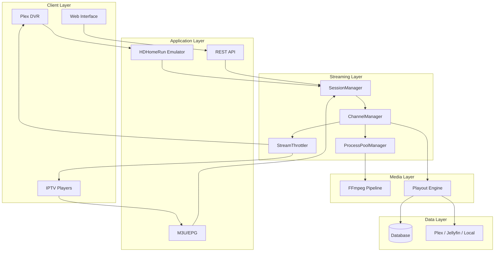

The flow is simple: clients connect through REST, M3U/EPG, or HDHomeRun; a session is tracked; the channel manager gets the requested channel’s stream from the playout engine and FFmpeg; the ProcessPoolManager controls how many FFmpeg processes run; and the StreamThrottler delivers data at a safe rate to clients.

### HDHomeRun Emulation in Plain Language

HDHomeRun is a physical TV tuner that broadcasts its presence on the local network. Media servers discover it, read its channel lineup, and request streams by “tuning” a channel number. EXStreamTV behaves the same way: it answers discovery requests, provides a lineup of your custom channels, and serves live MPEG-TS when a channel is tuned. Plex does not distinguish this from a real HDHomeRun.

---

## 2. How Streaming Works

### Channel Lifecycle

Each channel runs continuously in the background. When you enable a channel:

1. The channel manager starts a stream for that channel.
2. The playout engine decides what to play and when (based on schedules).
3. FFmpeg transcodes the current media item to MPEG-TS.
4. Clients receive the stream through the throttler.

If a client tunes a channel that is already running, they share the same FFmpeg output. Multiple clients can watch the same channel without spawning additional FFmpeg processes.

### FFmpeg Process Management

All FFmpeg processes go through the ProcessPoolManager. It is the single place that decides when to spawn or release FFmpeg. No other component starts FFmpeg directly.

The ProcessPoolManager:

- Enforces a global limit on processes (from config, memory, and file-descriptor limits).
- Rate-limits how quickly new processes can start (token bucket, default 5 per second).
- Checks memory and file descriptor usage before spawning.
- Detects zombie processes (exited but not cleaned up) and long-running processes (default: over 24 hours) and releases them.

If a spawn is rejected (e.g., memory too high or capacity reached), the request fails and the circuit breaker may record a failure for that channel.

### ProcessPoolManager Role

The ProcessPoolManager (`exstreamtv/streaming/process_pool_manager.py`):

- `acquire_process(channel_id, ffmpeg_cmd, timeout_seconds)` — Reserves a slot, runs guards, rate-limits, spawns FFmpeg, registers the process.
- `release_process(channel_id)` — Stops FFmpeg, unregisters, releases the slot.

The mpegts_streamer calls `acquire_process` before streaming and `release_process` when done or on error.

### Health Monitoring

A background task runs every 30 seconds to check channel health:

- **Last output time** — If no stream output for more than 180 seconds, the channel is considered unhealthy.
- **Error rate** — High error counts in the last 5 minutes trigger warnings.

When a channel is unhealthy and auto-restart is enabled, the system may trigger a restart—but only if the restart guards allow it.

### Restart Safety

Restarts are not unbounded. Three mechanisms limit them:

1. **Global throttle** — At most 10 restarts in any 60-second window. Exceeding this blocks all restarts.
2. **Per-channel cooldown** — A channel cannot be restarted again within 30 seconds of its last restart.
3. **Circuit breaker** — Per-channel: after 5 failures in a 300-second window, the circuit opens and blocks restarts for 120 seconds.

### CircuitBreaker Behavior

The circuit breaker has three states per channel:

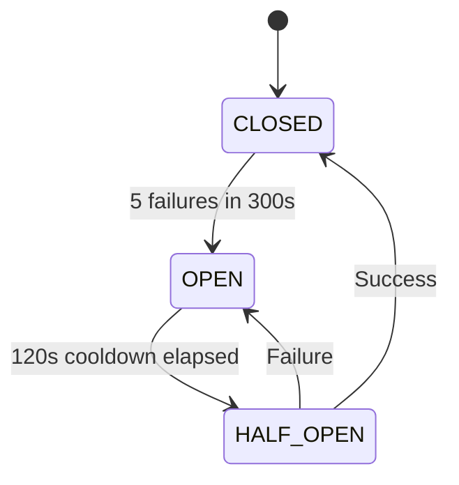

- **CLOSED** — Restarts are allowed. Failures are counted.
- **OPEN** — Restarts are blocked. The channel must wait 120 seconds.
- **HALF_OPEN** — After the cooldown, one restart is allowed. Success closes the circuit; failure reopens it.

### Why Restarts Are Bounded

Unbounded restarts can cause a “restart storm”: channels restart repeatedly, exhausting CPU, memory, and file descriptors. The throttle, cooldown, and circuit breaker prevent that. The system prefers stability over aggressive auto-recovery.

### Restart Decision Flow

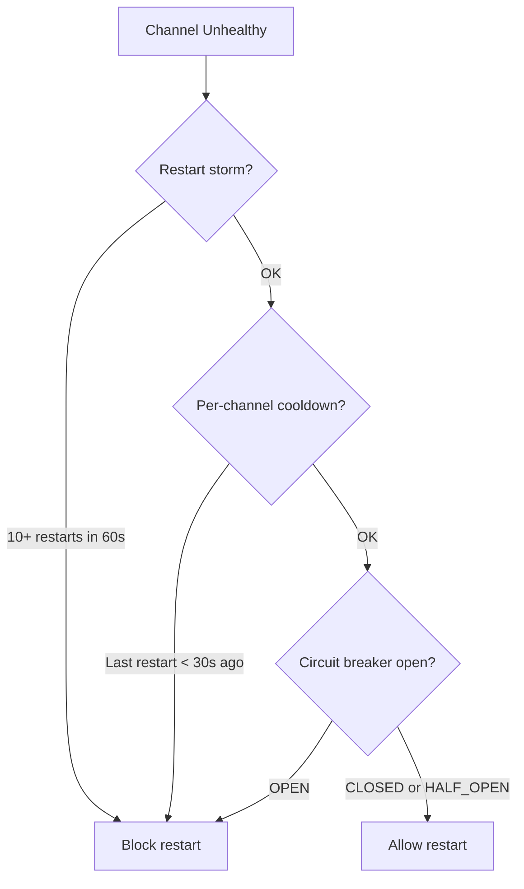

All restart requests—whether from the health task or the AI agent—go through `request_channel_restart` in `health_tasks.py`, which applies these checks.

### Stream Request Lifecycle

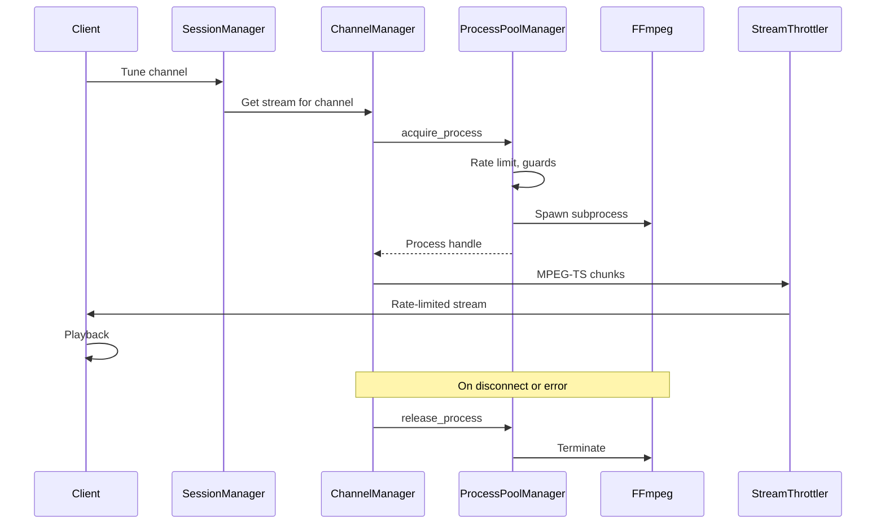

---

## 3. HDHomeRun Emulation

### discover.json

When Plex searches for tuners, it requests `/hdhomerun/discover.json`. EXStreamTV responds with a JSON object describing the virtual device:

- **FriendlyName** — Display name (e.g., "EXStreamTV").
- **ModelNumber** — Model identifier for compatibility.
- **DeviceID** — Exactly 8 hexadecimal characters (e.g., `E5E17001`).
- **BaseURL** — Base URL for HDHomeRun endpoints.
- **LineupURL** — URL to fetch the channel lineup.
- **GuideURL** — URL for EPG/guide data.
- **TunerCount** — Number of virtual tuners (default 4).

### lineup.json

The lineup is a JSON array of channel objects. Each entry has:

- **GuideNumber** — Channel number (used when tuning).
- **GuideName** — Channel name.
- **URL** — Stream URL for that channel (e.g., `/hdhomerun/tuner0/stream?...`).

Only enabled channels appear. Channels are ordered by number.

### Tuner Behavior

When Plex tunes a channel, it requests a URL like `/hdhomerun/tuner0/stream?channel=auto:v7` (where 7 is the guide number). EXStreamTV parses the channel number, maps it to the internal channel, and streams that channel’s output as MPEG-TS.

Tuner numbers must be in range (0 to tuner_count - 1). Plex typically uses `tuner0` for the first tune.

### DeviceID Requirements

Plex validates the DeviceID. It must be exactly 8 hexadecimal characters. Invalid IDs (e.g., `EXSTREAMTV`) cause “Could not Tune Channel” errors. The config validator normalizes invalid DeviceIDs to the default `E5E17001` and logs a warning.

### What Happens When Tuning a Channel

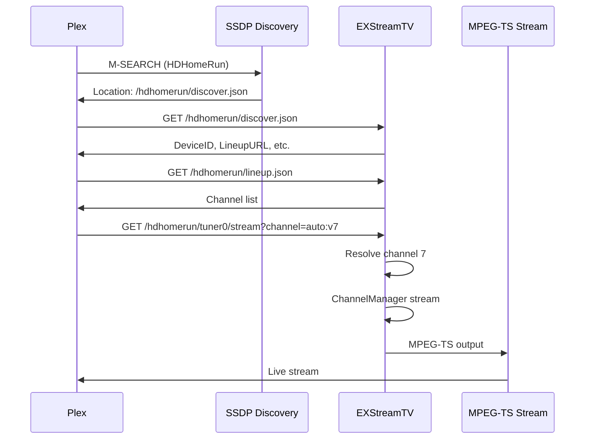

---

## 4. Metadata & XMLTV Pipeline

### Metadata Enrichment

Metadata (titles, episode numbers, years, descriptions) comes from multiple sources. The enricher tries them in order:

1. **TVDB** — Best for TV shows.
2. **TMDB** — Fallback or supplement.
3. **Local NFO files** — XML metadata beside media files.
4. **Filename extraction** — Patterns like `Show S01E02` or `Movie (2020)`.

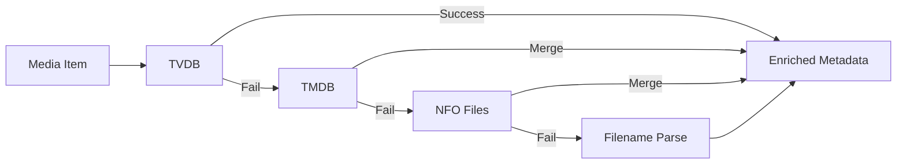

Each successful or failed lookup is counted for observability.

### Placeholder Detection

Some imports produce titles like `Item 12345` (internal IDs). The title resolver rejects these as placeholders. The XMLTV generator:

1. Checks if a title matches the `Item \d+` pattern.
2. Falls back to show/series title.
3. If still empty, uses `"{channel_name} — {timestamp}"`.

Placeholder usage is tracked per channel and overall for early warnings.

### Drift Detection

The metadata pipeline compares the current metadata failure ratio to the previous check. If the ratio increases by more than 0.1, a warning is logged. This is non-blocking: it does not stop streaming or EPG generation.

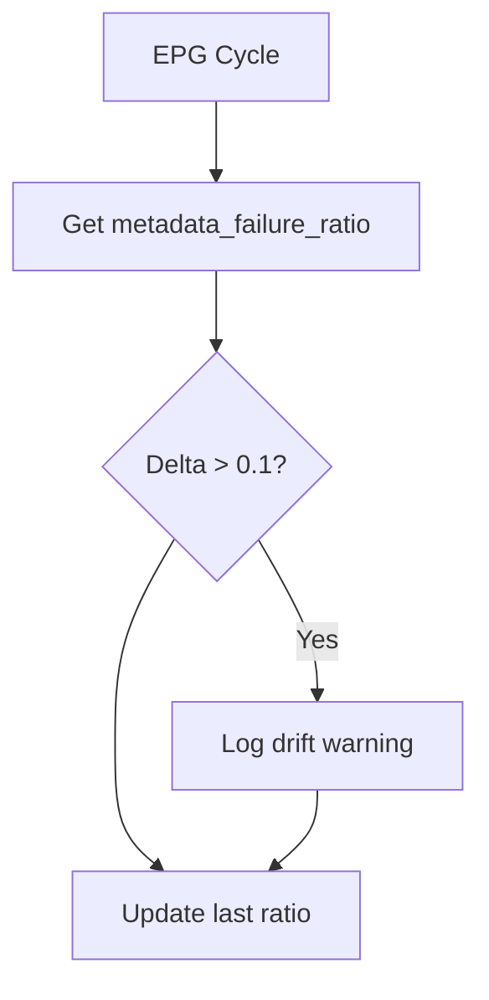

### Confidence Gating

The AI agent’s metadata tools require a minimum confidence (default 0.3) before running. If confidence is below the threshold, the tool is skipped unless explicitly overridden. On metadata tool failure, confidence decays (multiplied by 0.8, floor 0.1).

### XMLTV Generation

The XMLTV generator produces standard XMLTV for the EPG. It validates before emitting:

- **Monotonic times** — `start_time < stop_time` for each programme.
- **No overlaps** — `programme[i].stop_time <= programme[i+1].start_time`.
- **Required fields** — Non-empty title.
- **Datetime range** — Timestamps between 1970 and 2100.

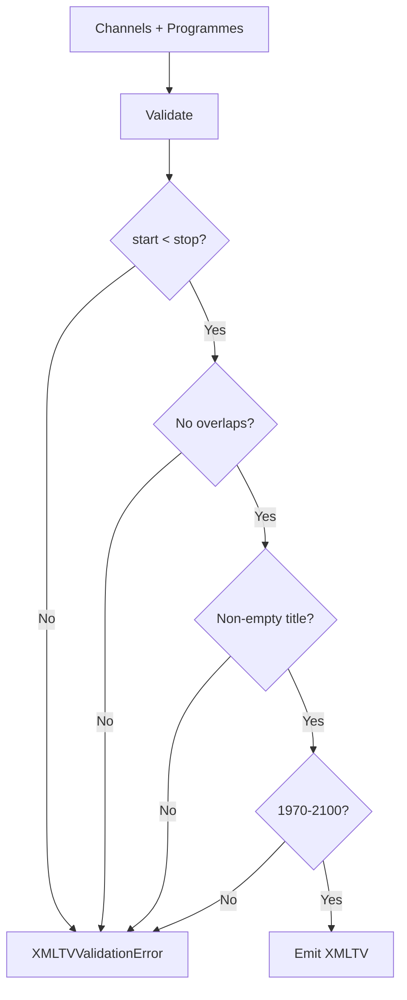

### Guide Corruption Prevention

The pipeline avoids corrupting the guide by:

- Rejecting placeholder titles and using safe fallbacks.
- Validating programme times and structure before emit.
- Cross-checking lineup vs. XMLTV (unique guide numbers, channel IDs, non-empty display names).

---

## 5. AI Agent & Safety Model

### What the Bounded Agent Is

The bounded agent is a deterministic loop that executes a small number of tools (diagnostic or remediation) based on context. It does not call LLMs for arbitrary actions. It does not perform database writes, tool-from-tool calls, or direct channel restarts. All restarts go through `health_tasks.request_channel_restart`.

### Why Autonomy Is Restricted

Unrestricted AI could restart channels repeatedly, overwrite data, or run expensive operations indefinitely. The bounded agent enforces:

- A maximum number of steps per run (default 3).
- A maximum of one HIGH-risk tool per loop.
- Cooldowns between tools (5 seconds normal, 30 seconds for metadata).
- Containment mode: when the system is unstable, the agent stops and escalates to the operator.

### How Tool Execution Works

Each tool has a risk class (LOW, MEDIUM, HIGH) and constraints (cooldown, retry cap, circuit breaker awareness). Before execution:

- Policy is checked (allow, deny, require_approval, require_evidence).
- HIGH-risk tools are limited to one per loop.
- Restart tools require failure classification and go through `request_channel_restart`.

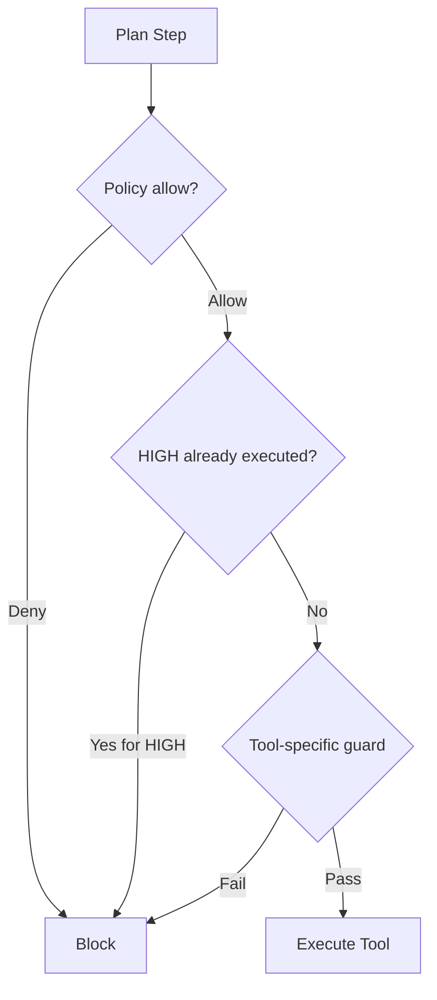

### Risk Levels

| Risk   | Tools                                  | Behavior                                      |
|--------|----------------------------------------|-----------------------------------------------|
| HIGH   | `restart_channel`                      | Max 1 per loop, circuit breaker aware         |
| MEDIUM | `rebuild_playout`                     | 120s cooldown, not implemented as action      |
| LOW    | Metadata tools, diagnostics            | 30s cooldown (metadata), 5s (diagnostics)     |

### Confidence Gating

Metadata tools require `confidence >= 0.3` (unless overridden). Confidence comes from pattern analysis. On failure:

```
new_confidence = max(0.1, confidence * 0.8)
```

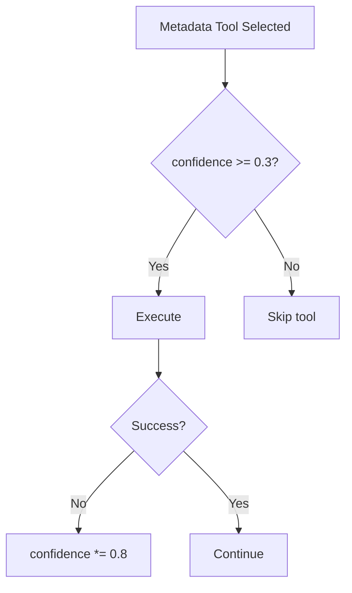

### Automatic Shutdown on Regression

After 3 consecutive metadata tool failures, the agent loop stops and escalates. It does not keep retrying. In metadata self-resolution, if the metadata failure ratio increases by more than 0.1 after an attempt, the system treats it as regression and can suspend further automatic resolution.

### Containment Mode

Containment mode disables the agent. It is triggered when:

- Restart velocity ≥ 10 restarts per 60 seconds.
- Pool pressure ≥ 0.9 (90% of FFmpeg capacity).
- Circuit breaker is OPEN for the channel.
- Long-run leak detection: RSS growth > 100 MB over the last 10 minutes.

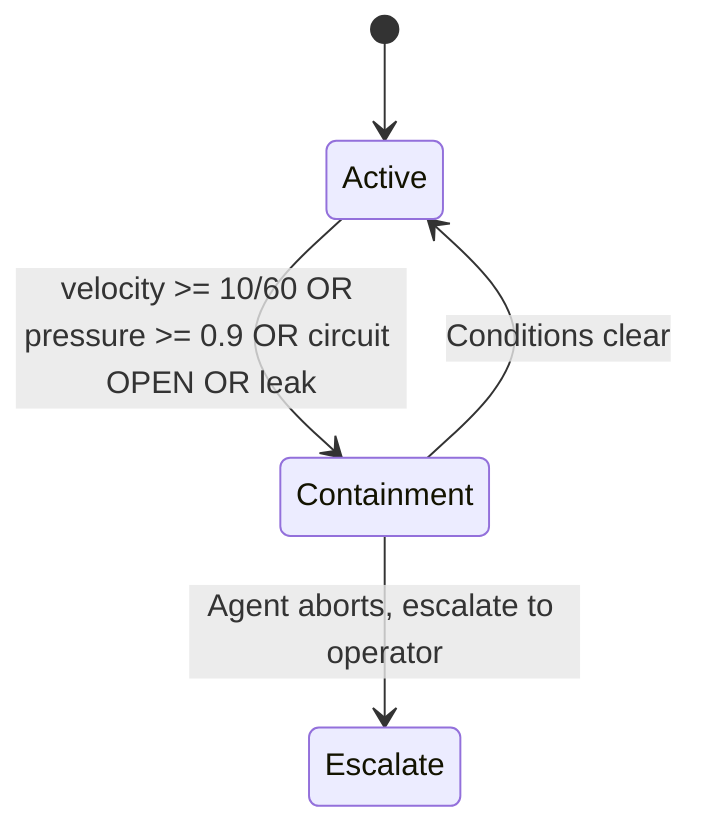

When containment is active, the agent loop exits immediately with an escalation message. No tools are executed.

---

## 6. Observability & Monitoring

### Prometheus Metrics

The `/metrics` endpoint exposes Prometheus text format. Metrics include:

#### FFmpeg Process Pool

| Metric                                     | Type   | Description                                  |
|--------------------------------------------|--------|----------------------------------------------|
| `exstreamtv_ffmpeg_processes_active`      | gauge  | Active FFmpeg processes                      |
| `exstreamtv_ffmpeg_spawn_pending`         | gauge  | Pending spawns                               |
| `exstreamtv_ffmpeg_spawn_rejected_total{reason}` | counter | Rejected spawns (memory, fd, capacity) |
| `exstreamtv_ffmpeg_spawn_timeout_total`   | counter | Spawn timeouts                             |
| `exstreamtv_ffmpeg_pool_pressure_events_total` | counter | Pool pressure events                    |

#### Per-Channel

| Metric                                 | Type   | Description                     |
|----------------------------------------|--------|---------------------------------|
| `exstreamtv_channel_restart_total{channel_id}` | counter | Restarts per channel     |
| `exstreamtv_stream_success_total{channel_id}` | counter | Successful streams     |
| `exstreamtv_stream_failure_total{channel_id}` | counter | Failed streams        |
| `exstreamtv_channel_memory_bytes{channel_id}`  | gauge  | Memory per channel      |
| `exstreamtv_circuit_breaker_state{channel_id}` | gauge  | 0=closed, 1=half_open, 2=open |

#### Stability

| Metric                                  | Type   | Description              |
|-----------------------------------------|--------|--------------------------|
| `exstreamtv_pool_acquisition_latency_seconds` | gauge | Pool acquisition time |
| `exstreamtv_restart_rate_per_minute`     | gauge  | Restart rate             |
| `exstreamtv_health_timeouts_total`      | counter | Health check timeouts  |
| `exstreamtv_playout_rebuild_total`       | counter | Playout rebuilds       |

#### System

| Metric                       | Type   | Description          |
|------------------------------|--------|----------------------|
| `exstreamtv_system_rss_bytes`| gauge  | Resident set size    |
| `exstreamtv_fd_usage`        | gauge  | Open file descriptors|
| `exstreamtv_event_loop_lag_seconds` | gauge | Event loop lag  |
| `exstreamtv_db_pool_checked_out`    | gauge | DB connections in use |
| `exstreamtv_db_pool_size`           | gauge | DB pool size          |

#### Metadata

| Metric                                           | Type   | Description                    |
|--------------------------------------------------|--------|--------------------------------|
| `exstreamtv_metadata_lookup_success_total`        | counter | Successful lookups          |
| `exstreamtv_metadata_lookup_failure_total`      | counter | Failed lookups             |
| `exstreamtv_placeholder_title_generated_total`   | counter | Placeholder titles used    |
| `exstreamtv_xmltv_validation_error_total`         | counter | XMLTV validation errors    |
| `exstreamtv_ai_metadata_resolution_attempt_total`  | counter | AI resolution attempts   |
| `exstreamtv_ai_metadata_resolution_success_total`   | counter | AI resolution successes  |
| `exstreamtv_ai_metadata_resolution_abort_total`     | counter | AI resolution aborts     |

### Alerting Philosophy

The codebase defines thresholds for external alerting (e.g., Prometheus Alertmanager):

- **Metadata failure ratio** — Warning at 0.3, critical at 0.5.
- **Placeholder ratio** — Warning at 0.2.
- **Restart velocity** — Warning at 0.5/min, critical at 2.0/min.
- **Pool pressure** — Critical at 0.9.

These are not enforced in-process; they are intended for observability stacks.

### Early Warning Signals

The metadata pipeline emits a single structured log per EPG cycle when:

- More than 5% of programmes lack episode number.
- More than 5% lack year.
- More than 10 programmes use placeholder titles.
- Metadata failure ratio exceeds 0.3.

---

## 7. Formal Invariants

### Restart Invariants

- **R1** — No more than 10 restarts in any 60-second window.
- **R2** — No channel restarts within 30 seconds of its previous restart.
- **R3** — When the circuit breaker is OPEN for a channel, no restart for that channel until cooldown (120s) elapses.
- **R4** — All restarts go through `request_channel_restart`; no direct `stop_channel`/`start_channel` from external callers.

### Streaming Invariants

- **S1** — All FFmpeg processes are acquired and released via ProcessPoolManager.
- **S2** — Process count never exceeds `min(config, memory-based, FD-based)`.
- **S3** — Spawn rate is limited by the token bucket (default 5/sec).
- **S4** — Memory and FD guards are checked before each spawn.

### Agent Invariants

- **A1** — No database writes by the agent loop.
- **A2** — No tool-from-tool calls; tools are executed sequentially.
- **A3** — At most one HIGH-risk tool per loop.
- **A4** — Containment mode blocks all tool execution.
- **A5** — Restart tools route through `health_tasks.request_channel_restart`.

### Async Invariants

- **U1** — No blocking I/O in the agent loop or envelope builder.
- **U2** — ProcessPoolManager uses asyncio.Lock for registry access.
- **U3** — Circuit breaker uses asyncio.Lock for state updates.

### Metadata Invariants

- **M1** — XMLTV validation runs before emit; invalid programmes raise XMLTVValidationError.
- **M2** — Placeholder titles (`Item \d+`) are never emitted; fallbacks are used.
- **M3** — Drift detection does not block EPG generation or streaming.

---

## 8. CI/CD & Deployment

### Test Enforcement

Tests use pytest with markers: `unit`, `integration`, `e2e`, `slow`, `ffmpeg`, `network`. Run focused suites:

```bash
pytest tests/unit/ tests/integration/ -v
pytest -m "not e2e and not slow" -v
```

### Regression Protection

- **Reliability tests** — `tests/reliability/test_streaming_stress.py` (restart guards, circuit breaker), `test_metadata_soak.py` (EPG loop, no spurious restarts), `test_platform_pytest.py` (HDHomeRun discover/lineup).
- **Safety invariant tests** — `tests/unit/test_section_a_safety_invariants.py`, `test_section_c_ai_gating.py`.

### Soak Tests

The script `scripts/soak_test.py` runs configurable-duration stress tests (default 24 hours). It tracks:

- Request counts, restarts, pool usage.
- Memory growth, recursion errors, restart storms.

Failure thresholds (configurable) include recursion errors, restart storms, and memory growth.

### Feature Flag Rollout

Feature flags are in `config.yaml` (see FEATURE_FLAGS.md). Bounded agent and metadata self-resolution are disabled by default. Enable them after validation in your environment.

### Deployment Options

- **Direct** — `./scripts/install_macos.sh`, then `./start.sh`.
- **Docker** — `docker-compose up` in `containers/docker`.
- **macOS App** — Build `EXStreamTVApp`, install to `/Applications`.

---

## 9. Operational Guide

### Diagnosing Issues

1. Check `/metrics` for restart rate, circuit breaker state, pool pressure.
2. Review logs for `ProcessPoolManager`, `Circuit breaker`, `Health check`.
3. If channels fail to tune, verify `discover.json` and `lineup.json` return valid JSON and DeviceID.

### Reading Logs

- **Channel health** — `Channel X no output for Ys` indicates stale stream; restart may be triggered.
- **Restart storm** — `Restart storm throttle` means the global limit was hit.
- **Circuit breaker** — `Circuit breaker OPEN for channel X` means restarts are blocked.
- **Metadata** — `EPG metadata early warning` or `Metadata drift` indicate enrichment or structural issues.

### Verifying Stream Health

- Use the web UI channel status.
- Query `exstreamtv_stream_success_total` and `exstreamtv_stream_failure_total` per channel.
- Ensure `last_output_time` is recent for active channels.

### Verifying HDHomeRun Compliance

- `GET /hdhomerun/discover.json` — DeviceID must be 8 hex chars.
- `GET /hdhomerun/lineup.json` — Non-empty array, unique GuideNumbers, non-empty URLs.
- If Plex reports “Could not Tune Channel,” re-add the DVR after fixing DeviceID.

### Verifying XMLTV Integrity

- Check `exstreamtv_xmltv_validation_error_total` — should be 0 in normal operation.
- Check `exstreamtv_xmltv_lineup_mismatch_total` — indicates lineup vs. XMLTV inconsistency.
- Fetch the EPG URL and validate structure if needed.

### Safely Disabling AI

Set in config:

- `ai_agent.enabled: false` — Disables all AI features.
- `ai_agent.bounded_agent_enabled: false` — Disables bounded agent (default).
- `ai_agent.metadata_self_resolution_enabled: false` — Disables metadata self-resolution (default).

---

## 10. Production Readiness & Safety Model

### Why Containment Over Automation

When the system is under stress (restart storms, high pool pressure, circuit breakers open), automation can worsen the situation. Containment mode stops the AI agent and escalates to the operator. Recovery is then human-driven.

### Why Bounded Loops Exist

Unbounded loops can run indefinitely and exhaust resources. The agent loop has a fixed maximum number of steps (default 3). No recursion, no tool-from-tool—each step is a single tool call.

### Why Automatic Shutdown Exists

Consecutive metadata tool failures suggest the remediation strategy is wrong. Continuing would waste resources and risk additional failures. Shutting down after 3 failures forces operator review.

### How Regression Detection Works

In metadata self-resolution, metrics before and after an attempt are compared. If the metadata failure ratio increases by more than 0.1, the change is treated as regression. The system can suspend automatic resolution to prevent further degradation.

---

## Related Documentation

- [README](README.md) — Quick start and overview.
- [System Design](architecture/SYSTEM_DESIGN.md) — Architecture details.
- [Streaming Stability](guides/STREAMING_STABILITY.md) — Session management, throttling, error screens.
- [AI Setup](guides/AI_SETUP.md) — AI configuration and bounded agent.
- [Observability](OBSERVABILITY.md) — Full metrics reference.
- [Feature Flags](FEATURE_FLAGS.md) — Config toggles.
