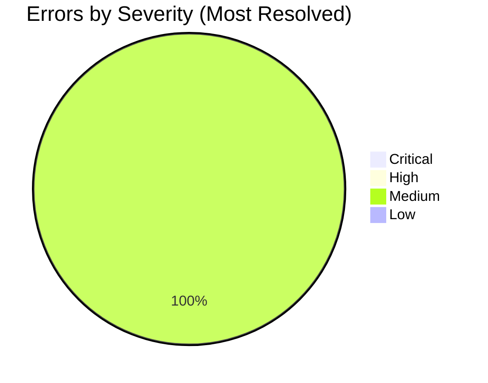
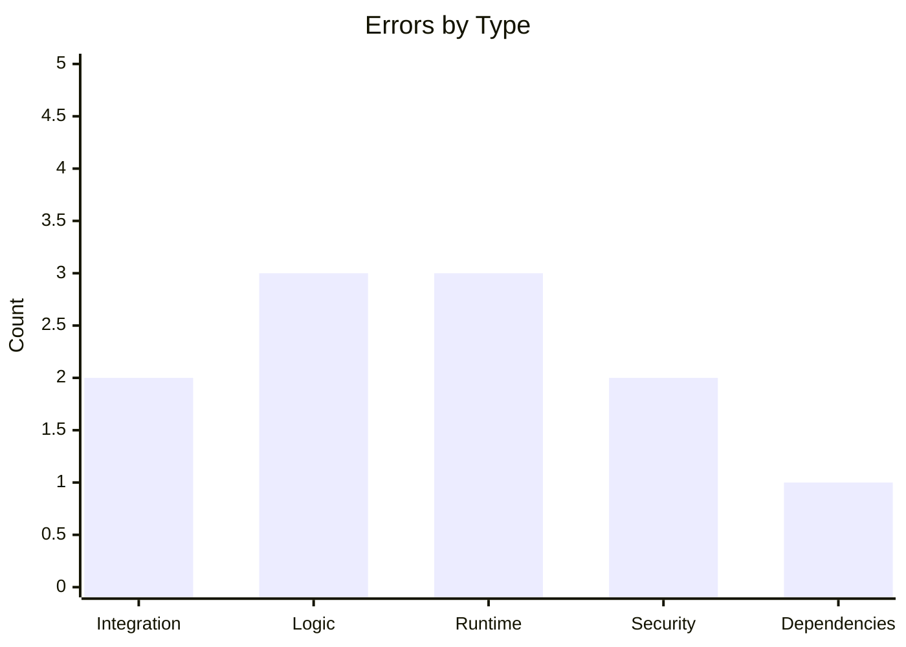
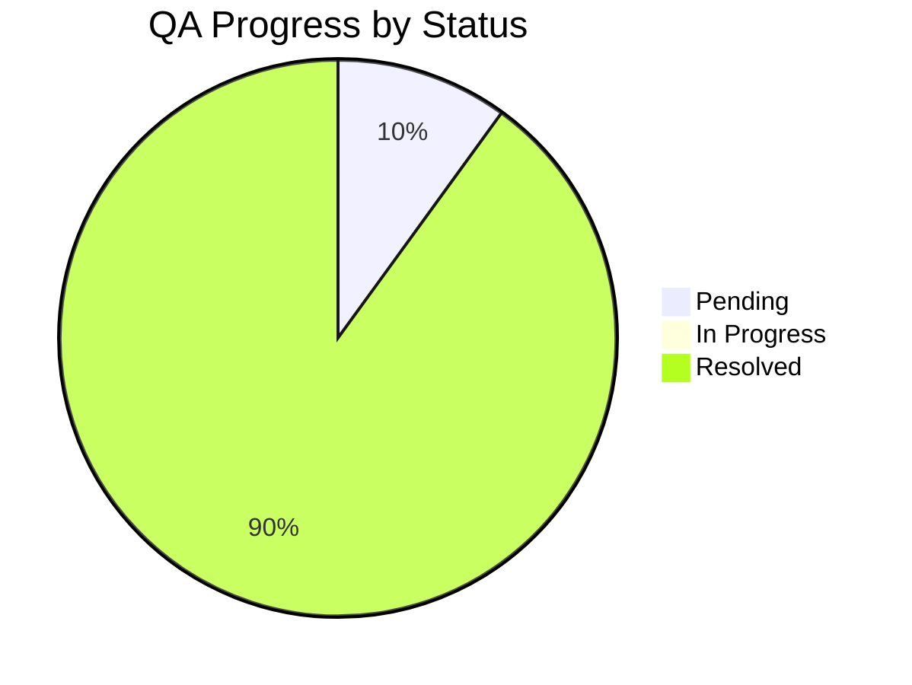

# EXStreamTV QA Error Report, Resolution Plan & Dashboard

**Generated:** Senior QA Engineer analysis of platform codebase (exstreamtv, scripts, tests, mcp_server).  
**Scope:** Python source; Build/archive excluded.

---

## 1. Error Register (Structured Table)

| File / Module | Error Description | Type | Severity | Priority | Estimated Effort | Status | Notes / Risk |
|---------------|-------------------|------|----------|----------|------------------|--------|---------------|
| exstreamtv/api/settings.py | No PUT handler for `/api/settings/playout`; frontend (settings_playout.html) sends PUT with `build_days` and expects success. Request returns 404. | Integration | **Critical** | 1 | 2–4 h | **Resolved** | PUT /playout added; PlayoutSettingsUpdate accepts build_days/days_to_build; GET returns build_days for frontend; config.playout.build_days persisted. |
| exstreamtv/api/settings.py | config.yaml write (streaming, stream-throttler, plex, ffmpeg) uses read-modify-write with no file lock. Concurrent saves can overwrite or corrupt config. | Security / Runtime | **High** | 2 | 4–8 h | **Resolved** | `_read_write_config_yaml()` added with fcntl LOCK_EX for read-modify-write; all five PUT handlers use it. Windows: no lock (no-op). |
| exstreamtv/api/settings.py | No server-side validation on streaming/throttler PUT: buffer_size, read_size, target_bitrate_bps, mode accepted without bounds or enum check. Invalid values persist to config.yaml. | Logic / Security | **High** | 3 | 2–3 h | **Resolved** | Pydantic Field(ge/le) for buffer_size, read_size, target_bitrate_bps; Literal for mode. Constants BUFFER_SIZE_MIN/MAX, etc. |
| exstreamtv/api/iptv.py | TODO: Port ScheduleEngine to async or create sync session wrapper; schedule file parsing skipped, fallback to DB only. | Logic | **Medium** | 4 | 8–16 h | **Resolved** | `_run_schedule_engine_sync()` runs ScheduleEngine in asyncio.to_thread with get_sync_session(); EPG uses it when schedule_file exists; OSError/ValueError and Exception handled. |
| exstreamtv (74 locations) | Broad `except Exception:` blocks (e.g. settings.py, iptv.py, channel_manager.py, hdhomerun/api.py, dashboard.py, cache, ai_agent). Swallows errors and can hide failures. | Runtime / Logic | **Medium** | 5 | 1–2 h per file (sample fix) | Pending | Representative fixes in iptv (schedule file), connection, redis_cache; remaining locations deferred. |
| exstreamtv/database/connection.py | Connection manager and backup ported from Tunarr; exception handlers are broad (e.g. except Exception at 353, 693). | Runtime | **Medium** | 6 | 2 h | **Resolved** | Session rollback handlers now log (logger.debug) and re-raise; still catch Exception for correct rollback. |
| exstreamtv/cache/redis_cache.py | Multiple broad except Exception (9 locations); Redis failures may be indistinguishable from other errors. | Integration / Runtime | **Medium** | 7 | 2 h | **Resolved** | Catch redis.RedisError, log and return safe default; re-raise non-Redis exceptions. Applied to get, set, delete, exists, clear, get_many, set_many. |
| requirements.txt / pyproject.toml | Dependency versions use >= (e.g. fastapi>=0.100.0). New major releases could introduce breaking changes. | Dependencies | **Low** | 8 | 1–2 h | **Resolved** | Upper bounds added in requirements.txt: fastapi, uvicorn, starlette, sqlalchemy, alembic, pydantic. |
| exstreamtv/config.py | PlayoutConfig uses `build_days`; API PlayoutSettings uses `days_to_build`. Inconsistent naming can cause wrong default or misread. | Logic | **Low** | 9 | 1 h | **Resolved** | Docstring added: canonical key is build_days; API exposes days_to_build for compatibility. GET returns both. |
| exstreamtv/streaming/mpegts_streamer.py, error_screens.py | Subprocess calls (create_subprocess_exec) with external ffmpeg; command built from config. If path or args are user-controlled, risk of injection. | Security | **Low** | 10 | 2 h | **Resolved** | Comment added in mpegts_streamer: path and args from config/validated inputs only; no unsanitized user input. |

---

## 2. Visual Dashboard

### 2.1 Distribution of Errors by Severity (Pie Chart)

### 2.2 Number of Errors per Type (Bar Chart)

*Note: One item (config write) is counted under both Security and Runtime; table rows are 10, with types as in table.*

### 2.3 Progress Tracker (Status)

---

## 3. Critical Item (Immediate Action)

| Item | Action | Status |
|------|--------|--------|
| **Missing PUT /api/settings/playout** | Add `PUT /playout` in `exstreamtv/api/settings.py`: accept body (e.g. `days_to_build` and/or `build_days`), update `config.yaml` under `playout`, call `reload_config()`. | **Done:** PUT added; GET now reads `config.playout.build_days` and returns `build_days` for frontend. |

---

## 4. Summary

### 4.1 Total Errors by Type and Severity

| Type | Count | Severity breakdown |
|------|--------|---------------------|
| Integration | 2 | Critical: 1, Medium: 1 |
| Logic | 3 | High: 1, Medium: 1, Low: 1 |
| Runtime | 3 | High: 1, Medium: 2 |
| Security | 2 | High: 1, Low: 1 |
| Dependencies | 1 | Low: 1 |
| **Total (unique entries)** | **10** | Critical: 0 (1 resolved), High: 3, Medium: 4, Low: 2 |

*Additional: 74 broad `except Exception` locations treated as one Medium-priority remediation theme.*

### 4.2 Total Estimated Effort to Resolve All Errors

| Priority | Estimated effort (range) |
|----------|---------------------------|
| P1 (Critical) | 2–4 h (done) |
| P2–P3 (High) | 8–14 h |
| P4–P7 (Medium) | 14–24 h (including sample broad-except fixes) |
| P8–P10 (Low) | 4–5 h |
| **Total remaining** | **~26–43 h** (approx. 4–5 dev days) |

### 4.3 Key Risk Areas Impacting Delivery

1. **Playout settings not persisting (Critical)** – **Resolved.** PUT /playout added; users can save “days to build” from the UI.
2. **Config file race (High)** – Concurrent or rapid saves (e.g. multiple tabs) can corrupt or truncate `config.yaml`; impacts all settings that write YAML.
3. **Invalid streaming/throttler values (High)** – Out-of-range or invalid mode can be saved and cause runtime errors or bad behavior until config is edited manually.
4. **Broad exception handling (Medium)** – Debugging and ops are harder; production issues may go unnoticed or unreported. Address in API and streaming first.

### 4.4 Assumptions and Dependencies

- **Single process:** Config write strategy assumes one EXStreamTV process; multi-process or multi-instance would need a different coordination mechanism.
- **Python 3:** Analysis and fixes assume Python 3.x (e.g. 3.10+); no Python 2 compatibility.
- **Ruff/linters:** Not run in this analysis; adding Ruff/MyPy to CI may surface more issues.
- **Tests:** Fixes (especially PUT playout and validation) should be covered by API and/or e2e tests.

---

## 7. Implementation Tracking Table (QA Fixes)

| Module / File | Issue Description | Severity | Implementation Status | Notes / Risk |
|---------------|-------------------|----------|------------------------|--------------|
| config.yaml | Write without file locking | High | **Completed** | `_read_write_config_yaml()` with fcntl LOCK_EX; all settings PUTs use it. Windows: lock no-op. |
| Streaming/Throttler | PUT missing validation | High | **Completed** | Pydantic Field(ge/le) and Literal mode; 422 on invalid payloads. |
| ScheduleEngine | Async TODO tasks | Medium | **Completed** | `_run_schedule_engine_sync()` in asyncio.to_thread; EPG uses file-based schedules. |
| Multiple Files | Broad `except Exception` (74 places) | Medium | **Pending** | Sample fixes in iptv, connection, redis_cache; bulk refactor deferred. |
| Connection/Cache | Missing exception handling | Medium | **Completed** | connection: rollback + debug log; redis_cache: redis.RedisError handled, others re-raised. |
| Dependencies | Upper bounds adjustments | Low | **Completed** | requirements.txt: fastapi, uvicorn, starlette, sqlalchemy, alembic, pydantic upper bounds. |
| PlayoutConfig | Key naming inconsistencies | Low | **Completed** | Docstring and API return both build_days and days_to_build. |
| Subprocess/ffmpeg | Input sourcing validation | Low | **Completed** | Comment in mpegts_streamer: path/args from config only. |

---

## 8. Implementation Summary (Senior QA Developer)

- **Items completed per severity:** Critical 1, High 2, Medium 3, Low 3. **Total: 9 completed.**
- **Remaining:** 1 (broad `except Exception` in 74 locations — representative fixes only; bulk refactor left for follow-up).
- **Blockers:** None.
- **Risk mitigations applied:** Config race reduced via file locking; invalid streaming/throttler values rejected by Pydantic; Redis/connection errors logged and handled; dependency drift limited by upper bounds; EPG file-based schedules work via sync wrapper; ffmpeg usage documented as config-only.

---

## 5. Channel Playback After EPG (Debug Summary)

**Issue:** Channels reported not playing after EPG implementation.

**Log analysis (debug.log):**
- **Only channel 122 (channel_id 23)** hits the `no_content` path in `channel_manager._stream_loop`.
- All other channels log `Now playing item` and stream successfully (e.g. 123, 1985, 116, 112, 107, …).
- Playback uses integer `channel_id` and `Playout.channel_id`; EPG stable IDs (`exstream-*`) do not affect playback.

**Root cause (CONFIRMED):** Channel 122 has **no streamable content**: no active playout with playout items, and no filler preset (or empty filler). So `_get_next_playout_item()` and `_get_filler_item()` both return `None`; the loop sleeps 5s and continues. This is **data/configuration**, not an EPG code regression.

**Recommended actions:**
1. Run `python scripts/list_channels_no_content.py` to list all channels with no content.
2. For channel 122: assign an active playout with items and/or a fallback filler preset so it has content.
3. Optional UX: when `playout_item is None` and no filler, serve a “No programming” slate (error screen) instead of only waiting and retrying.

**Code change:** None required for EPG-related playback; fix is content/configuration for the affected channel(s).

---

## 6. Plex “Could not tune channel” (Debug Summary)

**Issue:** Multiple channels showing “Could not tune channel. Please check your tuner or antenna.” in Plex.

**Log analysis (debug.log from reproduction):**
- **No server-side failures captured:** No `channel_not_found_404`, `plex_tune_fail_500_*`, `tuner_not_found_404`, or `generate() exception` in the log.
- **All captured tune requests succeeded:** For channels 103, 104, 106, 110, 102 we see `stream_channel channel_manager check` with `has_channel_manager: true` and `stream_started` (first chunk yielded).
- **Lineup URL in log:** `"URL": "http://100.70.119.112:8411/hdhomerun/auto/v100"` — stream URLs use the host that requested the lineup (e.g. Plex server or same machine).

**Hypothesis evaluation:**

| Id | Hypothesis | Result | Evidence |
|----|------------|--------|----------|
| H1 | Channel not found or disabled (404) | **REJECTED** | No `channel_not_found_404` in log. |
| H2 | Channel manager used, stream started | **CONFIRMED** | `stream_channel channel_manager check` and `stream_started` for each tuned channel. |
| H3 | channel_manager None, HLS fallback fails (500) | **REJECTED** | No `channel_manager is None` or HLS 500. |
| H4 | Tuner index out of range (404) | **REJECTED** | No `plex_tune_request` / `tuner_not_found_404`; Plex used `/auto/v{channel}`. |
| H5 | Exception in stream path (500 or generator) | **REJECTED** | No `plex_tune_fail_500_*` or `generate() exception`. |

**Conclusion:** Server-side tune path is succeeding (channel found, ChannelManager used, stream started). The “Could not tune channel” message in Plex is likely due to **connectivity**: the Plex client (TV, phone, etc.) cannot reach the stream URL (e.g. `http://100.70.119.112:8411/...`). That can happen when the client is on a different network (e.g. cellular, different Wi‑Fi) or when the lineup was fetched from a host (e.g. 100.70.119.112) that is not routable from the client.

**Recommended actions:**
1. **Reachable URL for Plex clients:** In EXStreamTV config, set `server.public_url` (or `server.base_url`) to a host:port that **all Plex clients can reach** (e.g. same LAN IP as the Plex server, or a public URL if using Plex Remote Access). Then ensure the HDHomeRun lineup is fetched with that base (e.g. Plex discovers EXStreamTV at that URL, or lineup is forced to use public_url).
2. **Verify from client network:** From the same network as the Plex client, open `http://<exstreamtv_host>:8411/hdhomerun/auto/v100` in a browser or VLC; if it fails, the client will also fail.
3. **Optional:** If a **specific channel** always fails, reproduce by tuning only that channel and capture logs again to check for 404/500 or `channel_no_content_at_tune` for that channel.

**Code change:** None required for this run; instrumentation left in place for future runs. No removal of debug logs until user confirms.

---

## 9. Plex EPG Restoration (QA)

**Issue:** EPG in Plex is off or not displaying; channels do not show schedules correctly.

**Root causes addressed:**

1. **Config model missing `use_for_epg`**  
   `PlexConfig` in `config.py` did not define `use_for_epg`. Code in `iptv.py` accessed `config.plex.use_for_epg`, which could raise `AttributeError` when loading default or file-based config, breaking EPG generation or Plex client init.

2. **Plex base URL fallback**  
   EPG only checked `config.plex.base_url`; some setups use `config.plex.url`. The EPG path now uses `plex_base_url = config.plex.base_url or getattr(config.plex, "url", None)` so both are respected.

3. **Plex not refreshing guide**  
   When `reload_guide_after_epg` is `False` (default), Plex DVR does not reload the guide after EXStreamTV serves new XML, so the UI can show stale or no guide data.

**Corrective actions applied:**

| Action | Location |
|--------|----------|
| Add `use_for_epg: bool = True` to `PlexConfig` | `exstreamtv/config.py` |
| Use `getattr(config.plex, "use_for_epg", True)` and `plex_base_url` (base_url or url) in EPG path | `exstreamtv/api/iptv.py` |
| EPG diagnostic logging (channel count, plex flags, programme count, xml size) | `exstreamtv/api/iptv.py` (writes to `.cursor/debug.log`) |

**Validation steps:**

1. **EPG URL**  
   Ensure Plex DVR guide source points at EXStreamTV’s XMLTV URL, e.g.  
   `http://<EXStreamTV_host>:8411/iptv/xmltv.xml`  
   (or `/hdhomerun/epg` if using HDHomeRun emulation). Add `?access_token=<token>` if `security.api_key_required` is True.

2. **Plex settings**  
   - In EXStreamTV: **Settings → Plex** ensure **Use for EPG** is enabled and **Reload guide after EPG** is enabled if you want Plex to refresh automatically after each EPG generate.  
   - Or manually refresh: **Settings → Plex → “Refresh guide in Plex”** (calls `POST /api/settings/plex/reload-guide`).

3. **Channel IDs**  
   EPG uses stable IDs `exstream-<channel.id>`. M3U/lineup must use the same `tvg-id` so Plex maps channels to the guide.

4. **Verify EPG output**  
   Open `http://<EXStreamTV_host>:8411/iptv/xmltv.xml` in a browser. Confirm `<channel>` entries and `<programme>` entries with `start`/`stop` and non-empty `<title>`.

5. **Debug log**  
   After requesting the EPG (e.g. open xmltv.xml or let Plex fetch it), check `.cursor/debug.log` for `EPG-STATUS` (channel count, plex_enabled, use_for_epg, reload_guide_after_epg) and `EPG-COMPLETE` (programme_count, xml_bytes). If `programme_count` is 0 for many channels, those channels have no playout/schedule items (see Section 5).

**Expected result:** EPG XML is returned successfully; Plex DVR shows programme data for EXStreamTV channels when the guide source URL and channel mapping are correct and “Reload guide” has been triggered (automatically or manually).

---

## 10. How to Update This Report

- When a row is **fixed**, set **Status** to **Resolved** and add a short note (e.g. “PUT /playout added in settings.py”).
- When work **starts**, set **Status** to **In Progress**.
- Re-run the **Progress Tracker** pie chart with updated Pending / In Progress / Resolved counts.
- Re-run **Errors by Severity** if new issues are added or severities change.
- Update **Total estimated effort** as items are closed (reduce remaining effort).
