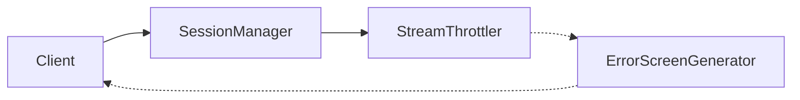
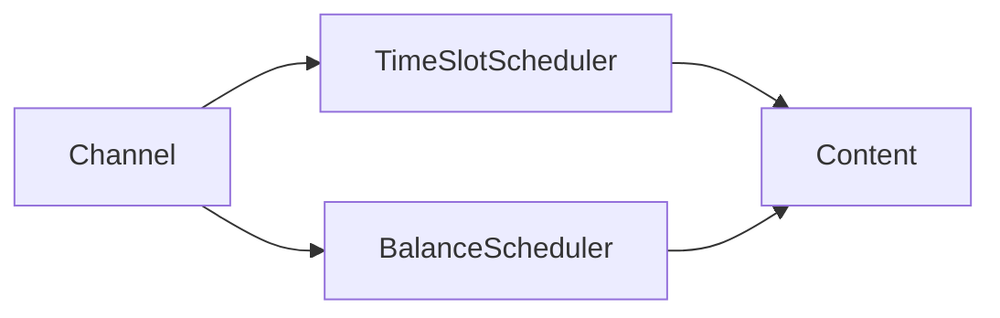
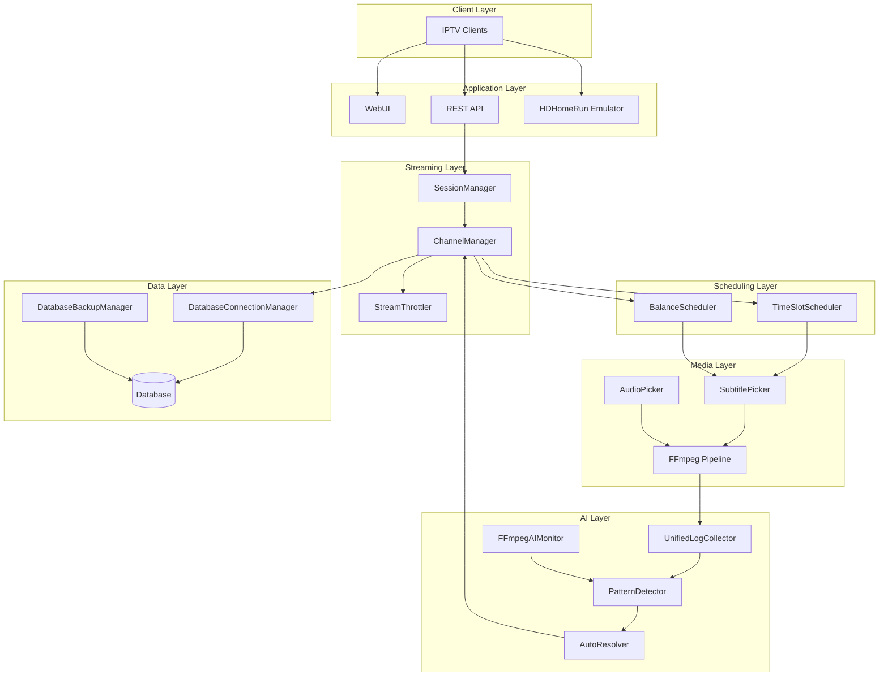

# EXStreamTV Documentation

**Version:** 2.6.0  
**Last Updated:** 2026-02-21

Welcome to the EXStreamTV documentation. This guide will help you set up, configure, and use EXStreamTV for your IPTV streaming needs.

---

## Quick Links

| Document | Description |
|----------|-------------|
| [Platform Guide](PLATFORM_GUIDE.md) | Full architecture, streaming, HDHomeRun, AI, observability |
| [Quick Start](guides/QUICK_START.md) | Get started in 10 minutes |
| [Installation](guides/INSTALLATION.md) | Complete installation guide |
| [API Reference](api/README.md) | REST API documentation |
| [System Design](architecture/SYSTEM_DESIGN.md) | Architecture overview |

---

## Documentation Structure

```
docs/
├── README.md                    # This file
├── PLATFORM_GUIDE.md            # Master platform document (architecture, streaming, AI, observability)
├── OBSERVABILITY.md             # Prometheus metrics reference
├── OPERATIONAL_GUIDE.md         # Diagnosis and verification
├── INVARIANTS.md                # Formal invariants
├── FEATURE_FLAGS.md             # Config toggles
├── VERSION                      # Documentation version
├── CHANGELOG.md                 # Documentation changes
│
├── guides/                      # User Guides
│   ├── QUICK_START.md          # Getting started
│   ├── INSTALLATION.md         # Installation
│   ├── AI_SETUP.md             # AI configuration
│   ├── CHANNEL_CREATION_GUIDE.md # Channel creation
│   ├── LOCAL_MEDIA.md          # Local media setup
│   ├── HW_TRANSCODING.md       # Hardware transcoding
│   ├── MACOS_APP_GUIDE.md      # macOS app
│   ├── NAVIGATION_GUIDE.md     # UI navigation
│   ├── ONBOARDING.md           # Onboarding
│   ├── STREAMING_STABILITY.md  # Streaming features (NEW)
│   └── ADVANCED_SCHEDULING.md  # Scheduling features (NEW)
│
├── api/                         # API Documentation
│   └── README.md               # Complete API reference
│
├── architecture/                # Architecture Documentation
│   ├── SYSTEM_DESIGN.md        # System architecture
│   └── TUNARR_DIZQUETV_INTEGRATION.md # v2.6.0 integration (NEW)
│
├── development/                 # Development Documentation
│   └── DISTRIBUTION.md         # Distribution guide
│
├── confluence/                  # Confluence-Ready Documentation (NEW)
│   ├── README.md               # Upload instructions
│   ├── 00-HOME.confluence.md   # Documentation home
│   ├── 01-SYSTEM-DESIGN.confluence.md
│   ├── 02-TUNARR-INTEGRATION.confluence.md
│   ├── 03-API-REFERENCE.confluence.md
│   ├── 04-STREAMING-STABILITY.confluence.md
│   ├── 05-ADVANCED-SCHEDULING.confluence.md
│   ├── 06-AI-SETUP.confluence.md
│   ├── 07-QUICK-START.confluence.md
│   └── 08-BUILD-PROGRESS.confluence.md
│
└── BUILD_PROGRESS.md           # Build tracking
```

---

## Getting Started

### New Users

1. **[Installation Guide](guides/INSTALLATION.md)** - Install EXStreamTV on your system
2. **[Quick Start](guides/QUICK_START.md)** - Create your first channel in 10 minutes
3. **[AI Setup](guides/AI_SETUP.md)** - Configure AI for smart channel creation

### Intermediate Users

1. **[Channel Creation Guide](guides/CHANNEL_CREATION_GUIDE.md)** - Advanced channel options
2. **[Local Media Setup](guides/LOCAL_MEDIA.md)** - Add your own media libraries
3. **[Hardware Transcoding](guides/HW_TRANSCODING.md)** - GPU acceleration setup

### Advanced Users

1. **[Advanced Scheduling](guides/ADVANCED_SCHEDULING.md)** - Time slots and balance scheduling
2. **[Streaming Stability](guides/STREAMING_STABILITY.md)** - Session management and throttling
3. **[API Reference](api/README.md)** - Build integrations

---

## New in v2.6.0

EXStreamTV v2.6.0 introduces major enhancements from the Tunarr/dizqueTV integration:

### Streaming Stability



- **Session Management** - Track and manage client connections
- **Stream Throttling** - Prevent buffer overruns
- **Error Screens** - Graceful fallback during failures

📖 [Streaming Stability Guide](guides/STREAMING_STABILITY.md)

### Advanced Scheduling



- **Time Slot Scheduling** - Time-of-day programming blocks
- **Balance Scheduling** - Weight-based content distribution

📖 [Advanced Scheduling Guide](guides/ADVANCED_SCHEDULING.md)

### AI Self-Healing


- **Unified Log Collector** - Multi-source log aggregation
- **FFmpeg AI Monitor** - Intelligent process monitoring
- **Pattern Detector** - ML-based issue detection
- **Auto Resolver** - Autonomous issue resolution

📖 [AI Setup Guide](guides/AI_SETUP.md#ai-self-healing-system-new-in-v260)

### Database Backup

- **Scheduled Backups** - Automatic daily backups
- **Backup Rotation** - Keep N most recent
- **Compression** - Gzip for space savings
- **Easy Restore** - One-click restoration

📖 [AI Setup Guide](guides/AI_SETUP.md#database-backup-new-in-v260)

---

## Architecture Overview



📖 [System Design](architecture/SYSTEM_DESIGN.md) | [Tunarr/dizqueTV Integration](architecture/TUNARR_DIZQUETV_INTEGRATION.md)

---

## API Overview

The EXStreamTV API provides complete control over your streaming server:

| Category | Endpoints | Description |
|----------|-----------|-------------|
| Channels | `/api/channels` | Channel CRUD, filler, deco |
| Playlists | `/api/playlists` | Playlist management |
| Schedules | `/api/schedules` | Schedule configuration |
| Playouts | `/api/playouts` | Playout control |
| Blocks | `/api/blocks` | Time-based blocks |
| Templates | `/api/templates` | Reusable schedules |
| AI | `/api/ai` | AI self-healing, health |
| System | `/api/health` | System monitoring |

📖 [Complete API Reference](api/README.md)

---

## Component Versions

| Component | Version | Last Modified |
|-----------|---------|---------------|
| backend_core | 2.6.0 | 2026-01-31 |
| streaming | 2.6.0 | 2026-01-31 |
| database | 2.6.0 | 2026-01-31 |
| ai_agent | 2.6.0 | 2026-01-31 |
| scheduling | 2.6.0 | 2026-01-31 |
| ffmpeg | 2.6.0 | 2026-01-31 |
| docs | 2.6.0 | 2026-01-31 |

---

## Confluence Export

All documentation is available in Confluence-ready format in the `confluence/` folder.

### Confluence Files

| File | Description |
|------|-------------|
| `00-HOME.confluence.md` | Documentation home page |
| `01-SYSTEM-DESIGN.confluence.md` | System architecture |
| `02-TUNARR-INTEGRATION.confluence.md` | v2.6.0 integration details |
| `03-API-REFERENCE.confluence.md` | REST API documentation |
| `04-STREAMING-STABILITY.confluence.md` | Streaming features |
| `05-ADVANCED-SCHEDULING.confluence.md` | Scheduling features |
| `06-AI-SETUP.confluence.md` | AI configuration |
| `07-QUICK-START.confluence.md` | Getting started |
| `08-BUILD-PROGRESS.confluence.md` | Development status |

### Upload Instructions

1. Install the "Mermaid Diagrams for Confluence" app
2. Create a new page in Confluence
3. Use "Insert" → "Markup" → "Markdown"
4. Copy/paste content from `.confluence.md` files

See `confluence/README.md` for detailed instructions.

---

## Support

- **GitHub Issues**: Report bugs and request features
- **Documentation**: This documentation site
- **Logs**: Check `Settings > Logs` for troubleshooting

---

## Related Resources

- [CHANGELOG](../CHANGELOG.md) - Version history
- [CONTRIBUTING](../CONTRIBUTING.md) - Contribution guidelines
- [LICENSE](../LICENSE) - MIT license
