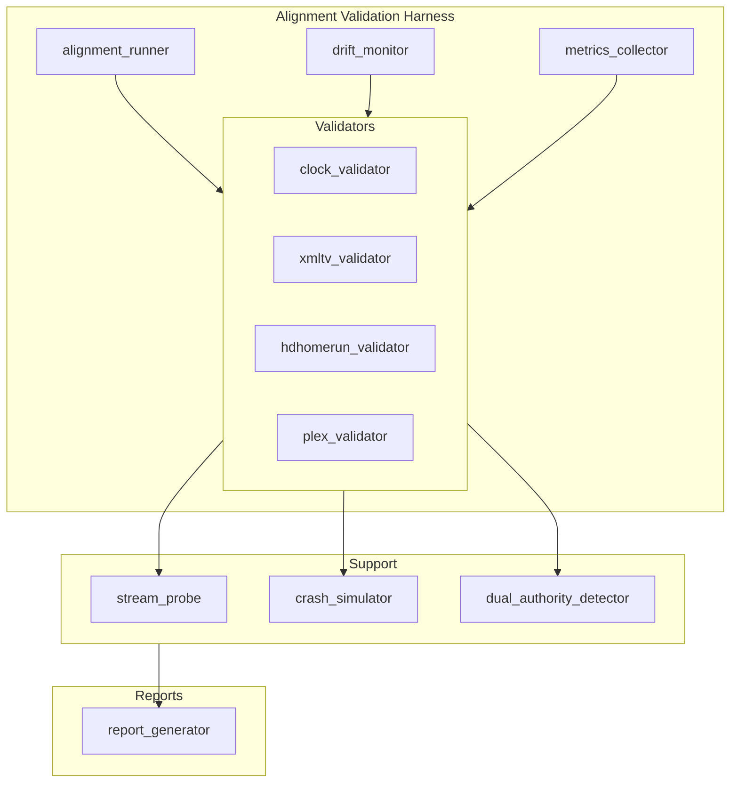
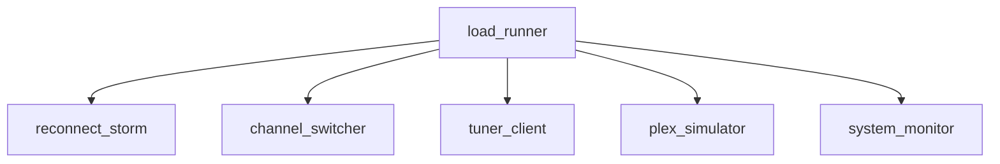

# Broadcast Alignment Validation Harness

## Architecture





## Directory Structure

See tests/integration/broadcast_alignment/ and tests/load/hdhomerun_stress/.

```
tests/integration/broadcast_alignment/
├── __init__.py
├── alignment_runner.py      # Main orchestrator
├── clock_validator.py       # /api/clock/{channel_id}
├── xmltv_validator.py       # Parse & validate XMLTV
├── hdhomerun_validator.py   # discover, lineup, lineup_status, device.xml
├── plex_validator.py        # Simulate Plex tune
├── stream_probe.py          # MPEG-TS capture & validation
├── drift_monitor.py         # Offset drift over time
├── crash_simulator.py       # Kill/restart validation
├── dual_authority_detector.py  # Scan for forbidden patterns
├── metrics_collector.py     # Per-channel & system metrics
├── report_generator.py      # JSON/HTML reports
└── conftest.py              # Fixtures

tests/load/hdhomerun_stress/
├── __init__.py
├── load_runner.py           # Stress mode orchestrator (writes stress_report, memory_profile)
├── burn_runner.py           # Long burn: 8 parallel clients, 2hr, random disconnect/switch
├── tuner_client.py          # Stream open/close
├── plex_simulator.py        # Wraps plex_validator
├── reconnect_storm.py       # Rapid connect/disconnect (60s, 100+ cycles)
├── channel_switcher.py      # Rapid channel switch (every 5s)
└── system_monitor.py        # CPU, memory, FD, FFmpeg count
```

## Stress Modes

| Mode | Duration | Reconnect | Channel Switch |
|------|----------|-----------|----------------|
| Light | 10 min | 60s | 60s |
| Production | 30 min | 90s | 120s |
| Extreme | 2 hours | 120s | 300s |
| 24h | 24 hours | 300s | 600s |

## Acceptance Criteria (PASS)

- 0 incorrect program listings
- 0 schedule drift beyond tolerance
- 0 unintended advancement
- 0 dual-authority detection
- 0 HDHomeRun protocol failures
- Stable Plex playback
- No memory leak
- No deadlocks
- No zombie FFmpeg processes
- XMLTV aligned with ChannelClock
- BroadcastScheduleAuthority sole schedule source

## Outputs Generated

| File | Source |
|------|--------|
| alignment_report.json | Alignment runner |
| alignment_report.html | Alignment runner |
| stress_report.json | Load runner |
| stress_report.html | Load runner |
| drift_log.csv | Drift monitor (when run_drift_monitor_full=True) |
| memory_profile.log | System metrics during alignment/load |

## Running

```bash
# Alignment validation (requires server on 127.0.0.1:8411)
python scripts/run_alignment_validation.py --base-url http://127.0.0.1:8411
python scripts/run_alignment_validation.py --drift  # Include 10min drift monitor

# Or via pytest
pytest tests/integration/test_broadcast_alignment.py -v -m "integration and not slow"
pytest tests/load/test_hdhomerun_stress.py -v -m "integration and not slow"

# Long burn (8 parallel clients, 2hr) - use burn_runner.run_long_burn
# Dual authority scan only
pytest tests/integration/test_broadcast_alignment.py::test_dual_authority_detection -v
```

**Last Revised:** 2026-03-20
