# EXStreamTV Architecture Diagrams

All diagrams use Mermaid. Referenced from Platform Guide, EPG Alignment, Observability, Invariants.

**Last Revised:** 2026-03-20

---

## 1. System Architecture Overview

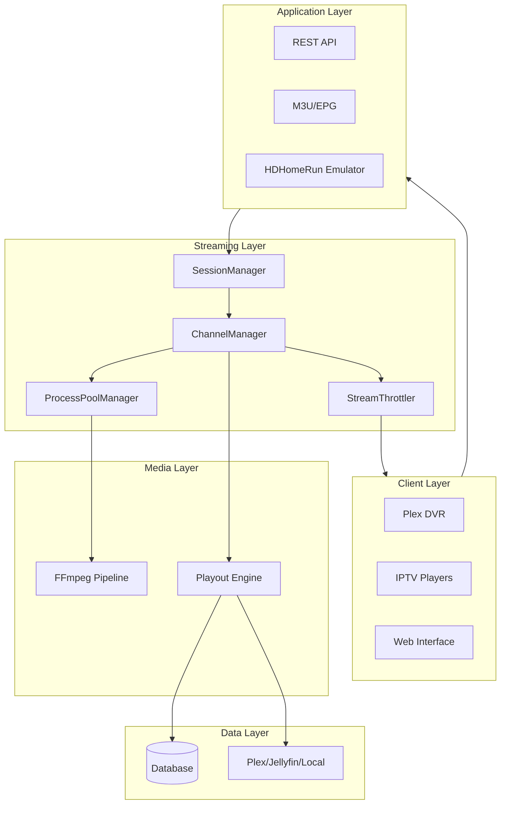

---

## 2. Zero-Drift Clock Authority Flow

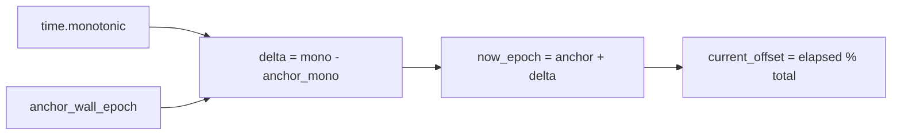

---

## 3. XMLTV Generation Pipeline

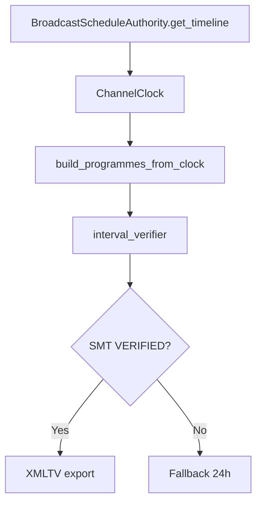

---

## 4. Validation Pipeline Order

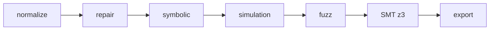

---

## 5. BroadcastScheduleAuthority Internal Flow

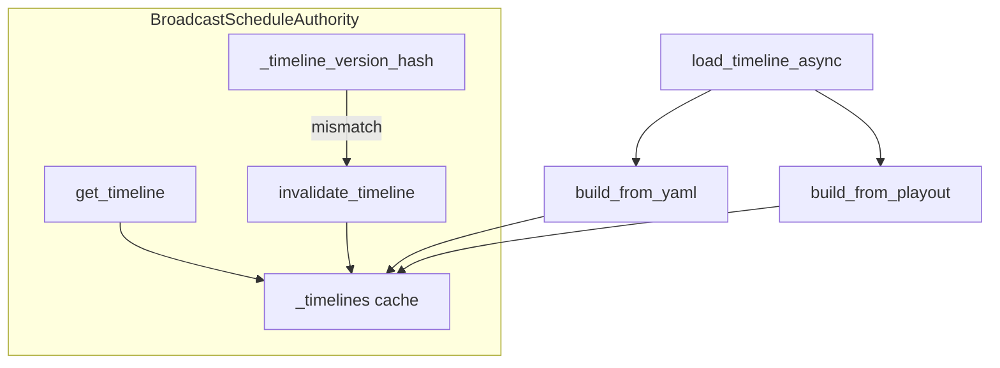

---

## 6. Watchdog Monitoring Loop

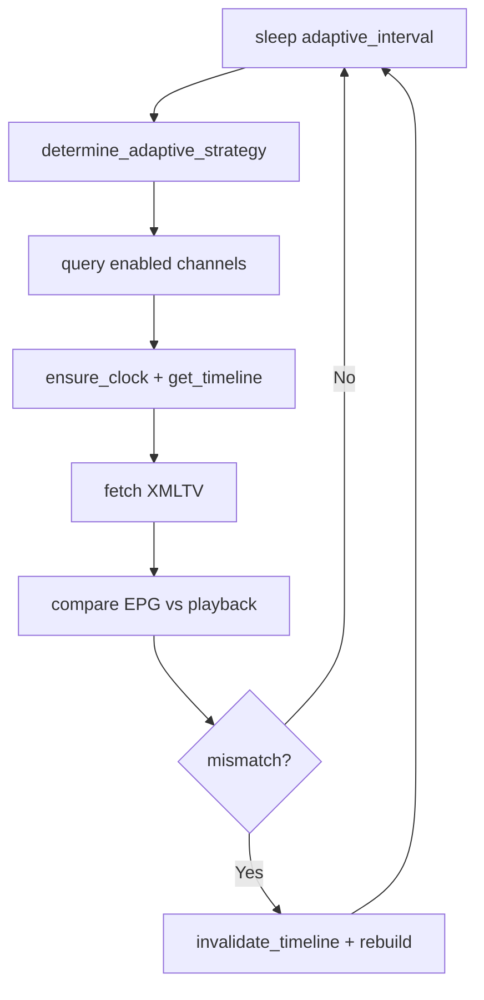

---

## 7. Adaptive Self-Tuning Feedback Loop

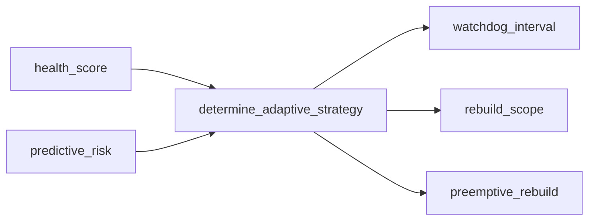

---

## 8. Metrics Exporter to Prometheus Flow

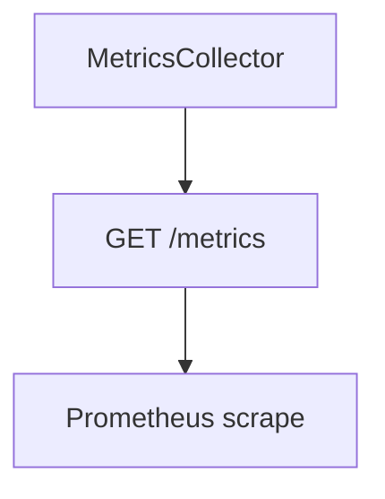

---

## 9. Dashboard Health Score Predictive Analyzer

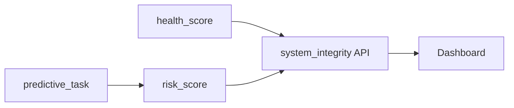

---

## 10. ChannelManager Lifecycle

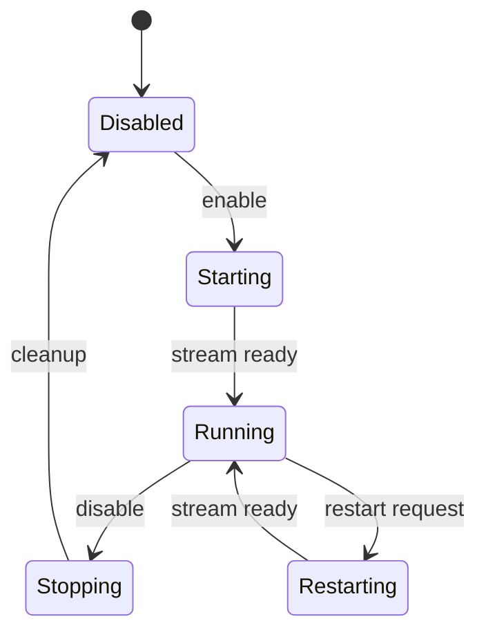

---

## 11. Stream Pre-flight Validation Path

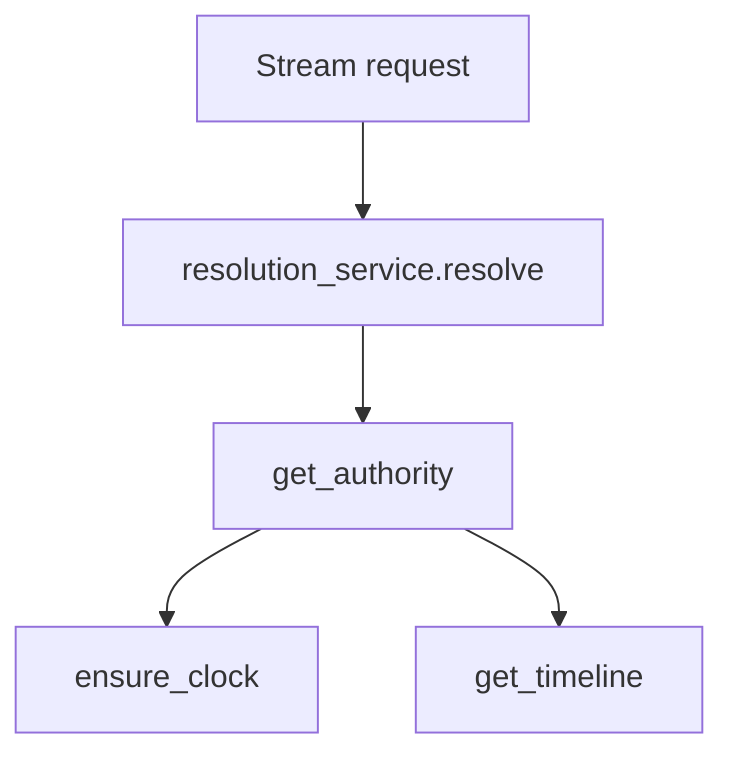

---

## 12. Fallback Safety Gate Logic

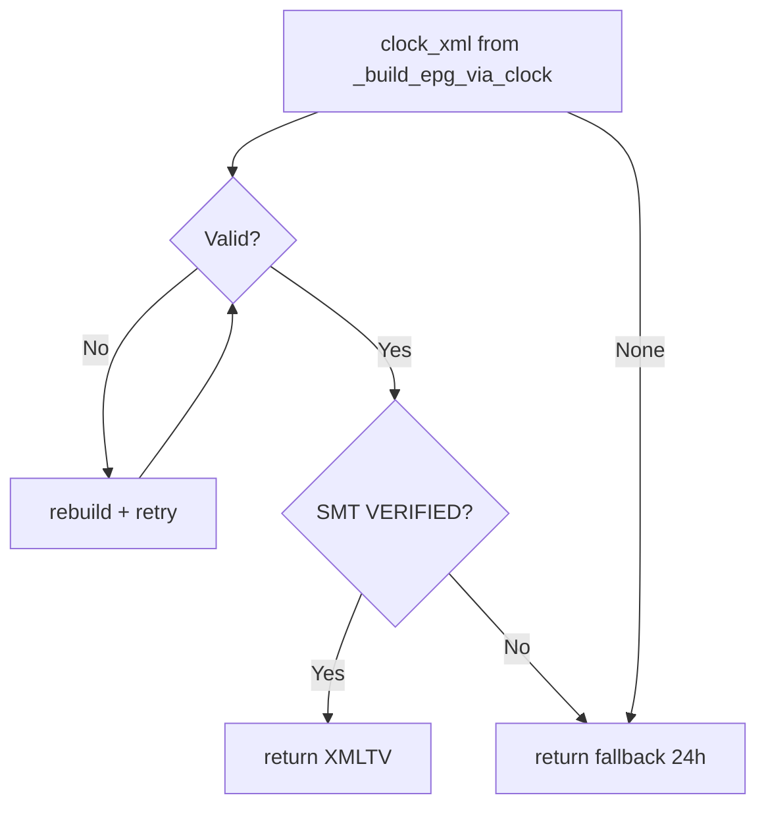

---

## 13. Temporal Simulation and Fuzz Layer

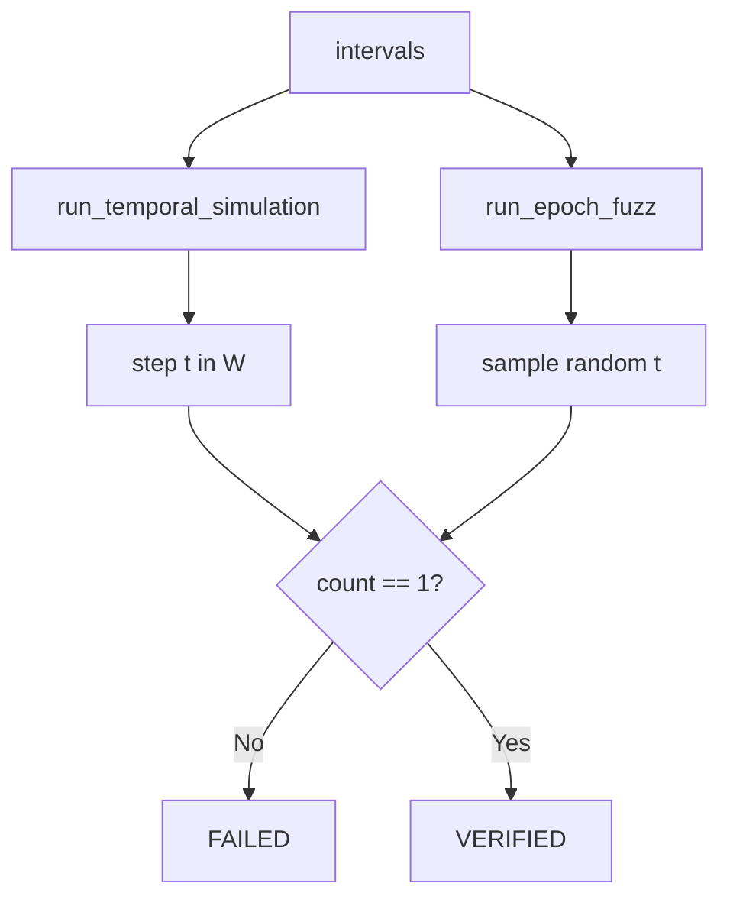

---

## 14. SMT Verifier Integration Path

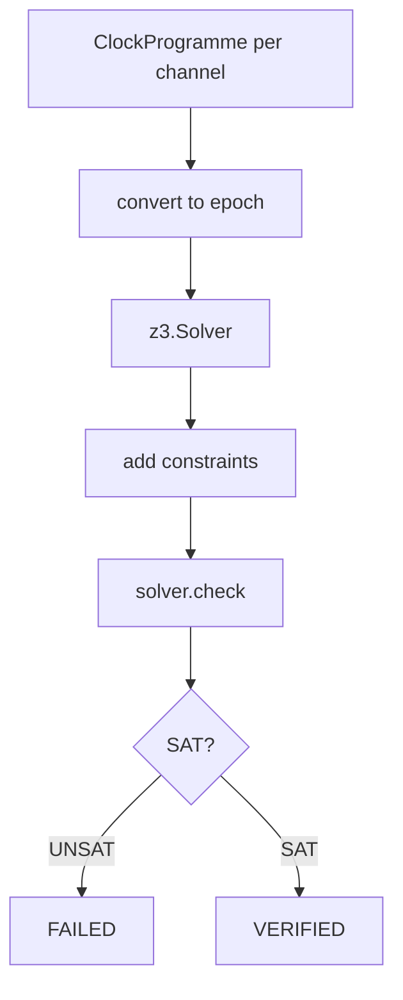

---

## 15. Stream resolution safety contract

Validates resolved sources before FFmpeg (`resolution_service`, `StreamingContractEnforcer`, `StreamSource`).

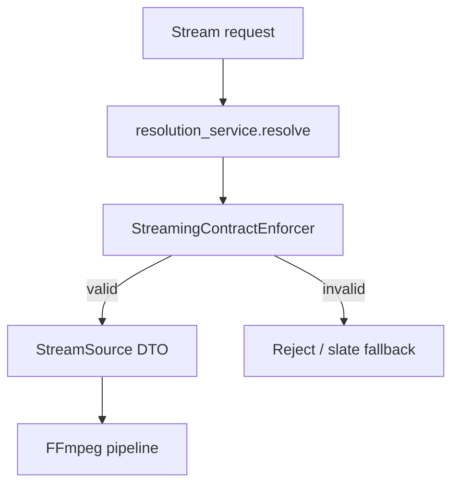
