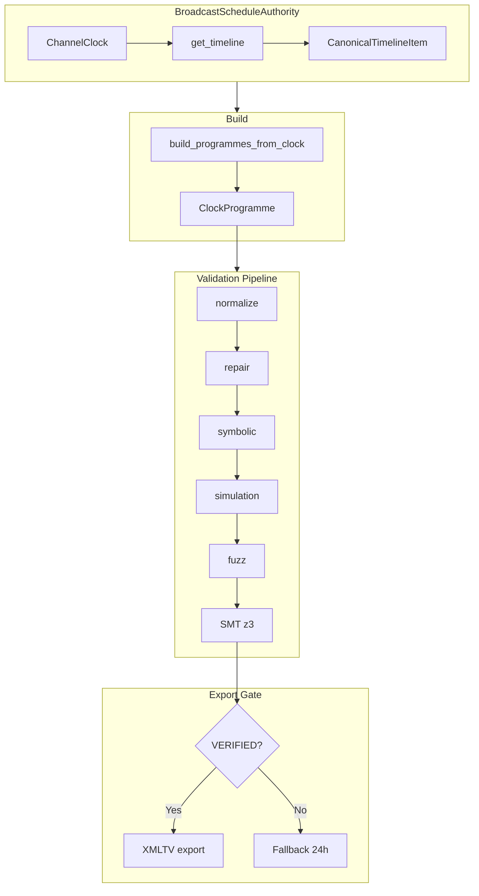

# EPG and Playout Alignment (Broadcast Contract)

## XMLTV Generation Pipeline

## Contract

**EPG reflects playout; playout is the source of truth.**

The Electronic Program Guide (XMLTV) must accurately reflect what is actually being streamed. Programme start and stop times in the EPG are derived from the **same authoritative timeline** used for playout. There is no separate "EPG schedule" that can drift from the stream.

## Authoritative Timeline (per channel)

The single source of truth for "what is playing now and when each programme starts/stops" is:

1. **ChannelPlaybackPosition** (database)
   - `playout_start_time` – anchor time when the current cycle started (ErsatzTV-style).
   - `current_item_start_time` – when the current programme started (for EPG accuracy).
   - `elapsed_seconds_in_item` – seconds into the current programme.
   - `last_item_index` – index into the playout item list (used by EPG to align).

2. **Active Playout + PlayoutItems** (database)
   - The channel’s active playout and its ordered items (with media and durations) define the programme sequence. The channel manager advances through this list using the anchor and elapsed time.

3. **Channel manager** (`exstreamtv/streaming/channel_manager.py`)
   - Loads or initializes `playout_start_time` and current item index from `ChannelPlaybackPosition` and the playout’s total duration.
   - Updates and persists `current_item_start_time`, `elapsed_seconds_in_item`, and `last_item_index` when saving position.

## Where EPG Gets Timeline Data

EPG derives exclusively from `BroadcastScheduleAuthority.get_timeline(channel_id)` (CanonicalTimelineItem). No alternate schedule reconstruction. Before export, interval verification runs: normalize→repair→symbolic→simulation→fuzz→SMT (z3). Export only if VERIFIED.

| EPG path | Timeline source | Alignment |
|----------|-----------------|-----------|
| **iptv.py `get_epg`** (main XMLTV) | `build_epg_from_clock` uses `auth.get_timeline(channel_id)` + `build_programmes_from_clock`. SMT gate before emit. | ✓ Clock authority, zero-drift. |
| **Fallback** | Single 24h placeholder when clock path yields no programmes. | Trivially verified. |

**Last Revised:** 2026-03-01

## Validation

- Programme boundaries in XMLTV must be derivable from the same `ChannelPlaybackPosition` + PlayoutItem sequence that the channel manager uses.
- Tests: see `tests/unit/test_epg_plex_integration.py` (programme bounds from timeline) and any integration tests that compare EPG programme start/stop to the playout timeline for a channel.

## Cache and invalidation

When playout or playback position changes, the EPG cache must be invalidated so the next guide fetch reflects the new timeline:

- Channel create/update/delete → `invalidate_epg()` (channels API).
- Schedule create/update/delete → `invalidate_epg()` (schedules API).
- Playout create/update/delete/rebuild/build commit → `invalidate_epg()` (playouts API).

This keeps EPG accuracy consistent with a TV broadcast system where the guide and the stream stay in sync.
