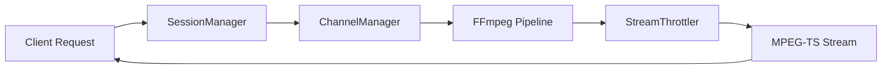
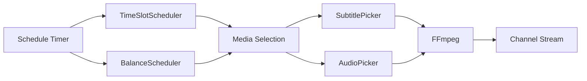
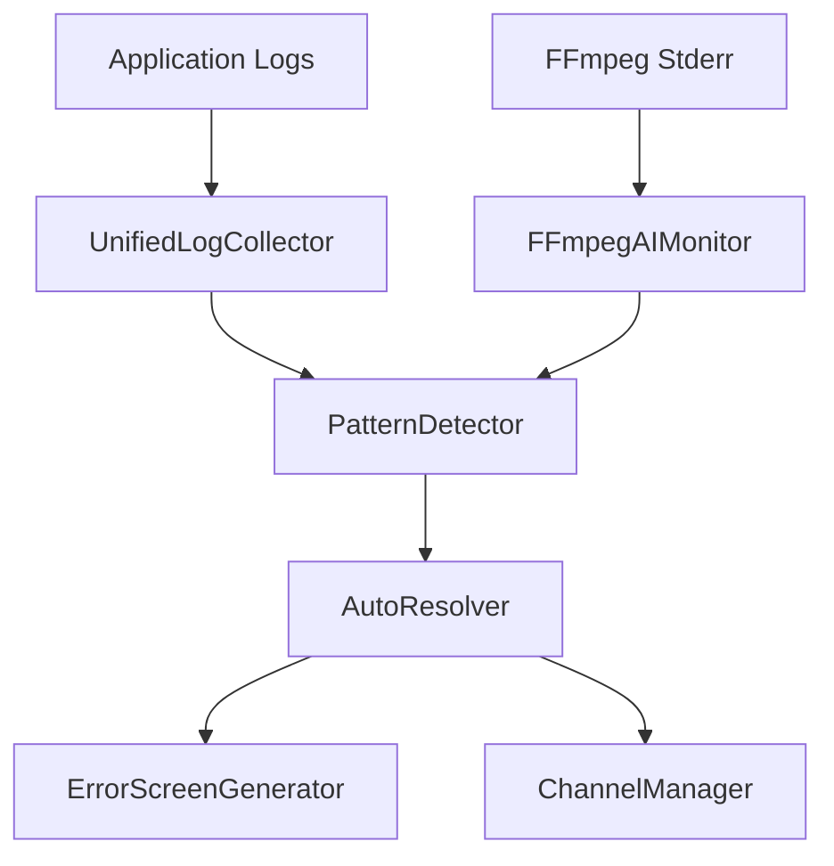

# EXStreamTV System Design

**Version:** 2.6.0  
**Last Updated:** 2026-01-31

---

## Overview

EXStreamTV is a unified IPTV streaming platform that combines:
- **StreamTV**: Python/FastAPI web application with AI agent
- **ErsatzTV**: Advanced scheduling, transcoding, and local media features

This document describes the system architecture and design decisions.

---

## Architecture Diagram

```
┌─────────────────────────────────────────────────────────────────────────────┐
│                              EXStreamTV Platform                             │
├─────────────────────────────────────────────────────────────────────────────┤
│                                                                             │
│  ┌──────────────────────────────────────────────────────────────────────┐  │
│  │                         WebUI (Jinja2 Templates)                      │  │
│  │  ┌─────────┐ ┌─────────┐ ┌─────────┐ ┌─────────┐ ┌─────────┐        │  │
│  │  │Channels │ │Playlists│ │Schedules│ │Libraries│ │Settings │        │  │
│  │  └─────────┘ └─────────┘ └─────────┘ └─────────┘ └─────────┘        │  │
│  └──────────────────────────────────────────────────────────────────────┘  │
│                                    │                                        │
│  ┌─────────────────────────────────▼────────────────────────────────────┐  │
│  │                        FastAPI Application                            │  │
│  │  ┌────────────┐ ┌────────────┐ ┌────────────┐ ┌────────────┐        │  │
│  │  │   REST     │ │  IPTV      │ │ HDHomeRun  │ │   SSDP     │        │  │
│  │  │   API      │ │  M3U/EPG   │ │  Emulator  │ │  Discovery │        │  │
│  │  └────────────┘ └────────────┘ └────────────┘ └────────────┘        │  │
│  └──────────────────────────────────────────────────────────────────────┘  │
│                                    │                                        │
│  ┌─────────────────────────────────▼────────────────────────────────────┐  │
│  │                         Core Services                                 │  │
│  │  ┌──────────────┐ ┌──────────────┐ ┌──────────────┐ ┌─────────────┐ │  │
│  │  │   Channel    │ │   Playout    │ │    Media     │ │  AI Agent   │ │  │
│  │  │   Manager    │ │   Engine     │ │   Scanner    │ │  (Log AI)   │ │  │
│  │  └──────────────┘ └──────────────┘ └──────────────┘ └─────────────┘ │  │
│  └──────────────────────────────────────────────────────────────────────┘  │
│                                    │                                        │
│  ┌─────────────────────────────────▼────────────────────────────────────┐  │
│  │                       FFmpeg Pipeline                                 │  │
│  │  ┌──────────┐ ┌──────────┐ ┌──────────┐ ┌──────────┐ ┌──────────┐  │  │
│  │  │Decoders  │ │Filters   │ │Encoders  │ │Formats   │ │Profiles  │  │  │
│  │  │(HW/SW)   │ │(V/A)     │ │(HW/SW)   │ │(TS/HLS)  │ │(Custom)  │  │  │
│  │  └──────────┘ └──────────┘ └──────────┘ └──────────┘ └──────────┘  │  │
│  └──────────────────────────────────────────────────────────────────────┘  │
│                                    │                                        │
│  ┌─────────────────────────────────▼────────────────────────────────────┐  │
│  │                         Data Layer                                    │  │
│  │  ┌────────────────────┐        ┌────────────────────────────────┐   │  │
│  │  │  SQLite/PostgreSQL │        │  Media Sources                  │   │  │
│  │  │  (SQLAlchemy)      │        │  ┌────────┐ ┌────────┐ ┌─────┐ │   │  │
│  │  │                    │        │  │YouTube │ │Archive │ │Local│ │   │  │
│  │  │  - Channels        │        │  │        │ │.org    │ │Files│ │   │  │
│  │  │  - Playlists       │        │  └────────┘ └────────┘ └─────┘ │   │  │
│  │  │  - Playouts        │        │  ┌────────┐ ┌────────┐ ┌─────┐ │   │  │
│  │  │  - Schedules       │        │  │Plex    │ │Jellyfin│ │Emby │ │   │  │
│  │  │  - Filler/Deco     │        │  └────────┘ └────────┘ └─────┘ │   │  │
│  │  └────────────────────┘        └────────────────────────────────┘   │  │
│  └──────────────────────────────────────────────────────────────────────┘  │
│                                                                             │
└─────────────────────────────────────────────────────────────────────────────┘
                                    │
                    ┌───────────────┼───────────────┐
                    ▼               ▼               ▼
            ┌─────────────┐ ┌─────────────┐ ┌─────────────┐
            │    Plex     │ │  Jellyfin   │ │   IPTV      │
            │   Client    │ │   Client    │ │   Player    │
            └─────────────┘ └─────────────┘ └─────────────┘
```

---

## Core Components

### 1. FastAPI Application (`exstreamtv/main.py`)

The main application entry point using FastAPI:

- **Lifespan Management**: Async startup/shutdown for database, channel manager
- **Router Registration**: REST API, IPTV, HDHomeRun, WebUI routes
- **Static Files**: CSS, JavaScript, images
- **Templates**: Jinja2 template rendering

### 2. Channel Manager (`exstreamtv/streaming/channel_manager.py`)

Manages continuous channel streaming (ErsatzTV-style):

- **Background Streams**: Each channel runs continuously in background
- **Client Connections**: Multiple clients can connect to same stream
- **Seamless Transitions**: Smooth switching between playlist items
- **Buffer Management**: 2MB buffer with 64KB read chunks

### 3. Playout Engine (`exstreamtv/scheduling/engine/`)

Advanced scheduling system ported from ErsatzTV:

- **Schedule Modes**: Flood, Duration, Multiple, One
- **Collection Enumerators**: Chronological, Shuffled, Random
- **Block Scheduling**: Time-based programming blocks
- **Filler System**: Pre-roll, mid-roll, post-roll, fallback

### 4. FFmpeg Pipeline (`exstreamtv/ffmpeg/`)

Hardware-accelerated transcoding pipeline:

- **Hardware Detection**: Auto-detect VideoToolbox, NVENC, QSV, VAAPI, AMF
- **Encoder Selection**: Choose optimal encoder based on capabilities
- **Filter Chains**: Scale, pad, overlay, deinterlace, watermark
- **Profile System**: Saved encoding presets

### 5. Media Scanner (`exstreamtv/media/scanner/`)

Local media library management:

- **Library Sources**: Plex, Jellyfin, Emby, local folders
- **Metadata Providers**: TVDB, TMDB, local NFO files
- **Collection Building**: Automatic show/season/episode grouping
- **Change Detection**: Efficient incremental scanning

### 6. AI Agent (`exstreamtv/ai_agent/`)

Intelligent log analysis and error detection:

- **Pattern Matching**: Detect FFmpeg, network, auth errors
- **Fix Suggestions**: Recommend solutions for common issues
- **Auto-Fix Mode**: Optional automatic remediation
- **Learning**: Improve suggestions based on outcomes

### 7. Session Manager (`exstreamtv/streaming/session_manager.py`) - NEW in v2.6.0

Tunarr-style client session tracking:

- **StreamSession**: Individual client connection tracking
- **SessionManager**: Centralized session lifecycle management
- **Health Monitoring**: Error counting, restart tracking
- **Idle Cleanup**: Automatic cleanup of inactive sessions

### 8. Stream Throttler (`exstreamtv/streaming/throttler.py`) - NEW in v2.6.0

dizqueTV-style rate limiting for MPEG-TS delivery:

- **Rate Limiting**: Match target bitrate to prevent buffer overruns
- **Multiple Modes**: realtime, burst, adaptive, disabled
- **Keepalive**: Packet support during stream stalls

### 9. Error Screen Generator (`exstreamtv/streaming/error_screens.py`) - NEW in v2.6.0

dizqueTV-style fallback streams during failures:

- **Visual Modes**: text, static, test_pattern, slate
- **Audio Modes**: silent, sine_wave, white_noise, beep
- **FFmpeg Integration**: Generate MPEG-TS error streams

### 10. AI Self-Healing System - NEW in v2.6.0

Enhanced AI capabilities for autonomous issue resolution:

- **UnifiedLogCollector**: Multi-source log aggregation with real-time streaming
- **FFmpegAIMonitor**: Intelligent FFmpeg monitoring with error classification
- **PatternDetector**: ML-based pattern detection and failure prediction
- **AutoResolver**: Autonomous issue resolution with zero-downtime fixes

---

## Data Models

### Channel
```python
class Channel:
    id: int
    number: int
    name: str
    logo_url: str
    streaming_mode: str  # "iptv" | "hdhomerun" | "both"
    ffmpeg_profile_id: int
    fallback_filler_id: int
    playouts: List[Playout]
```

### Playout (ErsatzTV-compatible)
```python
class Playout:
    id: int
    channel_id: int
    program_schedule_id: int
    anchor: PlayoutAnchor
    items: List[PlayoutItem]
```

### PlayoutItem
```python
class PlayoutItem:
    id: int
    playout_id: int
    media_item_id: int
    start_time: datetime
    finish_time: datetime
    in_point: timedelta
    out_point: timedelta
    filler_kind: str
```

### ProgramSchedule
```python
class ProgramSchedule:
    id: int
    name: str
    keep_multi_part_episodes: bool
    treat_collections_as_shows: bool
    shuffle_schedule_items: bool
    random_start_point: bool
    items: List[ProgramScheduleItem]
```

---

## Streaming Flow

### 1. IPTV Request Flow (v2.6.0 Enhanced)



```
Client Request → SessionManager → Channel Manager → FFmpeg Pipeline → Throttler → MPEG-TS Stream
```

### 2. HDHomeRun Flow
```
Plex/Jellyfin → SSDP Discovery → HDHomeRun API → Channel Manager → Stream
```

### 3. Playout Flow (v2.6.0 Enhanced)



```
Schedule Timer → TimeSlot/Balance Scheduler → Media Selection → Subtitle/Audio Pickers → FFmpeg → Channel Stream
```

### 4. AI Self-Healing Flow (NEW v2.6.0)



```
Logs/FFmpeg → UnifiedLogCollector → PatternDetector → AutoResolver → Error Screen/Channel Restart
```

---

## Configuration

Configuration is managed via `config.yaml` with environment variable overrides:

```yaml
server:
  host: "0.0.0.0"
  port: 8411

ffmpeg:
  hardware_acceleration:
    preferred: "auto"  # auto, nvenc, qsv, vaapi, videotoolbox

libraries:
  plex:
    enabled: true
    url: "http://localhost:32400"
    token: "xxx"
```

Environment variables use `EXSTREAMTV_` prefix:
```bash
EXSTREAMTV_PORT=8411
EXSTREAMTV_PLEX_TOKEN=xxx
```

---

## Security Considerations

1. **API Authentication**: Optional password protection
2. **Credential Storage**: Secure keyring for tokens
3. **Input Validation**: Pydantic models for all inputs
4. **Rate Limiting**: slowapi for API rate limiting

---

## Deployment Options

1. **Direct Install**: `./install_macos.sh`
2. **Docker**: `docker-compose up`
3. **macOS App**: `EXStreamTVApp.app` (menu bar)
4. **Kubernetes**: Helm chart in `containers/kubernetes/`

---

## Version History

| Version | Date | Changes |
|---------|------|---------|
| 1.0.0 | 2026-01-14 | Initial project structure |
| 1.0.1 | 2026-01-14 | Config system, database foundation |
| 2.0.0 | 2026-01-14 | Complete platform with all integrations |
| 2.5.0 | 2026-01-17 | AI Channel Creator, Block Scheduling |
| 2.6.0 | 2026-01-31 | Tunarr/dizqueTV integration, AI self-healing |

---

## Related Documentation

- [BUILD_PROGRESS.md](../BUILD_PROGRESS.md) - Current development status
- [TUNARR_DIZQUETV_INTEGRATION.md](./TUNARR_DIZQUETV_INTEGRATION.md) - v2.6.0 integration details
- [API Documentation](../api/README.md) - REST API reference
