# Tunarr/dizqueTV Integration Architecture

**Version:** 2.6.0  
**Last Updated:** 2026-01-31  
**Status:** Complete

---

## Executive Summary

This document describes the comprehensive integration of proven patterns and components from **Tunarr** (TypeScript IPTV server) and **dizqueTV** (NodeJS streaming platform) into EXStreamTV. The integration enhances platform stability, streaming reliability, and introduces AI-powered self-healing capabilities.

---

## Integration Overview

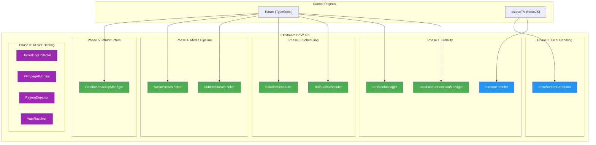
```mermaid
graph TB
    subgraph "EXStreamTV v2.6.0"
        subgraph "Phase 1: Stability"
            DCM[DatabaseConnectionManager]
            SM[SessionManager]
            ST[StreamThrottler]
        end
        
        subgraph "Phase 2: Error Handling"
            ESG[ErrorScreenGenerator]
        end
        
        subgraph "Phase 3: Scheduling"
            TSS[TimeSlotScheduler]
            BS[BalanceScheduler]
        end
        
        subgraph "Phase 4: Media Pipeline"
            SSP[SubtitleStreamPicker]
            ASP[AudioStreamPicker]
        end
        
        subgraph "Phase 5: Infrastructure"
            DBM[DatabaseBackupManager]
        end
        
        subgraph "Phase 6: AI Self-Healing"
            ULC[UnifiedLogCollector]
            FFM[FFmpegAIMonitor]
            PD[PatternDetector]
            AR[AutoResolver]
        end
    end
    
    subgraph "Source Projects"
        Tunarr["Tunarr (TypeScript)"]
        dizqueTV["dizqueTV (NodeJS)"]
    end
    
    Tunarr --> DCM
    Tunarr --> SM
    Tunarr --> TSS
    Tunarr --> BS
    Tunarr --> SSP
    Tunarr --> ASP
    Tunarr --> DBM
    
    dizqueTV --> ST
    dizqueTV --> ESG
    
    style DCM fill:#4CAF50,color:white
    style SM fill:#4CAF50,color:white
    style ST fill:#2196F3,color:white
    style ESG fill:#2196F3,color:white
    style TSS fill:#4CAF50,color:white
    style BS fill:#4CAF50,color:white
    style SSP fill:#4CAF50,color:white
    style ASP fill:#4CAF50,color:white
    style DBM fill:#4CAF50,color:white
    style ULC fill:#9C27B0,color:white
    style FFM fill:#9C27B0,color:white
    style PD fill:#9C27B0,color:white
    style AR fill:#9C27B0,color:white
```

**Legend:**
- 🟢 Green: Tunarr-sourced components
- 🔵 Blue: dizqueTV-sourced components
- 🟣 Purple: EXStreamTV AI enhancements

---

## Phase 1: Critical Stability Fixes

### 1.1 Database Connection Manager

**Source:** Tunarr `server/src/dao/connectionManager.ts`  
**Target:** `exstreamtv/database/connection.py`

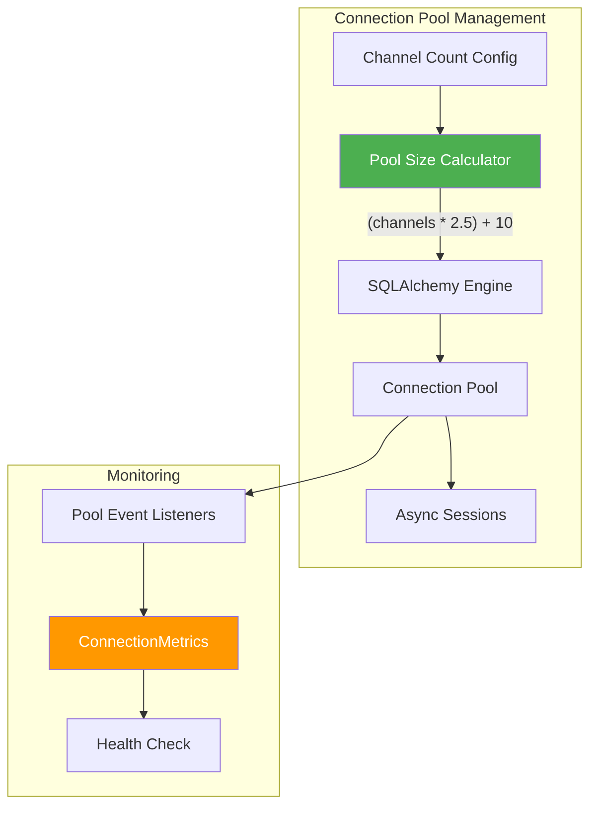
```mermaid
flowchart TB
    subgraph "Connection Pool Management"
        Config[Channel Count Config]
        Calculator[Pool Size Calculator]
        Engine[SQLAlchemy Engine]
        Pool[Connection Pool]
        Sessions[Async Sessions]
    end
    
    subgraph "Monitoring"
        Events[Pool Event Listeners]
        Metrics[ConnectionMetrics]
        Health[Health Check]
    end
    
    Config --> Calculator
    Calculator -->|"(channels * 2.5) + 10"| Engine
    Engine --> Pool
    Pool --> Sessions
    
    Pool --> Events
    Events --> Metrics
    Metrics --> Health
    
    style Calculator fill:#4CAF50,color:white
    style Metrics fill:#FF9800,color:white
```

**Key Features:**

| Feature | Description |
|---------|-------------|
| Dynamic Pool Sizing | Pool size = `(channel_count × 2.5) + BASE_POOL_SIZE` |
| Pool Event Monitoring | Tracks connections created, checked in/out, invalidated, recycled |
| Health Checks | Latency measurement and pool saturation metrics |
| Auto-Resize | Adjusts pool size when channel count changes |

**Pool Size Formula:**
```
optimal_pool_size = max(BASE_POOL_SIZE, min(calculated, MAX_POOL_SIZE))
where calculated = int(channel_count * CONNECTIONS_PER_CHANNEL) + BASE_POOL_SIZE

Constants:
- BASE_POOL_SIZE = 10
- MAX_POOL_SIZE = 100
- CONNECTIONS_PER_CHANNEL = 2.5
```

### 1.2 Session Manager

**Source:** Tunarr `server/src/stream/SessionManager.ts`  
**Target:** `exstreamtv/streaming/session_manager.py`

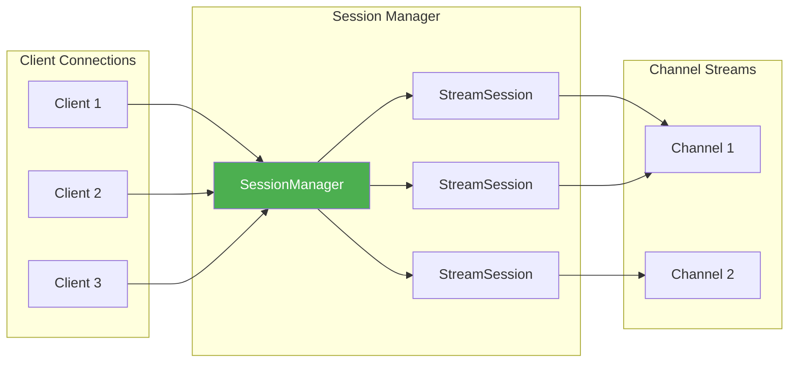
```mermaid
flowchart LR
    subgraph "Client Connections"
        C1[Client 1]
        C2[Client 2]
        C3[Client 3]
    end
    
    subgraph "Session Manager"
        SM[SessionManager]
        SS1[StreamSession]
        SS2[StreamSession]
        SS3[StreamSession]
    end
    
    subgraph "Channel Streams"
        CH1[Channel 1]
        CH2[Channel 2]
    end
    
    C1 --> SM
    C2 --> SM
    C3 --> SM
    
    SM --> SS1
    SM --> SS2
    SM --> SS3
    
    SS1 --> CH1
    SS2 --> CH1
    SS3 --> CH2
    
    style SM fill:#4CAF50,color:white
```

**StreamSession Dataclass:**

```python
@dataclass
class StreamSession:
    session_id: str
    channel_id: int
    channel_number: int
    client_id: Optional[str]
    client_ip: Optional[str]
    user_agent: Optional[str]
    state: SessionState
    created_at: datetime
    last_activity: datetime
    bytes_sent: int
    errors: list[SessionError]
    restart_count: int
```

**Session Lifecycle:**

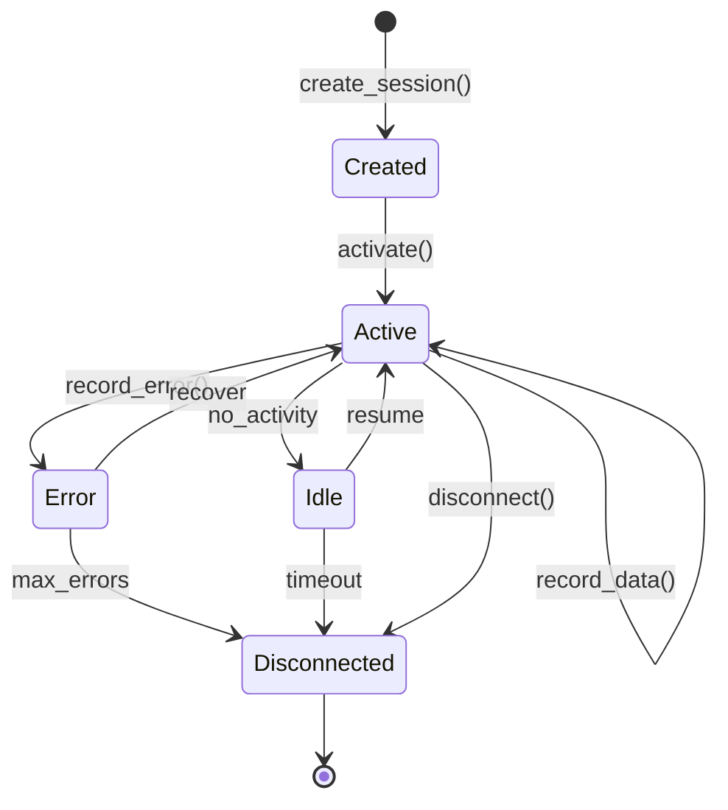
```mermaid
stateDiagram-v2
    [*] --> Created: create_session()
    Created --> Active: activate()
    Active --> Active: record_data()
    Active --> Error: record_error()
    Error --> Active: recover
    Error --> Disconnected: max_errors
    Active --> Idle: no_activity
    Idle --> Active: resume
    Idle --> Disconnected: timeout
    Active --> Disconnected: disconnect()
    Disconnected --> [*]
```

### 1.3 Stream Throttler

**Source:** dizqueTV `server/src/stream/throttler.ts`  
**Target:** `exstreamtv/streaming/throttler.py`

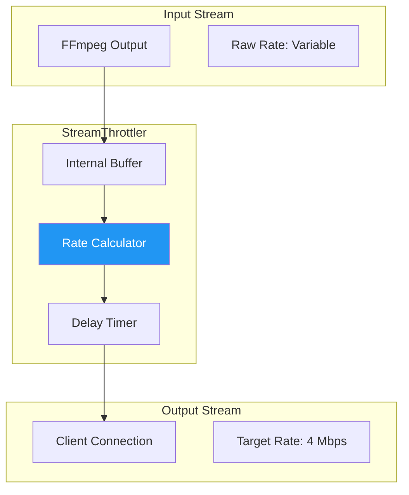
```mermaid
flowchart TB
    subgraph "Input Stream"
        FFmpeg[FFmpeg Output]
        Rate["Raw Rate: Variable"]
    end
    
    subgraph "StreamThrottler"
        Buffer[Internal Buffer]
        Calculator[Rate Calculator]
        Timer[Delay Timer]
    end
    
    subgraph "Output Stream"
        Client[Client Connection]
        Target["Target Rate: 4 Mbps"]
    end
    
    FFmpeg --> Buffer
    Buffer --> Calculator
    Calculator --> Timer
    Timer --> Client
    
    style Calculator fill:#2196F3,color:white
```

**Throttle Modes:**

| Mode | Behavior | Use Case |
|------|----------|----------|
| `realtime` | Match target bitrate exactly | Live streaming |
| `burst` | Allow 2x bursts, then throttle | VOD with seeking |
| `adaptive` | Adjust based on client feedback | Variable networks |
| `disabled` | No throttling | Direct connections |

**Throttle Algorithm:**
```python
async def throttle(self, data: bytes) -> AsyncIterator[bytes]:
    chunk_size = self._calculate_chunk_size()
    
    for i in range(0, len(data), chunk_size):
        chunk = data[i:i + chunk_size]
        delay = self._calculate_delay(len(chunk))
        
        if delay > 0:
            await asyncio.sleep(delay)
        
        yield chunk
        self._record_send(len(chunk))
```

---

## Phase 2: Error Handling System

### 2.1 Error Screen Generator

**Source:** dizqueTV `server/src/stream/errorScreen.ts`  
**Target:** `exstreamtv/streaming/error_screens.py`

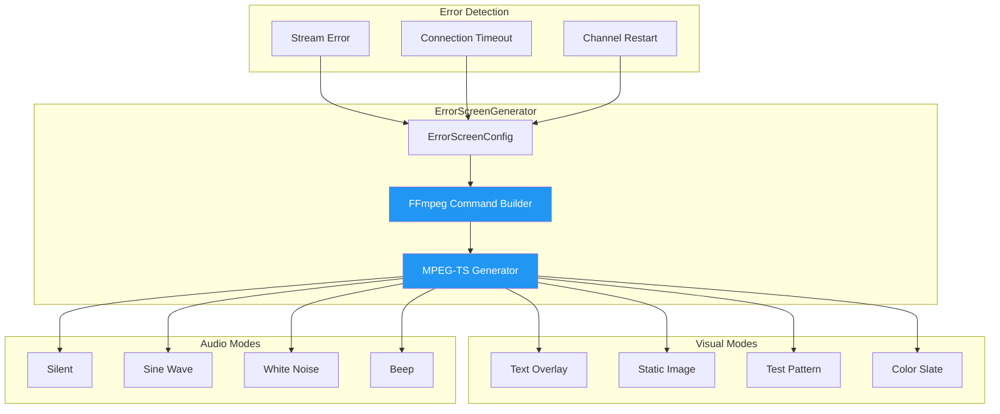
```mermaid
flowchart TB
    subgraph "Error Detection"
        StreamError[Stream Error]
        Timeout[Connection Timeout]
        Restart[Channel Restart]
    end
    
    subgraph "ErrorScreenGenerator"
        Config[ErrorScreenConfig]
        Builder[FFmpeg Command Builder]
        Generator[MPEG-TS Generator]
    end
    
    subgraph "Visual Modes"
        Text[Text Overlay]
        Static[Static Image]
        Pattern[Test Pattern]
        Slate[Color Slate]
    end
    
    subgraph "Audio Modes"
        Silent[Silent]
        Sine[Sine Wave]
        Noise[White Noise]
        Beep[Beep]
    end
    
    StreamError --> Config
    Timeout --> Config
    Restart --> Config
    
    Config --> Builder
    Builder --> Generator
    
    Generator --> Text
    Generator --> Static
    Generator --> Pattern
    Generator --> Slate
    
    Generator --> Silent
    Generator --> Sine
    Generator --> Noise
    Generator --> Beep
    
    style Builder fill:#2196F3,color:white
    style Generator fill:#2196F3,color:white
```

**FFmpeg Command Generation:**

```python
def build_ffmpeg_command(
    self,
    message: ErrorScreenMessage,
    config: ErrorScreenConfig,
    duration: float
) -> list[str]:
    # Visual generation
    if config.visual_mode == ErrorVisualMode.TEXT:
        video_filter = self._build_text_filter(message)
    elif config.visual_mode == ErrorVisualMode.TEST_PATTERN:
        video_input = "smptebars"
    
    # Audio generation
    if config.audio_mode == ErrorAudioMode.SINE:
        audio_filter = "sine=frequency=440:duration={duration}"
    
    return [
        "ffmpeg", "-f", "lavfi", "-i", video_input,
        "-f", "lavfi", "-i", audio_input,
        "-vf", video_filter,
        "-c:v", "libx264", "-c:a", "aac",
        "-f", "mpegts", "pipe:1"
    ]
```

---

## Phase 3: Advanced Scheduling

### 3.1 Time Slot Scheduler

**Source:** Tunarr `server/src/services/TimeSlotScheduler.ts`  
**Target:** `exstreamtv/scheduling/time_slots.py`

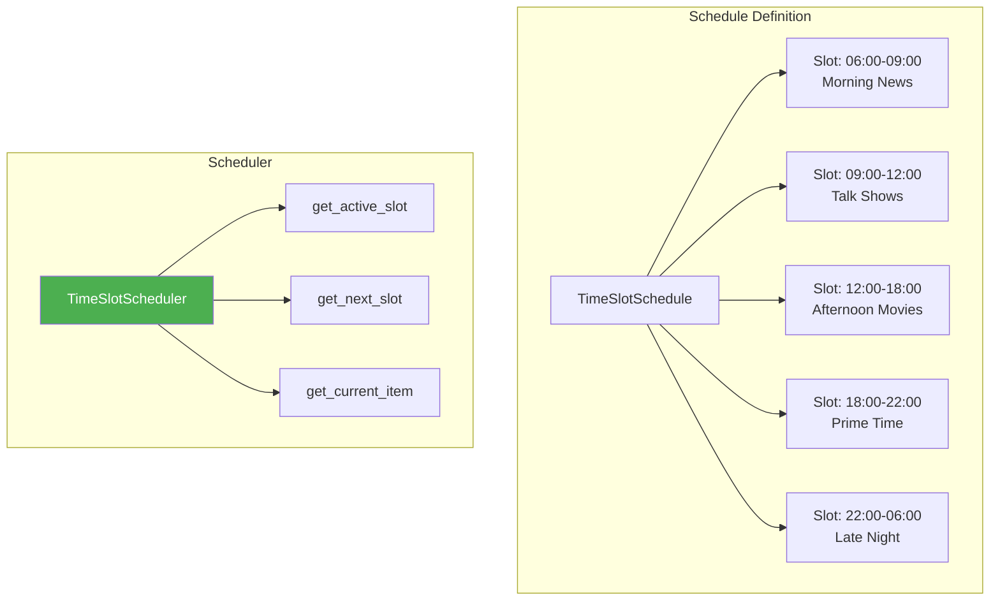
```mermaid
flowchart TB
    subgraph "Schedule Definition"
        Schedule[TimeSlotSchedule]
        Slot1["Slot: 06:00-09:00\nMorning News"]
        Slot2["Slot: 09:00-12:00\nTalk Shows"]
        Slot3["Slot: 12:00-18:00\nAfternoon Movies"]
        Slot4["Slot: 18:00-22:00\nPrime Time"]
        Slot5["Slot: 22:00-06:00\nLate Night"]
    end
    
    subgraph "Scheduler"
        TSS[TimeSlotScheduler]
        Current[get_active_slot]
        Next[get_next_slot]
        Item[get_current_item]
    end
    
    Schedule --> Slot1
    Schedule --> Slot2
    Schedule --> Slot3
    Schedule --> Slot4
    Schedule --> Slot5
    
    TSS --> Current
    TSS --> Next
    TSS --> Item
    
    style TSS fill:#4CAF50,color:white
```

**TimeSlot Configuration:**

```python
@dataclass
class TimeSlot:
    slot_id: str
    name: str
    start_time: time           # e.g., time(6, 0)
    duration_minutes: int      # e.g., 180
    collection_id: Optional[int]
    order_mode: TimeSlotOrderMode    # ordered, shuffle, random
    padding_mode: TimeSlotPaddingMode  # none, filler, loop, next
    flex_mode: TimeSlotFlexMode      # none, extend, compress
    days_of_week: int          # Bitmask (127 = all days)
```

**Scheduling Flow:**

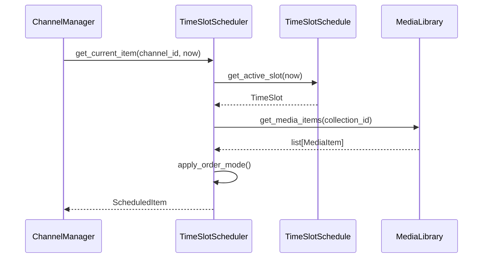
```mermaid
sequenceDiagram
    participant CM as ChannelManager
    participant TSS as TimeSlotScheduler
    participant Schedule as TimeSlotSchedule
    participant Media as MediaLibrary
    
    CM->>TSS: get_current_item(channel_id, now)
    TSS->>Schedule: get_active_slot(now)
    Schedule-->>TSS: TimeSlot
    TSS->>Media: get_media_items(collection_id)
    Media-->>TSS: list[MediaItem]
    TSS->>TSS: apply_order_mode()
    TSS-->>CM: ScheduledItem
```

### 3.2 Balance Scheduler

**Source:** Tunarr `server/src/services/BalanceScheduler.ts`  
**Target:** `exstreamtv/scheduling/balance.py`

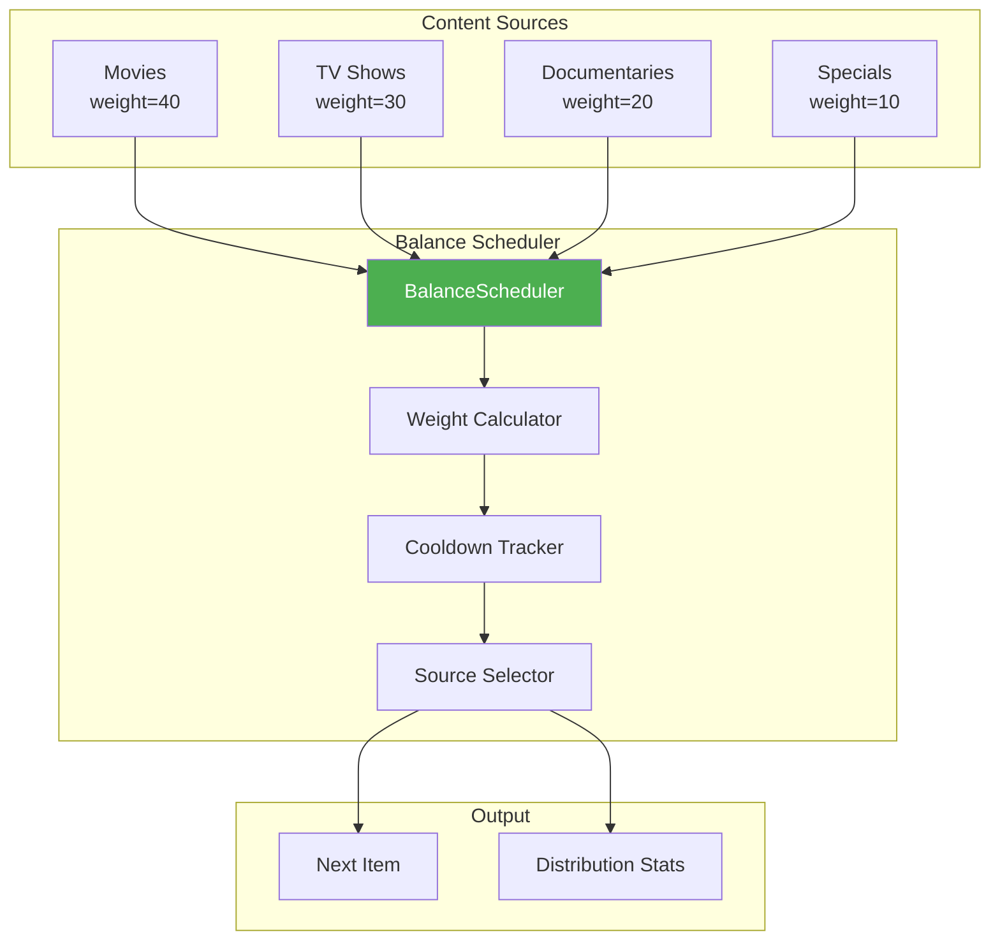
```mermaid
flowchart TB
    subgraph "Content Sources"
        S1["Movies\nweight=40"]
        S2["TV Shows\nweight=30"]
        S3["Documentaries\nweight=20"]
        S4["Specials\nweight=10"]
    end
    
    subgraph "Balance Scheduler"
        BS[BalanceScheduler]
        Weights[Weight Calculator]
        Cooldown[Cooldown Tracker]
        Selection[Source Selector]
    end
    
    subgraph "Output"
        Next[Next Item]
        Stats[Distribution Stats]
    end
    
    S1 --> BS
    S2 --> BS
    S3 --> BS
    S4 --> BS
    
    BS --> Weights
    Weights --> Cooldown
    Cooldown --> Selection
    Selection --> Next
    Selection --> Stats
    
    style BS fill:#4CAF50,color:white
```

**Weight-Based Selection:**

```python
def select_source(self, channel_id: int) -> ContentSource:
    state = self._get_state(channel_id)
    available = [
        s for s in self._config.sources
        if self._is_available(s, state)
    ]
    
    if not available:
        return self._get_fallback_source()
    
    # Weighted random selection
    total_weight = sum(s.weight for s in available)
    target = random.uniform(0, total_weight)
    
    cumulative = 0
    for source in available:
        cumulative += source.weight
        if cumulative >= target:
            return source
```

---

## Phase 4: Media Pipeline Improvements

### 4.1 Subtitle Stream Picker

**Source:** Tunarr `server/src/ffmpeg/SubtitleStreamPicker.ts`  
**Target:** `exstreamtv/ffmpeg/subtitle_picker.py`

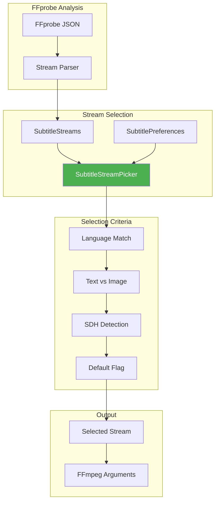
```mermaid
flowchart TB
    subgraph "FFprobe Analysis"
        Probe[FFprobe JSON]
        Parser[Stream Parser]
    end
    
    subgraph "Stream Selection"
        Streams[SubtitleStreams]
        Prefs[SubtitlePreferences]
        Picker[SubtitleStreamPicker]
    end
    
    subgraph "Selection Criteria"
        Lang[Language Match]
        Type[Text vs Image]
        SDH[SDH Detection]
        Default[Default Flag]
    end
    
    subgraph "Output"
        Selected[Selected Stream]
        Args[FFmpeg Arguments]
    end
    
    Probe --> Parser
    Parser --> Streams
    
    Streams --> Picker
    Prefs --> Picker
    
    Picker --> Lang
    Lang --> Type
    Type --> SDH
    SDH --> Default
    Default --> Selected
    
    Selected --> Args
    
    style Picker fill:#4CAF50,color:white
```

**Selection Priority:**
1. Exact language match + preferred type
2. Exact language match + any type
3. Default stream
4. First available stream

### 4.2 Audio Stream Picker

**Source:** Tunarr `server/src/ffmpeg/AudioStreamPicker.ts`  
**Target:** `exstreamtv/ffmpeg/audio_picker.py`

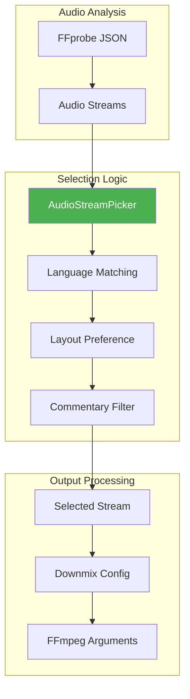
```mermaid
flowchart TB
    subgraph "Audio Analysis"
        Probe[FFprobe JSON]
        AudioStreams[Audio Streams]
    end
    
    subgraph "Selection Logic"
        Picker[AudioStreamPicker]
        LangMatch[Language Matching]
        LayoutPref[Layout Preference]
        Commentary[Commentary Filter]
    end
    
    subgraph "Output Processing"
        Selected[Selected Stream]
        Downmix[Downmix Config]
        FFmpegArgs[FFmpeg Arguments]
    end
    
    Probe --> AudioStreams
    AudioStreams --> Picker
    
    Picker --> LangMatch
    LangMatch --> LayoutPref
    LayoutPref --> Commentary
    
    Commentary --> Selected
    Selected --> Downmix
    Downmix --> FFmpegArgs
    
    style Picker fill:#4CAF50,color:white
```

**Downmix Options:**

| Input Layout | Target | FFmpeg Filter |
|--------------|--------|---------------|
| 5.1 Surround | Stereo | `pan=stereo\|FL=...` |
| 7.1 Surround | 5.1 | `pan=5.1\|...` |
| Stereo | Mono | `pan=mono\|c0=...` |

---

## Phase 5: Database Infrastructure

### 5.1 Database Backup Manager

**Source:** Tunarr `server/src/dao/BackupManager.ts`  
**Target:** `exstreamtv/database/backup.py`

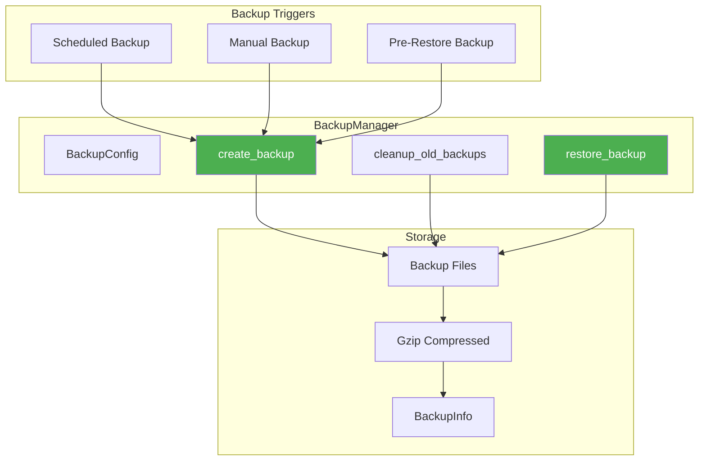
```mermaid
flowchart TB
    subgraph "Backup Triggers"
        Schedule[Scheduled Backup]
        Manual[Manual Backup]
        PreRestore[Pre-Restore Backup]
    end
    
    subgraph "BackupManager"
        Config[BackupConfig]
        Creator[create_backup]
        Restorer[restore_backup]
        Cleaner[cleanup_old_backups]
    end
    
    subgraph "Storage"
        Files[Backup Files]
        Compressed[Gzip Compressed]
        Metadata[BackupInfo]
    end
    
    Schedule --> Creator
    Manual --> Creator
    PreRestore --> Creator
    
    Creator --> Files
    Files --> Compressed
    Compressed --> Metadata
    
    Cleaner --> Files
    Restorer --> Files
    
    style Creator fill:#4CAF50,color:white
    style Restorer fill:#4CAF50,color:white
```

**Backup Configuration:**

```python
@dataclass
class BackupConfig:
    enabled: bool = True
    backup_directory: str = "backups"
    interval_hours: int = 24
    keep_count: int = 7        # Keep N most recent
    keep_days: int = 30        # Delete older than N days
    compress: bool = True      # Gzip compression
```

**Backup File Naming:**
```
exstreamtv_backup_20260131_143022.db.gz
exstreamtv_backup_20260131_143022_auto.db.gz
exstreamtv_backup_20260131_143022_pre_restore.db.gz
```

---

## Phase 6: Enhanced AI Integration

### 6.1 Unified Log Collector

**Target:** `exstreamtv/ai_agent/unified_log_collector.py`

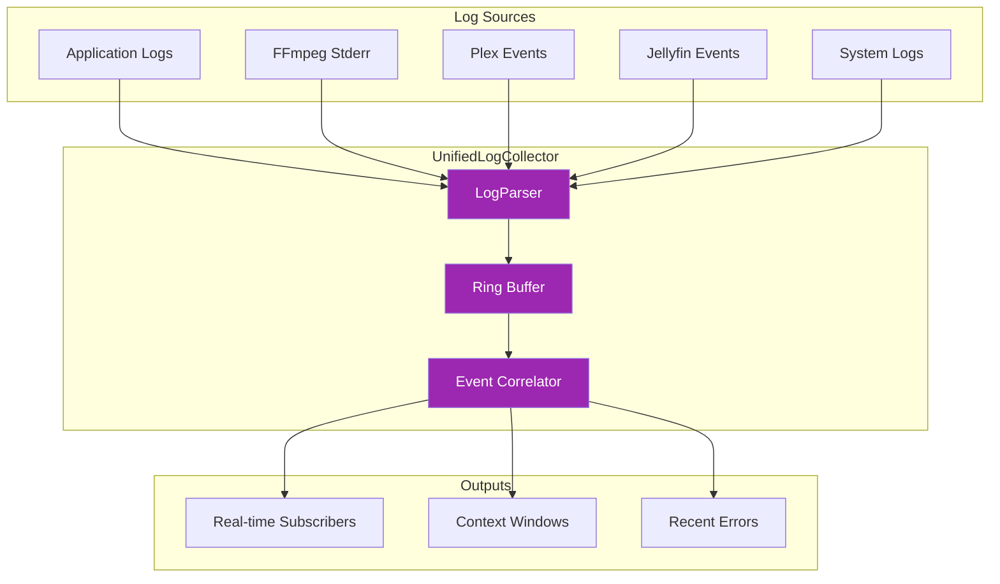
```mermaid
flowchart TB
    subgraph "Log Sources"
        App[Application Logs]
        FFmpeg[FFmpeg Stderr]
        Plex[Plex Events]
        Jellyfin[Jellyfin Events]
        System[System Logs]
    end
    
    subgraph "UnifiedLogCollector"
        Parser[LogParser]
        Buffer[Ring Buffer]
        Correlator[Event Correlator]
    end
    
    subgraph "Outputs"
        Subscribers[Real-time Subscribers]
        Context[Context Windows]
        Errors[Recent Errors]
    end
    
    App --> Parser
    FFmpeg --> Parser
    Plex --> Parser
    Jellyfin --> Parser
    System --> Parser
    
    Parser --> Buffer
    Buffer --> Correlator
    
    Correlator --> Subscribers
    Correlator --> Context
    Correlator --> Errors
    
    style Parser fill:#9C27B0,color:white
    style Buffer fill:#9C27B0,color:white
    style Correlator fill:#9C27B0,color:white
```

**LogEvent Structure:**

```python
@dataclass
class LogEvent:
    event_id: str
    timestamp: datetime
    source: LogSource      # APPLICATION, FFMPEG, PLEX, etc.
    level: LogLevel        # DEBUG, INFO, WARNING, ERROR, CRITICAL
    message: str
    component: Optional[str]
    channel_id: Optional[int]
    session_id: Optional[str]
    ffmpeg_pid: Optional[int]
    parsed_data: dict[str, Any]
    tags: list[str]
```

### 6.2 FFmpeg AI Monitor

**Target:** `exstreamtv/ai_agent/ffmpeg_monitor.py`

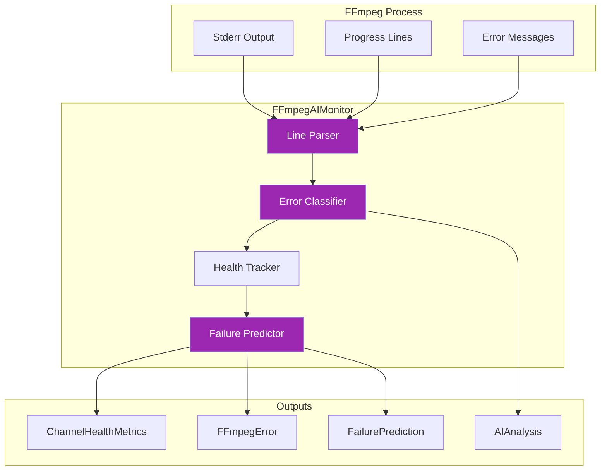
```mermaid
flowchart TB
    subgraph "FFmpeg Process"
        Stderr[Stderr Output]
        Progress[Progress Lines]
        Errors[Error Messages]
    end
    
    subgraph "FFmpegAIMonitor"
        Parser[Line Parser]
        Classifier[Error Classifier]
        HealthTracker[Health Tracker]
        Predictor[Failure Predictor]
    end
    
    subgraph "Outputs"
        Metrics[ChannelHealthMetrics]
        FFErrors[FFmpegError]
        Predictions[FailurePrediction]
        Analysis[AIAnalysis]
    end
    
    Stderr --> Parser
    Progress --> Parser
    Errors --> Parser
    
    Parser --> Classifier
    Classifier --> HealthTracker
    HealthTracker --> Predictor
    
    Predictor --> Metrics
    Predictor --> FFErrors
    Predictor --> Predictions
    Classifier --> Analysis
    
    style Parser fill:#9C27B0,color:white
    style Classifier fill:#9C27B0,color:white
    style Predictor fill:#9C27B0,color:white
```

**Error Classification:**

| Error Type | Pattern | Severity | Recoverable |
|------------|---------|----------|-------------|
| `CONNECTION_TIMEOUT` | "Connection timed out" | ERROR | Yes |
| `HTTP_ERROR` | "HTTP error 4xx/5xx" | ERROR | Yes |
| `CODEC_ERROR` | "Decoder not found" | CRITICAL | No |
| `HARDWARE_ERROR` | "videotoolbox error" | ERROR | Yes |
| `MEMORY_ERROR` | "Out of memory" | CRITICAL | No |

**Health Metrics:**

```python
@dataclass
class ChannelHealthMetrics:
    channel_id: int
    status: HealthStatus       # HEALTHY, DEGRADED, UNHEALTHY, FAILED
    current_fps: float
    expected_fps: float
    current_speed: float       # 1.0 = realtime
    current_bitrate_kbps: float
    dropped_frames: int
    duplicate_frames: int
    error_count: int
    restart_count: int
```

### 6.3 Pattern Detector

**Target:** `exstreamtv/ai_agent/pattern_detector.py`

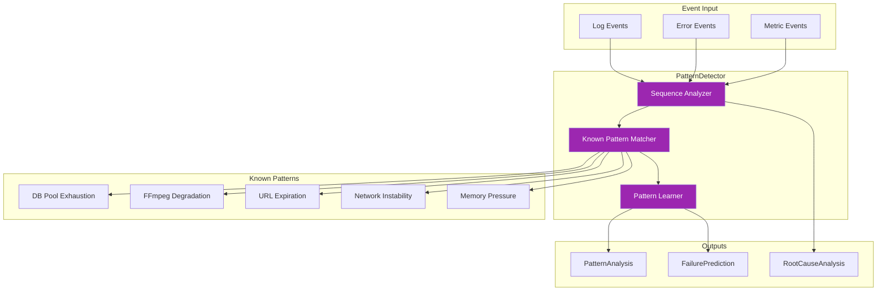
```mermaid
flowchart TB
    subgraph "Event Input"
        LogEvents[Log Events]
        ErrorEvents[Error Events]
        MetricEvents[Metric Events]
    end
    
    subgraph "PatternDetector"
        Analyzer[Sequence Analyzer]
        Matcher[Known Pattern Matcher]
        Learner[Pattern Learner]
    end
    
    subgraph "Known Patterns"
        DBPool["DB Pool Exhaustion"]
        FFDeg["FFmpeg Degradation"]
        URLExp["URL Expiration"]
        NetInst["Network Instability"]
        MemPress["Memory Pressure"]
    end
    
    subgraph "Outputs"
        Analysis[PatternAnalysis]
        Predictions[FailurePrediction]
        RootCause[RootCauseAnalysis]
    end
    
    LogEvents --> Analyzer
    ErrorEvents --> Analyzer
    MetricEvents --> Analyzer
    
    Analyzer --> Matcher
    Matcher --> DBPool
    Matcher --> FFDeg
    Matcher --> URLExp
    Matcher --> NetInst
    Matcher --> MemPress
    
    Matcher --> Learner
    Learner --> Analysis
    Learner --> Predictions
    Analyzer --> RootCause
    
    style Analyzer fill:#9C27B0,color:white
    style Matcher fill:#9C27B0,color:white
    style Learner fill:#9C27B0,color:white
```

**Known Pattern Indicators:**

| Pattern | Indicators | Risk Level |
|---------|------------|------------|
| DB Pool Exhaustion | "pool exhausted", "connection timeout", "no connections" | HIGH |
| FFmpeg Degradation | "speed < 1.0x", "dropping frames", "buffer underrun" | MEDIUM |
| URL Expiration | "403 forbidden", "401 unauthorized", "token expired" | MEDIUM |
| Network Instability | "connection reset", "connection refused", "timeout" | HIGH |
| Memory Pressure | "out of memory", "allocation failed", "swap usage" | CRITICAL |

### 6.4 Auto Resolver

**Target:** `exstreamtv/ai_agent/auto_resolver.py`

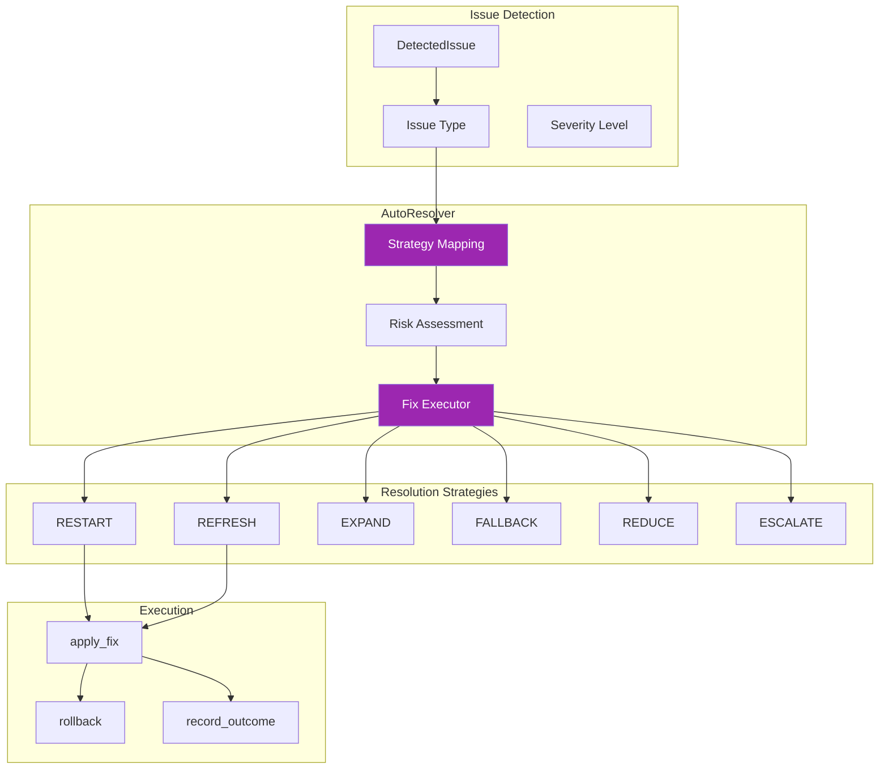
```mermaid
flowchart TB
    subgraph "Issue Detection"
        Issue[DetectedIssue]
        Type[Issue Type]
        Severity[Severity Level]
    end
    
    subgraph "AutoResolver"
        StrategyMap[Strategy Mapping]
        RiskCheck[Risk Assessment]
        Executor[Fix Executor]
    end
    
    subgraph "Resolution Strategies"
        Restart[RESTART]
        Refresh[REFRESH]
        Expand[EXPAND]
        Fallback[FALLBACK]
        Reduce[REDUCE]
        Escalate[ESCALATE]
    end
    
    subgraph "Execution"
        Apply[apply_fix]
        Rollback[rollback]
        Learn[record_outcome]
    end
    
    Issue --> Type
    Type --> StrategyMap
    StrategyMap --> RiskCheck
    RiskCheck --> Executor
    
    Executor --> Restart
    Executor --> Refresh
    Executor --> Expand
    Executor --> Fallback
    Executor --> Reduce
    Executor --> Escalate
    
    Restart --> Apply
    Refresh --> Apply
    Apply --> Rollback
    Apply --> Learn
    
    style StrategyMap fill:#9C27B0,color:white
    style Executor fill:#9C27B0,color:white
```

**Issue-to-Strategy Mapping:**

| Issue Type | Primary Strategy | Risk Level | Confidence |
|------------|------------------|------------|------------|
| `FFMPEG_HANG` | RESTART | MEDIUM | 0.90 |
| `FFMPEG_CRASH` | RESTART | MEDIUM | 0.85 |
| `URL_EXPIRED` | REFRESH | SAFE | 0.95 |
| `DB_POOL_EXHAUSTED` | EXPAND | LOW | 0.80 |
| `AUTH_FAILED` | REFRESH | SAFE | 0.90 |
| `MEMORY_PRESSURE` | REDUCE | MEDIUM | 0.70 |
| `SOURCE_UNAVAILABLE` | FALLBACK | SAFE | 0.95 |

**Zero-Downtime Resolution Flow:**

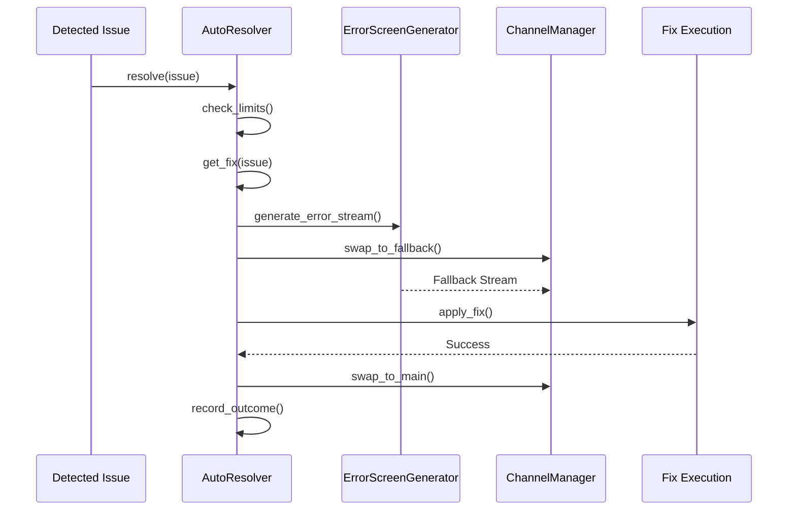
```mermaid
sequenceDiagram
    participant Issue as Detected Issue
    participant AR as AutoResolver
    participant ESG as ErrorScreenGenerator
    participant CM as ChannelManager
    participant Fix as Fix Execution
    
    Issue->>AR: resolve(issue)
    AR->>AR: check_limits()
    AR->>AR: get_fix(issue)
    AR->>ESG: generate_error_stream()
    AR->>CM: swap_to_fallback()
    ESG-->>CM: Fallback Stream
    AR->>Fix: apply_fix()
    Fix-->>AR: Success
    AR->>CM: swap_to_main()
    AR->>AR: record_outcome()
```

---

## Complete Data Flow

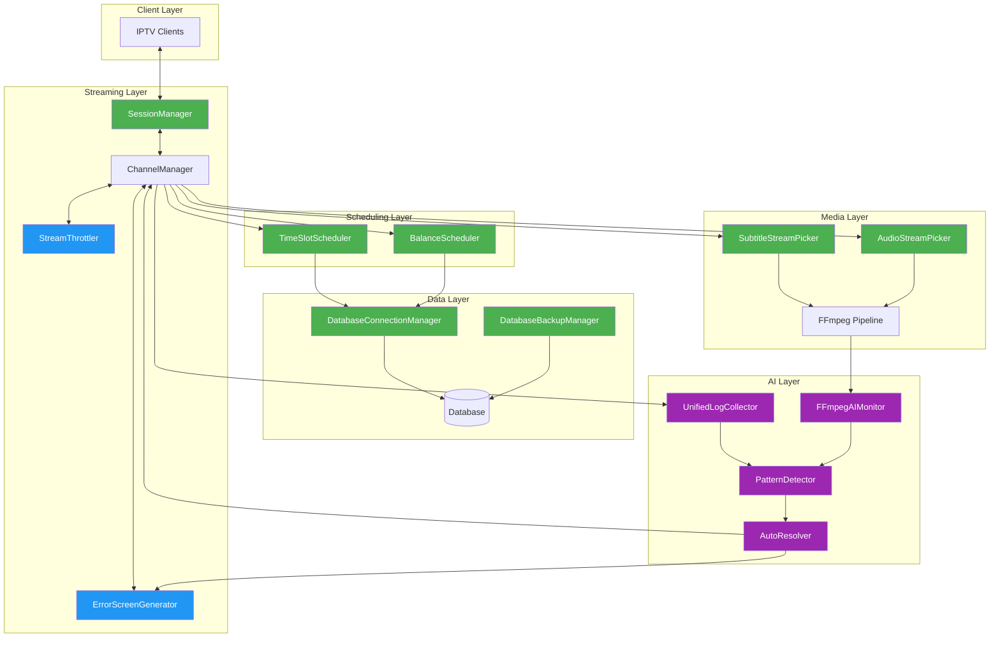
```mermaid
flowchart TB
    subgraph "Client Layer"
        Clients[IPTV Clients]
    end
    
    subgraph "Streaming Layer"
        SM[SessionManager]
        CM[ChannelManager]
        ST[StreamThrottler]
        ESG[ErrorScreenGenerator]
    end
    
    subgraph "Scheduling Layer"
        TSS[TimeSlotScheduler]
        BS[BalanceScheduler]
    end
    
    subgraph "Media Layer"
        SSP[SubtitleStreamPicker]
        ASP[AudioStreamPicker]
        FFmpeg[FFmpeg Pipeline]
    end
    
    subgraph "Data Layer"
        DCM[DatabaseConnectionManager]
        DBM[DatabaseBackupManager]
        DB[(Database)]
    end
    
    subgraph "AI Layer"
        ULC[UnifiedLogCollector]
        FFM[FFmpegAIMonitor]
        PD[PatternDetector]
        AR[AutoResolver]
    end
    
    Clients <--> SM
    SM <--> CM
    CM <--> ST
    CM <--> ESG
    
    CM --> TSS
    CM --> BS
    TSS --> DCM
    BS --> DCM
    
    CM --> SSP
    CM --> ASP
    SSP --> FFmpeg
    ASP --> FFmpeg
    
    DCM --> DB
    DBM --> DB
    
    CM --> ULC
    FFmpeg --> FFM
    ULC --> PD
    FFM --> PD
    PD --> AR
    AR --> CM
    AR --> ESG
    
    style SM fill:#4CAF50,color:white
    style ST fill:#2196F3,color:white
    style ESG fill:#2196F3,color:white
    style DCM fill:#4CAF50,color:white
    style TSS fill:#4CAF50,color:white
    style BS fill:#4CAF50,color:white
    style SSP fill:#4CAF50,color:white
    style ASP fill:#4CAF50,color:white
    style DBM fill:#4CAF50,color:white
    style ULC fill:#9C27B0,color:white
    style FFM fill:#9C27B0,color:white
    style PD fill:#9C27B0,color:white
    style AR fill:#9C27B0,color:white
```

---

## Configuration Reference

### AIAutoHealConfig

```yaml
ai_auto_heal:
  enabled: true
  log_buffer_minutes: 30
  realtime_streaming: true
  ffmpeg_monitor_enabled: true
  ffmpeg_health_threshold: 0.8
  pattern_detection_enabled: true
  prediction_confidence_threshold: 0.75
  auto_resolve_enabled: true
  max_auto_fixes_per_hour: 50
  require_approval_above_risk: "MEDIUM"
  use_error_screen_fallback: true
  hot_swap_enabled: true
  learning_enabled: true
```

### DatabaseBackupConfig

```yaml
database_backup:
  enabled: true
  backup_directory: "backups"
  interval_hours: 24
  keep_count: 7
  keep_days: 30
  compress: true
```

### SessionManagerConfig

```yaml
session_manager:
  max_sessions_per_channel: 50
  idle_timeout_seconds: 300
  cleanup_interval_seconds: 60
```

### StreamThrottlerConfig

```yaml
stream_throttler:
  enabled: true
  target_bitrate_bps: 4000000
  mode: "realtime"  # realtime, burst, adaptive, disabled
```

---

## File Reference

### New Files Created

| File | Lines | Description |
|------|-------|-------------|
| `streaming/session_manager.py` | ~450 | Session tracking from Tunarr |
| `streaming/throttler.py` | ~380 | Rate limiting from dizqueTV |
| `streaming/error_screens.py` | ~420 | Error streams from dizqueTV |
| `scheduling/time_slots.py` | ~400 | Time slot scheduling from Tunarr |
| `scheduling/balance.py` | ~350 | Balance scheduling from Tunarr |
| `ffmpeg/subtitle_picker.py` | ~320 | Subtitle selection from Tunarr |
| `ffmpeg/audio_picker.py` | ~340 | Audio selection from Tunarr |
| `database/backup.py` | ~450 | Backup management from Tunarr |
| `ai_agent/unified_log_collector.py` | ~520 | Log aggregation |
| `ai_agent/ffmpeg_monitor.py` | ~480 | FFmpeg monitoring |
| `ai_agent/pattern_detector.py` | ~440 | Pattern detection |
| `ai_agent/auto_resolver.py` | ~500 | Auto resolution |

### Modified Files

| File | Changes |
|------|---------|
| `database/connection.py` | Added DatabaseConnectionManager |
| `config.py` | Added 4 new config classes |
| `main.py` | Initialize new components on startup |
| `streaming/channel_manager.py` | Integrated new components |
| `streaming/__init__.py` | Export new components |
| `scheduling/__init__.py` | Export new components |
| `database/__init__.py` | Export new components |
| `ffmpeg/__init__.py` | Export new components |

---

## Version History

| Version | Date | Changes |
|---------|------|---------|
| 2.6.0 | 2026-01-31 | Initial Tunarr/dizqueTV integration |

---

*See [BUILD_PROGRESS.md](../BUILD_PROGRESS.md) for overall development status.*
