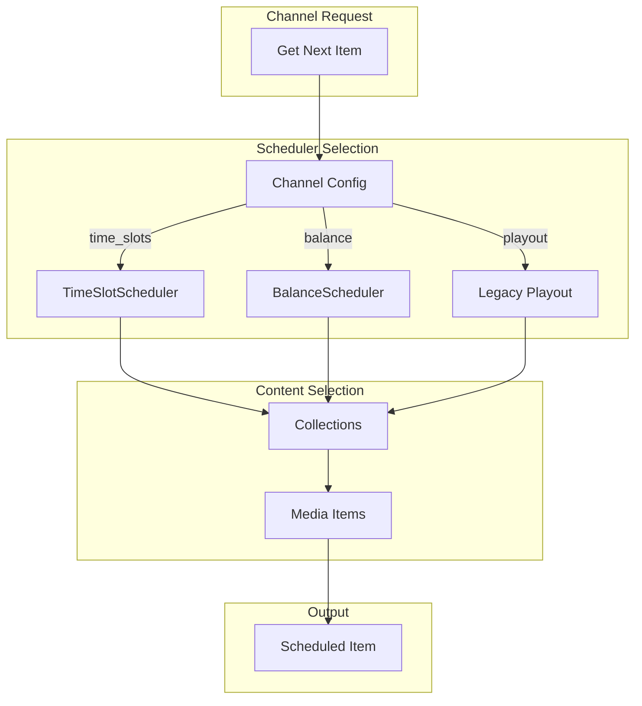
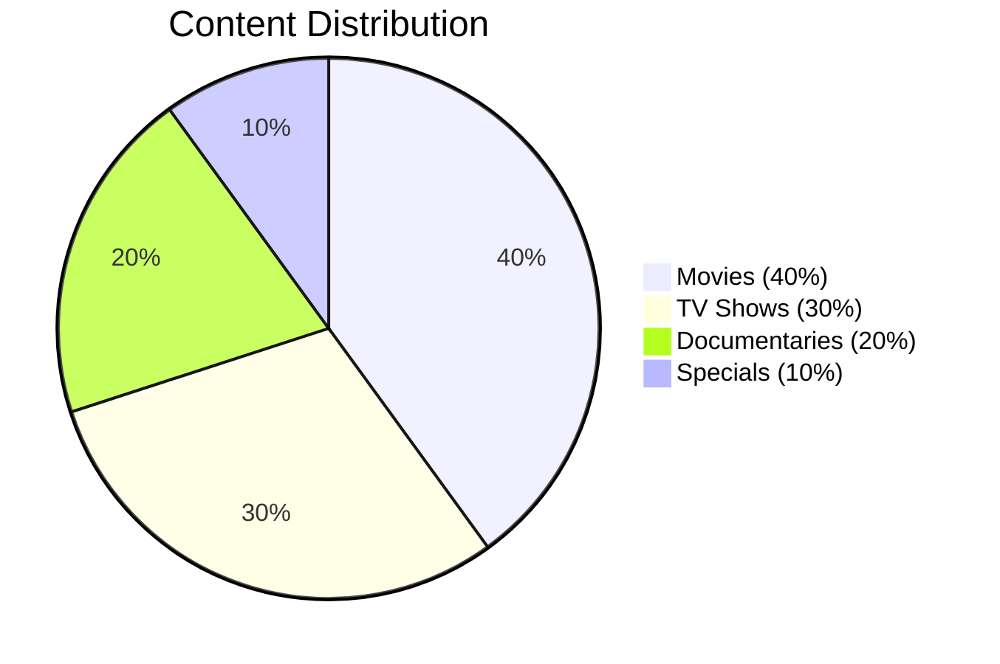
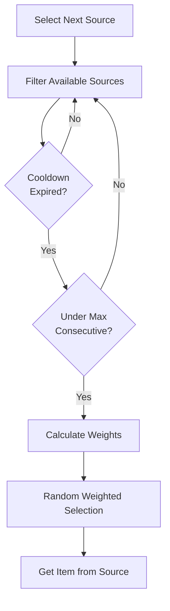
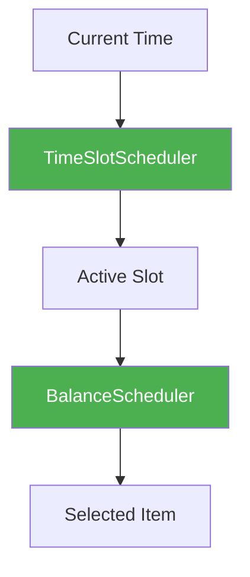

# Advanced Scheduling Guide

**Version:** 2.6.0  
**Last Updated:** 2026-01-31

This guide covers the advanced scheduling features introduced in EXStreamTV v2.6.0, including time slot scheduling and balance scheduling from Tunarr.

---

## Table of Contents

- [Overview](#overview)
- [Time Slot Scheduling](#time-slot-scheduling)
- [Balance Scheduling](#balance-scheduling)
- [Combining Schedulers](#combining-schedulers)
- [Configuration](#configuration)
- [API Reference](#api-reference)
- [Best Practices](#best-practices)

---

## Overview

EXStreamTV v2.6.0 introduces two powerful scheduling systems from Tunarr:

| Scheduler | Purpose | Best For |
|-----------|---------|----------|
| **Time Slot Scheduler** | Time-of-day programming | Traditional TV schedules |
| **Balance Scheduler** | Weight-based content mixing | Variety channels |

### Scheduling Architecture



---

## Time Slot Scheduling

Time slot scheduling divides the day into blocks, each with its own content and settings.

### Concept



```mermaid
gantt
    title Daily Schedule
    dateFormat HH:mm
    axisFormat %H:%M
    
    section Morning
    Morning News :06:00, 3h
    
    section Daytime
    Talk Shows :09:00, 3h
    Afternoon Movies :12:00, 6h
    
    section Evening
    Prime Time :18:00, 4h
    Late Night :22:00, 8h
```

### Time Slot Configuration

```python
from exstreamtv.scheduling.time_slots import (
    TimeSlot,
    TimeSlotSchedule,
    TimeSlotScheduler,
    TimeSlotOrderMode,
    TimeSlotPaddingMode,
)
from datetime import time

# Define slots
morning_slot = TimeSlot(
    slot_id="morning",
    name="Morning News",
    start_time=time(6, 0),      # 6:00 AM
    duration_minutes=180,        # 3 hours
    collection_id=1,             # News collection
    order_mode=TimeSlotOrderMode.ORDERED,
    padding_mode=TimeSlotPaddingMode.LOOP,
    days_of_week=62,            # Monday-Friday (2+4+8+16+32)
)

prime_time_slot = TimeSlot(
    slot_id="primetime",
    name="Prime Time",
    start_time=time(18, 0),     # 6:00 PM
    duration_minutes=240,        # 4 hours
    collection_id=5,             # Prime time collection
    order_mode=TimeSlotOrderMode.SHUFFLE,
    padding_mode=TimeSlotPaddingMode.FILLER,
    filler_preset_id=2,         # Commercial breaks
    days_of_week=127,           # All days
)

# Create schedule
schedule = TimeSlotSchedule(
    schedule_id="main_schedule",
    name="Main Channel Schedule",
    slots=[morning_slot, prime_time_slot],
)
```

### Order Modes

| Mode | Behavior | Use Case |
|------|----------|----------|
| `ORDERED` | Play items in sequence | News, episodes |
| `SHUFFLE` | Random order, no repeats until all played | Movies, variety |
| `RANDOM` | Pure random selection | Music videos, clips |

### Padding Modes

When a slot ends before the next begins:

| Mode | Behavior | Use Case |
|------|----------|----------|
| `NONE` | Dead air | Not recommended |
| `FILLER` | Play from filler preset | Commercials, bumpers |
| `LOOP` | Repeat slot content | Short programs |
| `NEXT` | Start next slot early | Continuous programming |

### Flex Modes

When content doesn't fit the slot exactly:

| Mode | Behavior | Use Case |
|------|----------|----------|
| `NONE` | Cut off at slot end | Strict scheduling |
| `EXTEND` | Let current item finish | Movies, long shows |
| `COMPRESS` | Skip items to fit | Time-sensitive content |

### Days of Week

Use a bitmask to specify active days:

| Day | Value |
|-----|-------|
| Sunday | 1 |
| Monday | 2 |
| Tuesday | 4 |
| Wednesday | 8 |
| Thursday | 16 |
| Friday | 32 |
| Saturday | 64 |

Examples:
- All days: `127` (1+2+4+8+16+32+64)
- Weekdays: `62` (2+4+8+16+32)
- Weekends: `65` (1+64)

---

## Balance Scheduling

Balance scheduling distributes content based on weights, ensuring variety.

### Concept



### Balance Configuration

```python
from exstreamtv.scheduling.balance import (
    BalanceScheduler,
    BalanceConfig,
    ContentSource,
)

# Define content sources
movies = ContentSource(
    source_id="movies",
    name="Movies",
    collection_id=1,
    weight=40,              # 40% of content
    cooldown_minutes=60,    # Wait 1 hour before repeating
    max_consecutive=2,      # Max 2 movies in a row
)

tv_shows = ContentSource(
    source_id="tv_shows",
    name="TV Shows",
    collection_id=2,
    weight=30,
    cooldown_minutes=30,
    max_consecutive=4,
)

documentaries = ContentSource(
    source_id="docs",
    name="Documentaries",
    collection_id=3,
    weight=20,
    cooldown_minutes=120,
    max_consecutive=1,
)

specials = ContentSource(
    source_id="specials",
    name="Specials",
    collection_id=4,
    weight=10,
    cooldown_minutes=240,
    max_consecutive=1,
)

# Create scheduler
config = BalanceConfig(
    sources=[movies, tv_shows, documentaries, specials],
    enforce_cooldown=True,
    enforce_max_consecutive=True,
)

scheduler = BalanceScheduler(config=config)
```

### Weight Selection Algorithm



### Cooldown

Cooldown prevents the same source from being selected too frequently:

```python
ContentSource(
    source_id="movies",
    collection_id=1,
    weight=40,
    cooldown_minutes=60,    # After playing a movie, wait 60 min
)
```

### Max Consecutive

Limits how many items from one source play in a row:

```python
ContentSource(
    source_id="documentaries",
    collection_id=3,
    weight=20,
    max_consecutive=1,      # Never play 2 documentaries back-to-back
)
```

---

## Combining Schedulers

You can use both schedulers together for complex programming.

### Example: Time-Based Balance

Different balance weights at different times of day:

```python
from datetime import time

# Morning: More news and talk shows
morning_config = BalanceConfig(
    sources=[
        ContentSource("news", 1, weight=50),
        ContentSource("talk", 2, weight=30),
        ContentSource("reruns", 3, weight=20),
    ]
)

# Prime Time: More movies and premium content
evening_config = BalanceConfig(
    sources=[
        ContentSource("movies", 4, weight=45),
        ContentSource("series", 5, weight=35),
        ContentSource("documentaries", 6, weight=20),
    ]
)

# Create time slots with different balance configs
morning_slot = TimeSlot(
    slot_id="morning",
    start_time=time(6, 0),
    duration_minutes=360,
    balance_config=morning_config,
)

evening_slot = TimeSlot(
    slot_id="evening",
    start_time=time(18, 0),
    duration_minutes=360,
    balance_config=evening_config,
)
```

### Flow Diagram



---

## Configuration

### config.yaml Example

```yaml
# Time Slot Scheduling
scheduling:
  type: "time_slots"  # or "balance" or "hybrid"
  
  time_slots:
    enabled: true
    default_padding_mode: "filler"
    default_order_mode: "shuffle"
    
  balance:
    enabled: true
    enforce_cooldown: true
    enforce_max_consecutive: true
    
# Channel-specific overrides
channels:
  - number: 1
    name: "Movie Channel"
    scheduling:
      type: "balance"
      sources:
        - collection_id: 1
          weight: 70
          name: "Action Movies"
        - collection_id: 2
          weight: 30
          name: "Comedy Movies"
          
  - number: 2
    name: "News 24/7"
    scheduling:
      type: "time_slots"
      slots:
        - name: "Morning News"
          start_time: "06:00"
          duration_minutes: 180
          collection_id: 3
```

---

## API Reference

### Time Slot Scheduler API

```python
from exstreamtv.scheduling import (
    TimeSlot,
    TimeSlotSchedule,
    TimeSlotScheduler,
    get_time_slot_scheduler,
)

# Get global scheduler
scheduler = get_time_slot_scheduler()

# Get current item for a channel
item = await scheduler.get_current_item(
    channel_id=1,
    dt=datetime.now(),
    get_media_items=media_callback,
)

# Get active slot
slot = schedule.get_active_slot(datetime.now())

# Get next slot
next_slot = schedule.get_next_slot(datetime.now())
```

### Balance Scheduler API

```python
from exstreamtv.scheduling import (
    BalanceScheduler,
    BalanceConfig,
    ContentSource,
    get_balance_scheduler,
)

# Get global scheduler
scheduler = get_balance_scheduler()

# Get next item
item = await scheduler.get_next_item(
    channel_id=1,
    get_media_items=media_callback,
)

# Get distribution stats
stats = scheduler.get_stats(channel_id=1)
# Returns: {"movies": 42.1, "tv_shows": 31.5, "docs": 18.9, "specials": 7.5}
```

---

## Best Practices

### Time Slot Scheduling

1. **Cover the Full Day**: Ensure slots cover 24 hours to avoid gaps
2. **Use Flex Mode**: Set `EXTEND` for movies to prevent mid-film cuts
3. **Add Filler**: Configure filler presets for smooth transitions
4. **Weekend Variations**: Use different slots for weekends

### Balance Scheduling

1. **Set Appropriate Weights**: Start with 10-point increments
2. **Use Cooldowns**: Prevent repetition fatigue
3. **Limit Consecutive**: Keep variety with max_consecutive
4. **Monitor Distribution**: Check stats and adjust weights

### General Tips

1. **Test Before Production**: Run schedules in preview mode
2. **Have Fallback Content**: Always configure filler collections
3. **Monitor Performance**: Check AI health metrics
4. **Use AI Personas**: Let AI suggest optimal schedules

---

## Related Documentation

- [Channel Creation Guide](CHANNEL_CREATION_GUIDE.md) - Basic channel setup
- [Tunarr/dizqueTV Integration](../architecture/TUNARR_DIZQUETV_INTEGRATION.md) - Technical details
- [Streaming Stability](STREAMING_STABILITY.md) - Streaming features
- [API Reference](../api/README.md) - Complete API documentation
