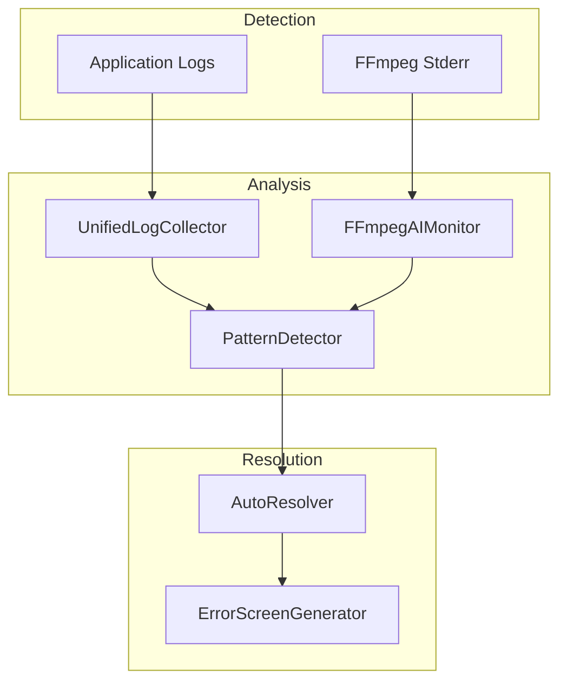

# AI Setup Guide

EXStreamTV uses AI to help create channels, troubleshoot issues, and analyze logs. This guide covers configuring AI providers for your installation.

## Table of Contents

- [Overview](#overview)
- [Provider Options](#provider-options)
- [Cloud AI Setup](#cloud-ai-setup)
  - [Groq (Recommended)](#groq-recommended)
  - [SambaNova](#sambanova)
  - [OpenRouter](#openrouter)
- [Local AI Setup](#local-ai-setup)
  - [Installing Ollama](#installing-ollama)
  - [Choosing a Model](#choosing-a-model)
  - [Downloading Models](#downloading-models)
- [Hybrid Mode](#hybrid-mode)
- [Configuration Reference](#configuration-reference)
- [Troubleshooting](#troubleshooting)

---

## Overview

EXStreamTV supports three AI provider modes:

| Mode | Description | Best For |
|------|-------------|----------|
| **Cloud** | Uses cloud AI services (Groq, SambaNova, OpenRouter) | Most users - fast setup, no local resources needed |
| **Local** | Runs AI models on your Mac via Ollama | Privacy-focused users, offline usage |
| **Hybrid** | Cloud primary with local fallback | Best reliability - works offline when cloud unavailable |

All cloud providers offer **free tiers** - no credit card required.

---

## Provider Options

### Cloud Providers Comparison

| Provider | Free Tier | Speed | Models | Signup Time |
|----------|-----------|-------|--------|-------------|
| **Groq** | 14,400 req/day, 30 req/min | Ultra-fast | Llama 3.3 70B, Mixtral | 30 seconds |
| **SambaNova** | 1M tokens/day | Fast | Llama 3.3 70B, DeepSeek | 1 minute |
| **OpenRouter** | $5 credit | Varies | 100+ models | 2 minutes |

### Local Models by RAM

| RAM | Recommended Model | Size | Capabilities |
|-----|------------------|------|--------------|
| 4GB | phi4-mini:3.8b-q4 | 2.5GB | Basic channel creation, troubleshooting |
| 6-8GB | granite3.1:2b-instruct | 2GB | Full troubleshooting, tool calling |
| 8-16GB | qwen2.5:7b | 4.4GB | All features, excellent JSON output |
| 16GB+ | qwen2.5:14b | 9GB | Best quality, all 6 channel personas |
| 32GB+ | qwen2.5-coder:32b | 18GB | Power users, complex schedules |

---

## Cloud AI Setup

### Groq (Recommended)

Groq offers the fastest inference and a generous free tier. This is the recommended choice for most users.

#### Step 1: Get Your API Key

1. Go to [console.groq.com](https://console.groq.com/keys)
2. Sign in with Google or GitHub (takes 10 seconds)
3. Click **Create API Key**
4. Copy your API key (starts with `gsk_`)

#### Step 2: Configure EXStreamTV

**Option A: Environment Variable**

```bash
export GROQ_API_KEY="gsk_your_key_here"
```

Add to your shell profile (`~/.zshrc` or `~/.bashrc`) for persistence.

**Option B: Configuration File**

Edit `config.yaml`:

```yaml
ai_agent:
  enabled: true
  provider_type: "cloud"
  cloud:
    provider: "groq"
    api_key: "gsk_your_key_here"
    model: "llama-3.3-70b-versatile"
```

**Option C: macOS App Settings**

1. Open EXStreamTV menu bar app
2. Go to **Settings** > **AI** tab
3. Select **Cloud AI**
4. Choose **Groq**
5. Paste your API key
6. Click **Validate & Save**

#### Groq Free Tier Limits

- 30 requests per minute
- 14,400 requests per day
- 6,000 tokens per minute
- No credit card required

---

### SambaNova

SambaNova offers 1 million tokens per day free, making it an excellent backup provider.

#### Step 1: Get Your API Key

1. Go to [cloud.sambanova.ai](https://cloud.sambanova.ai)
2. Create an account
3. Navigate to API Keys section
4. Generate a new key

#### Step 2: Configure

```yaml
ai_agent:
  provider_type: "cloud"
  cloud:
    provider: "sambanova"
    api_key: "your_sambanova_key"
    model: "Meta-Llama-3.3-70B-Instruct"
```

Or set environment variable:

```bash
export SAMBANOVA_API_KEY="your_key_here"
```

---

### OpenRouter

OpenRouter provides access to 100+ models with $5 free credit on signup.

#### Step 1: Get Your API Key

1. Go to [openrouter.ai/keys](https://openrouter.ai/keys)
2. Sign in with Google or GitHub
3. Create an API key

#### Step 2: Configure

```yaml
ai_agent:
  provider_type: "cloud"
  cloud:
    provider: "openrouter"
    api_key: "sk-or-your_key_here"
    model: "meta-llama/llama-3.3-70b-instruct"
```

#### Free Models on OpenRouter

- `meta-llama/llama-3.2-3b-instruct:free`
- `mistralai/mistral-7b-instruct:free`
- `google/gemini-2.0-flash-exp:free`

---

## Local AI Setup

Local AI runs entirely on your Mac using Ollama. No internet required after setup.

### Installing Ollama

**Option 1: Homebrew (Recommended)**

```bash
brew install ollama
```

**Option 2: Direct Download**

1. Go to [ollama.com/download](https://ollama.com/download)
2. Download and install the macOS app

**Option 3: Script Installation**

```bash
curl -fsSL https://ollama.com/install.sh | sh
```

### Starting Ollama

Ollama runs as a background service:

```bash
# Start Ollama service
ollama serve
```

Or launch the Ollama app, which starts the service automatically.

### Choosing a Model

Check your Mac's RAM to determine the best model:

```bash
# Check RAM
sysctl -n hw.memsize | awk '{print int($1/1024/1024/1024) " GB"}'
```

**Model Recommendations:**

| Your RAM | Model Command | Use Case |
|----------|---------------|----------|
| 4GB | `ollama pull phi4-mini:3.8b-q4` | Basic AI features |
| 8GB | `ollama pull qwen2.5:7b` | Full functionality |
| 16GB | `ollama pull qwen2.5:14b` | Best quality |
| 32GB+ | `ollama pull qwen2.5-coder:32b` | Power users |

### Downloading Models

```bash
# Download recommended model for 8GB RAM
ollama pull qwen2.5:7b

# Verify installation
ollama list
```

### Configure for Local AI

```yaml
ai_agent:
  enabled: true
  provider_type: "local"
  local:
    host: "http://localhost:11434"
    model: "qwen2.5:7b"  # or "auto" for automatic selection
```

Setting `model: "auto"` automatically selects the best model based on your RAM.

---

## Hybrid Mode

Hybrid mode uses cloud AI when available and falls back to local when offline.

### Configuration

```yaml
ai_agent:
  provider_type: "hybrid"
  
  cloud:
    provider: "groq"
    api_key: "${GROQ_API_KEY}"
    model: "llama-3.3-70b-versatile"
    
    # Optional fallback providers
    fallback:
      - provider: "sambanova"
        api_key: "${SAMBANOVA_API_KEY}"
        model: "Meta-Llama-3.3-70B-Instruct"
  
  local:
    host: "http://localhost:11434"
    model: "auto"
```

### How Hybrid Mode Works

1. Attempts cloud provider first (Groq)
2. If cloud fails, tries fallback cloud providers in order
3. If all cloud providers fail, uses local Ollama
4. Returns error only if all providers fail

---

## Configuration Reference

### Complete config.yaml Example

```yaml
ai_agent:
  enabled: true
  
  # Provider selection: cloud, local, or hybrid
  provider_type: "cloud"
  
  # Cloud provider configuration
  cloud:
    provider: "groq"  # groq, sambanova, or openrouter
    api_key: "${GROQ_API_KEY}"
    model: "llama-3.3-70b-versatile"
    
    # Fallback providers (optional)
    fallback:
      - provider: "sambanova"
        api_key: "${SAMBANOVA_API_KEY}"
        model: "Meta-Llama-3.3-70B-Instruct"
  
  # Local provider configuration
  local:
    host: "http://localhost:11434"
    model: "auto"  # or specific model like "qwen2.5:7b"
  
  # Model settings
  settings:
    temperature: 0.3  # Lower = more deterministic
    max_tokens: 4096
    timeout: 30  # seconds
```

### Environment Variables

| Variable | Description |
|----------|-------------|
| `GROQ_API_KEY` | Groq Cloud API key |
| `SAMBANOVA_API_KEY` | SambaNova API key |
| `OPENROUTER_API_KEY` | OpenRouter API key |
| `OLLAMA_URL` | Custom Ollama URL (default: http://localhost:11434) |

---

## Troubleshooting

### Cloud AI Issues

**"Invalid API key" Error**

- Verify the key is correct (no extra spaces)
- Check the key hasn't expired
- Ensure you're using the right provider's key

**"Rate limit exceeded"**

- Wait a few minutes and try again
- Consider adding fallback providers
- Switch to a different cloud provider

**"Connection refused"**

- Check your internet connection
- Verify the provider's service status
- Try a different provider

### Local AI Issues

**"Ollama not found"**

```bash
# Check if Ollama is installed
which ollama

# Install if missing
brew install ollama
```

**"Model not found"**

```bash
# List installed models
ollama list

# Pull the required model
ollama pull qwen2.5:7b
```

**"Connection refused to localhost:11434"**

```bash
# Start Ollama service
ollama serve

# Or check if already running
pgrep -f ollama
```

**Slow performance with local AI**

- Choose a smaller model appropriate for your RAM
- Close other memory-intensive applications
- Consider using cloud AI for better performance

### General Issues

**AI features not working**

1. Check that `ai_agent.enabled: true` in config.yaml
2. Verify at least one provider is configured
3. Check the logs: **Settings** > **Logs**

**"AI configuration incomplete"**

- Ensure you've entered an API key (cloud) or installed a model (local)
- Run the onboarding wizard again from Settings

---

## AI Self-Healing System (NEW in v2.6.0)

EXStreamTV v2.6.0 introduces an AI-powered self-healing system that autonomously detects and resolves streaming issues.

### Overview



### Configuration

Add to your `config.yaml`:

```yaml
ai_auto_heal:
  enabled: true
  
  # Log collection
  log_buffer_minutes: 30
  realtime_streaming: true
  
  # FFmpeg monitoring
  ffmpeg_monitor_enabled: true
  ffmpeg_health_threshold: 0.8  # Speed threshold for healthy
  
  # Pattern detection
  pattern_detection_enabled: true
  prediction_confidence_threshold: 0.75
  
  # Auto resolution
  auto_resolve_enabled: true
  max_auto_fixes_per_hour: 50
  require_approval_above_risk: "MEDIUM"  # SAFE, LOW, MEDIUM, HIGH
  
  # Zero-downtime features
  use_error_screen_fallback: true
  hot_swap_enabled: true
  
  # Learning
  learning_enabled: true
```

### Components

#### 1. Unified Log Collector

Aggregates logs from all sources in real-time:

- Application logs
- FFmpeg stderr
- Plex/Jellyfin events
- System logs

```python
# Access log collector
from exstreamtv.ai_agent.unified_log_collector import get_log_collector

collector = get_log_collector()

# Get recent errors
errors = collector.get_recent_errors(minutes=60)

# Get context window for a channel
context = collector.get_context_window(channel_id=1, minutes=5)
```

#### 2. FFmpeg AI Monitor

Monitors FFmpeg processes for issues:

| Metric | Description | Healthy Range |
|--------|-------------|---------------|
| FPS | Frames per second | 25-30 |
| Speed | Encoding speed | 0.95-1.1x |
| Bitrate | Output bitrate | Target ±20% |
| Dropped Frames | Frame drops | < 10/minute |

#### 3. Pattern Detector

Detects known problematic patterns:

| Pattern | Indicators | Risk Level |
|---------|------------|------------|
| DB Pool Exhaustion | "pool exhausted", "connection timeout" | HIGH |
| FFmpeg Degradation | "speed < 1.0x", "dropping frames" | MEDIUM |
| URL Expiration | "403 forbidden", "token expired" | MEDIUM |
| Network Instability | "connection reset", "timeout" | HIGH |
| Memory Pressure | "out of memory" | CRITICAL |

#### 4. Auto Resolver

Automatically resolves detected issues:

| Issue Type | Strategy | Downtime |
|------------|----------|----------|
| FFmpeg Hang | Restart | ~2 sec |
| URL Expired | Refresh | 0 sec |
| DB Pool Exhausted | Expand | 0 sec |
| Source Unavailable | Fallback | 0 sec |

### Error Screen Fallback

During issue resolution, clients receive an error screen instead of a broken stream:

```yaml
# Visual modes: text, static, test_pattern, slate
# Audio modes: silent, sine_wave, white_noise, beep

ai_auto_heal:
  use_error_screen_fallback: true
```

### Monitoring AI Health

Check the AI system status:

```bash
# Via API
curl http://localhost:8411/api/ai/health

# Via WebUI
# Navigate to Settings > AI > Health Status
```

### Risk Levels

Configure which fixes require approval:

| Risk Level | Example Fixes | Default Behavior |
|------------|---------------|------------------|
| SAFE | Refresh URL, Switch fallback | Auto-apply |
| LOW | Expand pool, Restart channel | Auto-apply |
| MEDIUM | Reduce load, Kill process | Requires approval |
| HIGH | Full restart, Database restore | Requires approval |

---

## Database Backup (NEW in v2.6.0)

EXStreamTV now includes automatic database backup:

```yaml
database_backup:
  enabled: true
  backup_directory: "backups"
  interval_hours: 24      # Backup every 24 hours
  keep_count: 7           # Keep 7 most recent
  keep_days: 30           # Delete older than 30 days
  compress: true          # Gzip compression
```

### Manual Backup

```bash
# Via API
curl -X POST http://localhost:8411/api/database/backup

# Via WebUI
# Navigate to Settings > Database > Create Backup
```

---

## Next Steps

- [Quick Start Guide](QUICK_START.md) - Create your first channel
- [Onboarding Guide](ONBOARDING.md) - Complete setup wizard
- [macOS App Guide](MACOS_APP_GUIDE.md) - Use the menu bar app
- [Tunarr/dizqueTV Integration](../architecture/TUNARR_DIZQUETV_INTEGRATION.md) - v2.6.0 technical details