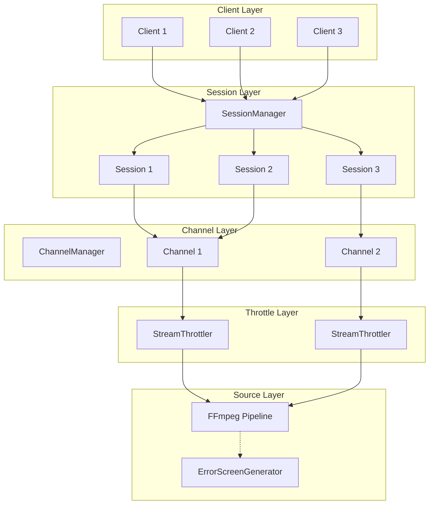
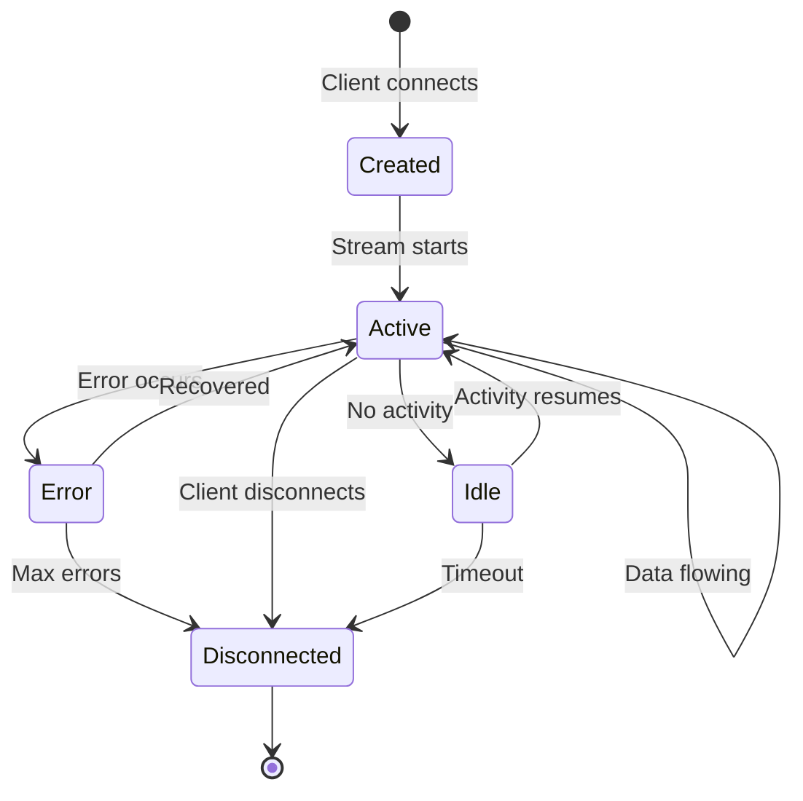
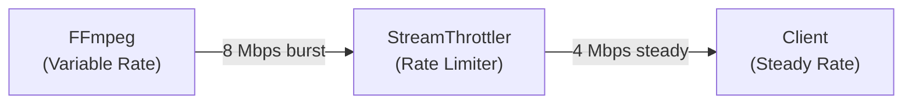
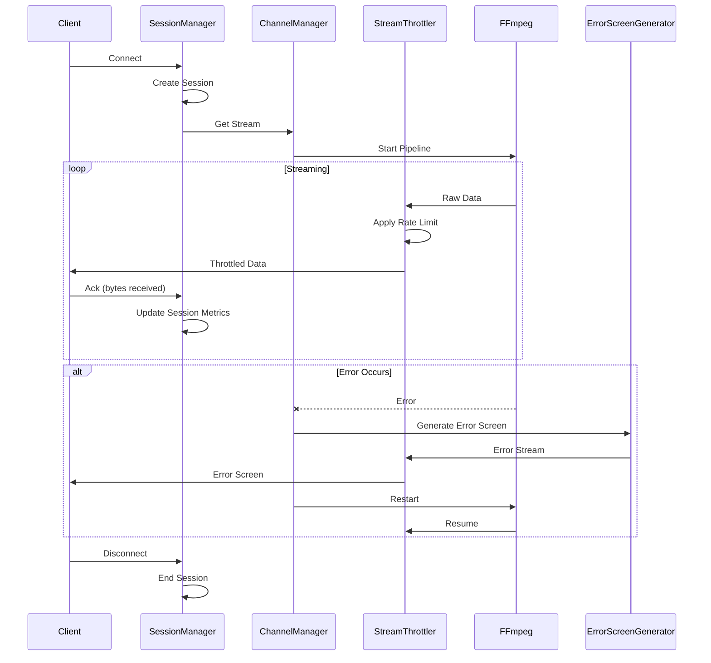

# Streaming Stability Guide

**Version:** 2.6.0  
**Last Updated:** 2026-02-21

This guide covers streaming stability: session management, stream throttling, error screens, ProcessPoolManager, CircuitBreaker, and restart safety. For full architecture and restart decision logic, see the [Platform Guide](../PLATFORM_GUIDE.md#2-how-streaming-works).

---

## Table of Contents

- [Overview](#overview)
- [ProcessPoolManager & Restart Safety](#processpoolmanager--restart-safety)
- [Session Management](#session-management)
- [Stream Throttling](#stream-throttling)
- [Error Screens](#error-screens)
- [Configuration](#configuration)
- [Monitoring](#monitoring)
- [Troubleshooting](#troubleshooting)

---

## Overview

EXStreamTV v2.6.0 integrates proven streaming patterns from Tunarr and dizqueTV to provide:

- **Session Tracking**: Monitor and manage client connections
- **Stream Throttling**: Prevent buffer overruns and optimize delivery
- **Error Screens**: Graceful fallback during failures
- **Zero-Downtime Fixes**: Hot-swap streams during repairs

### Streaming Architecture



---

## ProcessPoolManager & Restart Safety

### ProcessPoolManager

All FFmpeg processes are spawned through the ProcessPoolManager. It enforces:

- **Global process cap** — From config, memory, and file descriptor limits
- **Rate limiting** — Token bucket (default 5 spawns per second)
- **Guards** — Memory (85% threshold), FD reserve (100) before each spawn
- **Zombie detection** — Background task checks every 30 seconds
- **Long-run guard** — Processes running > 24 hours are released

When a spawn is rejected (memory, FD, or capacity), the circuit breaker may record a failure for that channel.

### Circuit Breaker

Per-channel protection. After 5 failures in a 300-second window, restarts are blocked for 120 seconds. States: CLOSED → OPEN → HALF_OPEN. See [Platform Guide §2](../PLATFORM_GUIDE.md#circuitbreaker-behavior).

### Restart Guards

Three mechanisms prevent restart storms:

1. **Global throttle** — Max 10 restarts in any 60-second window
2. **Per-channel cooldown** — 30 seconds between restarts for the same channel
3. **Circuit breaker** — Blocks when OPEN for that channel

All restart requests (health task, AI agent) go through `request_channel_restart`, which applies these checks. See [Platform Guide §2](../PLATFORM_GUIDE.md#restart-decision-flow).

---

## Session Management

Session management tracks each client connection to your channels.

### How It Works

1. **Client Connects**: SessionManager creates a StreamSession
2. **Session Tracking**: Records bytes sent, duration, errors
3. **Idle Detection**: Monitors for inactive sessions
4. **Cleanup**: Removes disconnected or idle sessions

### Session States



### Session Limits

Prevent resource exhaustion with per-channel limits:

```yaml
session_manager:
  max_sessions_per_channel: 50   # Max concurrent viewers per channel
  idle_timeout_seconds: 300      # Disconnect after 5 min idle
  cleanup_interval_seconds: 60   # Check for idle sessions every minute
```

### API Access

```bash
# Get all active sessions
curl http://localhost:8411/api/ai/sessions

# Get sessions for a specific channel
curl http://localhost:8411/api/ai/sessions?channel_id=1
```

---

## Stream Throttling

Stream throttling prevents buffer overruns and ensures smooth playback.

### The Problem

Without throttling:
- FFmpeg outputs data as fast as possible
- Client buffers fill rapidly
- Seeking becomes unreliable
- Memory usage spikes

### The Solution



### Throttle Modes

| Mode | Behavior | Best For |
|------|----------|----------|
| `realtime` | Match target bitrate exactly | Live/linear streaming |
| `burst` | Allow 2x bursts, then throttle | VOD with seeking |
| `adaptive` | Adjust based on client feedback | Variable networks |
| `disabled` | No throttling | Direct/local connections |

### Configuration

```yaml
stream_throttler:
  enabled: true
  target_bitrate_bps: 4000000    # 4 Mbps target
  mode: "realtime"               # realtime, burst, adaptive, disabled
```

### Bitrate Guidelines

| Content Type | Recommended Bitrate |
|--------------|---------------------|
| 480p SD | 1.5-2.5 Mbps |
| 720p HD | 3-5 Mbps |
| 1080p Full HD | 6-10 Mbps |
| 4K UHD | 15-25 Mbps |

---

## Error Screens

Error screens provide a graceful user experience during failures.

### When Error Screens Appear

- Channel restart in progress
- Source temporarily unavailable
- FFmpeg process recovery
- Network interruption

### Visual Modes

| Mode | Description | Example |
|------|-------------|---------|
| `text` | Text overlay on background | "We'll Be Right Back" |
| `static` | Static image | Channel logo |
| `test_pattern` | SMPTE color bars | Technical difficulties |
| `slate` | Solid color with text | Simple fallback |

### Audio Modes

| Mode | Description | Use Case |
|------|-------------|----------|
| `silent` | No audio | Default |
| `sine_wave` | 440Hz tone | Signal presence |
| `white_noise` | Static noise | Retro feel |
| `beep` | Periodic beep | Attention |

### Customization

Error screens can display:

- Channel name and number
- Custom title and subtitle
- Timestamp
- Estimated return time

```python
from exstreamtv.streaming.error_screens import (
    get_error_screen_generator,
    ErrorScreenMessage,
    ErrorScreenConfig,
    ErrorVisualMode,
    ErrorAudioMode,
)

generator = get_error_screen_generator()

message = ErrorScreenMessage(
    title="Technical Difficulties",
    subtitle="We'll be right back shortly",
    channel_name="Movie Channel",
    channel_number=5,
)

config = ErrorScreenConfig(
    visual_mode=ErrorVisualMode.TEXT,
    audio_mode=ErrorAudioMode.SILENT,
    background_color="#1a1a1a",
    text_color="#ffffff",
)

# Generate error stream
async for chunk in generator.generate_error_stream(message, config, duration=30):
    # Stream to clients
    pass
```

---

## Configuration

### Complete Example

```yaml
# Session management
session_manager:
  max_sessions_per_channel: 50
  idle_timeout_seconds: 300
  cleanup_interval_seconds: 60

# Stream throttling
stream_throttler:
  enabled: true
  target_bitrate_bps: 4000000
  mode: "realtime"

# AI self-healing
ai_auto_heal:
  enabled: true
  use_error_screen_fallback: true
  hot_swap_enabled: true
  
# Database backup
database_backup:
  enabled: true
  interval_hours: 24
  keep_count: 7
  compress: true
```

### Environment Variables

| Variable | Description | Default |
|----------|-------------|---------|
| `EXSTREAMTV_MAX_SESSIONS` | Max sessions per channel | 50 |
| `EXSTREAMTV_THROTTLE_BITRATE` | Target bitrate in bps | 4000000 |
| `EXSTREAMTV_THROTTLE_MODE` | Throttle mode | realtime |

---

## Monitoring

### Session Metrics

```bash
# Get session statistics
curl http://localhost:8411/api/ai/sessions

# Response:
{
  "total_sessions": 15,
  "sessions_by_channel": {
    "1": 8,
    "2": 4,
    "3": 3
  },
  "average_duration_seconds": 1847,
  "total_bytes_sent": 125000000000
}
```

### Channel Health

```bash
# Get channel health metrics
curl http://localhost:8411/api/ai/channels/1/health

# Response:
{
  "channel_id": 1,
  "status": "healthy",
  "current_fps": 29.97,
  "current_speed": 1.02,
  "current_bitrate_kbps": 4250,
  "dropped_frames": 5,
  "sessions_active": 8
}
```

### Health Status Values

| Status | Description | Action |
|--------|-------------|--------|
| `healthy` | Normal operation | None |
| `degraded` | Minor issues | Monitor |
| `unhealthy` | Significant problems | Investigate |
| `failed` | Stream down | Immediate action |

---

## Troubleshooting

### Session Issues

**"Max sessions reached"**

- Increase `max_sessions_per_channel`
- Check for zombie sessions
- Reduce `idle_timeout_seconds` to clean up faster

**"Session not found"**

- Session may have been cleaned up
- Check if client disconnected
- Verify session ID is correct

### Throttling Issues

**"Buffer underrun on client"**

- Increase `target_bitrate_bps`
- Switch to `burst` mode
- Check source media bitrate

**"Seeking not working"**

- Use `burst` mode for VOD content
- Ensure throttle is not too aggressive
- Check client player settings

### Error Screen Issues

**"Error screen not appearing"**

- Verify `use_error_screen_fallback: true`
- Check FFmpeg is installed correctly
- Review logs for generation errors

**"Error screen quality poor"**

- Error screens use minimal resources by design
- Focus on message clarity over quality
- Custom images can improve appearance

### General Issues

**"High memory usage"**

- Check session count
- Reduce buffer sizes
- Enable more aggressive cleanup

**"Streams dropping randomly"**

- Check AI self-healing logs
- Monitor FFmpeg health
- Verify source stability

---

## Data Flow Diagram



---

## Related Documentation

- [Platform Guide](../PLATFORM_GUIDE.md) — Full streaming lifecycle and restart logic
- [System Design](../architecture/SYSTEM_DESIGN.md) — Overall architecture
- [Tunarr/dizqueTV Integration](../architecture/TUNARR_DIZQUETV_INTEGRATION.md) — Technical details
- [AI Setup Guide](AI_SETUP.md) — AI configuration
- [Hardware Transcoding](HW_TRANSCODING.md) — FFmpeg optimization
